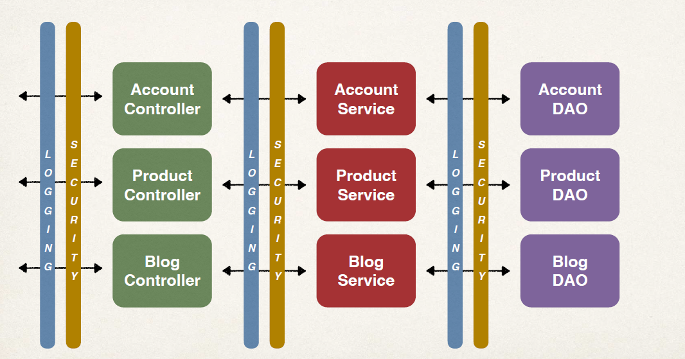
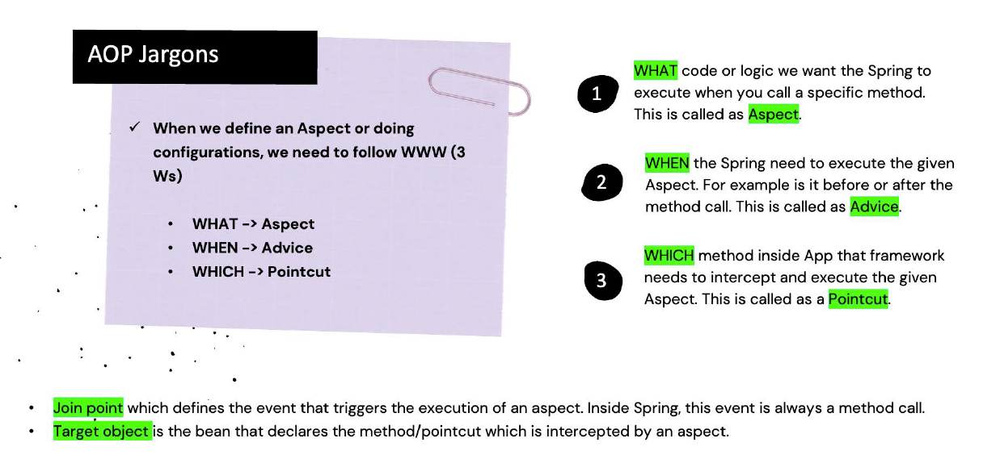
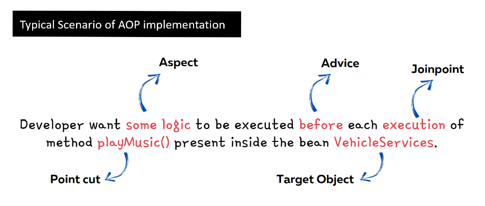

# AOP(Aspect oriented programming)

New Requirement - Logging
- Need to add logging to our DAO methods
- Add some logging statements before the start of the method
- Possibly more places … but get started on that ASAP!

```java
@Repository
public class AccountDAOImpl implements AccountDAO {

    @Override
    public void addAccount() {
        //logging here
        System.out.println(getClass() + ": DOING MY DB WORK: ADDING AN ACCOUNT");

    }
}
```

possibly you add logging here now security requirement came so you add security too for DAO
now need to add for all DAO and controleers

### Two Main Problems
#### Code Tangling
- For a given method: addAccount(…)
- We have logging and security code tangled in
####  Code Scattering
- If we need to change logging or security code
- We have to update ALL classes

__A solution can be inheritance!! bu then every class need to inherit 
bas class__

AOP encapsulates Cross Cutting concerns and put all code of security logging or extra things separate from
business logic!!


### Benefits of AOP
- Code for Aspect is defined in a single class
    - Much better than being scattered everywhere
    - Promotes code reuse and easier to change
- Business code in your application is cleaner
  - Only applies to business functionality: addAccount
  - Reduces code complexity
- Configurable
  - Based on configuration, apply Aspects selectively to different parts of app
  - No need to make changes to main application code … very important!
  


***

  - 
#### Understanding AOP Concepts
- __Aspect__ : The key unit of modularity in AOP, representing a concern that cuts across multiple classes. For example, an aspect for logging can be applied across various methods in different classes.
- __Advice__ : This is the action taken by an aspect at a particular join point. There are five types of advice:
  - Before : Executed before the method call.
  - After : Executed after the method call, regardless of its outcome.
  - AfterReturning : Executed after the method returns a result, but not if an exception occurs.
  - Around : Surrounds the method execution, allowing you to control the method execution and its result.
  - AfterThrowing : Executed if the method throws an exception.
- Join Point : A specific point in the execution of a program, 
such as method execution or exception handling, where an aspect can be applied.
- Pointcut : A predicate that matches join points. A pointcut expression specifies where an advice should be applied.
- Weaving : The process of linking aspects with the target object.
Weaving can occur at compile-time, load-time, or runtime. Spring AOP performs runtime weaving using proxy-based mechanisms.

```xml
	<dependency>
			<groupId>org.springframework.boot</groupId>
			<artifactId>spring-boot-starter-aop</artifactId>
		</dependency>
```
### Add above dependency 
Since this dependency is part of our pom.xml
- Spring Boot will automatically enable support for AOP
- No need to explicitly use __@EnableAspectJAutoProxy__ … we get it for free.can see it in some old legacy code
## Project 1
### @before code Aspect code
```java
@Aspect // @aspect telling this is aspect this listen to events before ,after ans so on
@Component
public class MyDemoLoggingAspect {

    // this is where we add all of our related advices for logging

    // let's start with an @Before advice

    @Before("execution(public void addAccount())")//code inside() is called as Pointcut expression
    public void beforeAddAccountAdvice() {

        System.out.println("\n=====>>> Executing @Before advice on addAccount()");

    }
}

```

### Main class

```java


@SpringBootApplication
public class AopdemoApplication {

	public static void main(String[] args) {
		SpringApplication.run(AopdemoApplication.class, args);
	}

	@Bean
	public CommandLineRunner commandLineRunner(AccountDAO theAccountDAO) {

		return runner -> {

			demoTheBeforeAdvice(theAccountDAO);
		};
	}

	private void demoTheBeforeAdvice(AccountDAO theAccountDAO) {

		// call the business method
		theAccountDAO.addAccount();

		// do it again!
		System.out.println("\n let's call it again!\n");

		// call the business method again
		theAccountDAO.addAccount();
	}

}
```
### DAO layer code
```java
package com.luv2code.aopdemo.dao;

import org.springframework.stereotype.Repository;

@Repository
public class AccountDAOImpl implements AccountDAO {

    @Override
    public void addAccount() {

        System.out.println(getClass() + ": DOING MY DB WORK: ADDING AN ACCOUNT");

    }
}

```
we never call any aspect see just addAccount is called 2 times and see output
### Output:
```text

=====>>> Executing @Before advice on addAccount()
class com.luv2code.aopdemo.dao.AccountDAOImpl: DOING MY DB WORK: ADDING AN ACCOUNT

 let's call it again!


=====>>> Executing @Before advice on addAccount()
class com.luv2code.aopdemo.dao.AccountDAOImpl: DOING MY DB WORK: ADDING AN ACCOUNT

Process finished with exit code 0

```
see before calling DAO a statement is printed from aspect 


### Use case of before Advice
Most common
- logging, security, transactions
- Audit logging
- who, what, when, where
- API Management
- how many times has a method been called user
- analytics: what are peak times? what is average load? who is top user?

Lets see pointcut in next project

## Project 2
### Main
```java

@SpringBootApplication
public class AopdemoApplication {

	public static void main(String[] args) {
		SpringApplication.run(AopdemoApplication.class, args);
	}

	@Bean
	public CommandLineRunner commandLineRunner(AccountDAO theAccountDAO, MembershipDAO theMembershipDAO) {

		return runner -> {

			demoTheBeforeAdvice(theAccountDAO, theMembershipDAO);
		};
	}

	private void demoTheBeforeAdvice(AccountDAO theAccountDAO, MembershipDAO theMembershipDAO) {

		// call the business method
		theAccountDAO.addAccount();

		// call the membership business method
		theMembershipDAO.addAccount();

	}

}

```

### now we have two daos

```java
package com.luv2code.aopdemo.dao;

import org.springframework.stereotype.Repository;

@Repository
public class MembershipDAOImpl implements MembershipDAO {

    @Override
    public void addAccount() {

        System.out.println(getClass() + ": DOING MY DB WORK: ADDING A MEMBERSHIP ACCOUNT");

    }
}

```

```java
package com.luv2code.aopdemo.dao;

import org.springframework.stereotype.Repository;

@Repository
public class AccountDAOImpl implements AccountDAO {

    @Override
    public void addAccount() {

        System.out.println(getClass() + ": DOING MY DB WORK: ADDING AN ACCOUNT");

    }
}

```

### aspect execution(public void addAccount())" telling to run before public void addAccount() method
```java
package com.luv2code.aopdemo.aspect;

@Aspect
@Component
public class MyDemoLoggingAspect {

    @Before("execution(public void addAccount())")
    public void beforeAddAccountAdvice() {

        System.out.println("\n=====>>> Executing @Before advice on method");

    }
}


```

### Both DAO has public void addAccount() so apsect run before both of that so Output :

```text

=====>>> Executing @Before advice on method
class com.luv2code.aopdemo.dao.AccountDAOImpl: DOING MY DB WORK: ADDING AN ACCOUNT

=====>>> Executing @Before advice on method
class com.luv2code.aopdemo.dao.MembershipDAOImpl: DOING MY DB WORK: ADDING A MEMBERSHIP ACCOUNT

Process finished with exit code 0

```

## Project 3

### aspect in here

```java
@Aspect
@Component
public class MyDemoLoggingAspect {


    @Before("execution(public void com.luv2code.aopdemo.dao.AccountDAO.addAccount())")
    public void beforeAddAccountAdvice() {

        System.out.println("\n=====>>> Executing @Before advice on method");

    }
}

```

__here point cut expression says any public void method of com.luv2code.aopdemo.dao.AccountDAO.addAccount() package__

__now from before AccountDAO.addAccount() this aspect will run__

```text

=====>>> Executing @Before advice on method
class com.luv2code.aopdemo.dao.AccountDAOImpl: DOING MY DB WORK: ADDING AN ACCOUNT
class com.luv2code.aopdemo.dao.MembershipDAOImpl: DOING MY DB WORK: ADDING A MEMBERSHIP ACCOUNT

Process finished with exit code 0

```

see only before account DAO before is implemented

## Project 4


### Aspect

```java
package com.luv2code.aopdemo.aspect;


@Aspect
@Component
public class MyDemoLoggingAspect {

    @Before("execution(public void add*())")
    public void beforeAddAccountAdvice() {

        System.out.println("\n=====>>> Executing @Before advice on method");

    }
}
```
Aspect tells any public void method having add as prefix

### DAO's

```java
package com.luv2code.aopdemo.dao;

import org.springframework.stereotype.Repository;

@Repository
public class AccountDAOImpl implements AccountDAO {

    @Override
    public void addAccount() {

        System.out.println(getClass() + ": DOING MY DB WORK: ADDING AN ACCOUNT");

    }
}

```

before this addAccount() aspect will run 

```java
package com.luv2code.aopdemo.dao;

@Repository
public class MembershipDAOImpl implements MembershipDAO {

    @Override
    public void addSillyMember() {

        System.out.println(getClass() + ": DOING MY DB WORK: ADDING A MEMBERSHIP ACCOUNT");

    }

    @Override
    public void add() {
        System.out.println("simple add aspect should run before it");
    }

    @Override
    public int addVersion() {
        System.out.println("No expect should run as int return type method although add* satisfied");
        return 0;
    }
}

```
before addVersion(), aspect will not run 
as addVersion() is returning int and aspect says

```text
"execution(public void add*())"
```
 which means return type should be void here then only aspect will run!!
### Main
```java
@SpringBootApplication
public class AopdemoApplication {

	public static void main(String[] args) {
		SpringApplication.run(AopdemoApplication.class, args);
	}

	@Bean
	public CommandLineRunner commandLineRunner(AccountDAO theAccountDAO, MembershipDAO theMembershipDAO) {

		return runner -> {

			demoTheBeforeAdvice(theAccountDAO, theMembershipDAO);
		};
	}

	private void demoTheBeforeAdvice(AccountDAO theAccountDAO, MembershipDAO theMembershipDAO) {

		// call the business method
		theAccountDAO.addAccount();

		// call the membership business method
		theMembershipDAO.addSillyMember();
		theMembershipDAO.add();
		theMembershipDAO.addVersion();

	}

}
```

## Output:

```text

=====>>> Executing @Before advice on method
class com.luv2code.aopdemo.dao.AccountDAOImpl: DOING MY DB WORK: ADDING AN ACCOUNT

=====>>> Executing @Before advice on method
class com.luv2code.aopdemo.dao.MembershipDAOImpl: DOING MY DB WORK: ADDING A MEMBERSHIP ACCOUNT

=====>>> Executing @Before advice on method
simple add aspect should run before it
No expect should run as int return type method although add* satisfied

Process finished with exit code 0

```

## Project 5

### now aspect is

```java
@Aspect
@Component
public class MyDemoLoggingAspect {

    @Before("execution(* add*())")
    public void beforeAddAccountAdvice() {

        System.out.println("\n=====>>> Executing @Before advice on method");

    }
}


```
now aspect run before every method ,we removed return type constraint


```java
package com.luv2code.aopdemo.dao;

import org.springframework.stereotype.Repository;

@Repository
public class AccountDAOImpl implements AccountDAO {

    @Override
    public void addAccount() {

        System.out.println(getClass() + ": DOING MY DB WORK: ADDING AN ACCOUNT");

    }
}

```

before this addAccount(), aspect will run 

```java
package com.luv2code.aopdemo.dao;

import org.springframework.stereotype.Repository;

@Repository
public class MembershipDAOImpl implements MembershipDAO {

    @Override
    public void addSillyMember() {

        System.out.println(getClass() + ": DOING MY DB WORK: ADDING A MEMBERSHIP ACCOUNT");

    }

    @Override
    public void add() {
        System.out.println("simple add aspect should run before it");
    }

    @Override
    public int addVersion() {
        System.out.println("No expect should run as int return type method although add* satisfied");
        return 0;
    }
}

```
__now here aspect will run before AddVersion() too as we removed the constraint of void as of 004__

### Main
```java
@SpringBootApplication
public class AopdemoApplication {

	public static void main(String[] args) {
		SpringApplication.run(AopdemoApplication.class, args);
	}

	@Bean
	public CommandLineRunner commandLineRunner(AccountDAO theAccountDAO, MembershipDAO theMembershipDAO) {

		return runner -> {

			demoTheBeforeAdvice(theAccountDAO, theMembershipDAO);
		};
	}

	private void demoTheBeforeAdvice(AccountDAO theAccountDAO, MembershipDAO theMembershipDAO) {
		theAccountDAO.addAccount();

		theMembershipDAO.addSillyMember();
		theMembershipDAO.add();
		theMembershipDAO.addVersion();

	}

}
```

### Previous Output:

```text

=====>>> Executing @Before advice on method
class com.luv2code.aopdemo.dao.AccountDAOImpl: DOING MY DB WORK: ADDING AN ACCOUNT

=====>>> Executing @Before advice on method
class com.luv2code.aopdemo.dao.MembershipDAOImpl: DOING MY DB WORK: ADDING A MEMBERSHIP ACCOUNT

=====>>> Executing @Before advice on method
simple add aspect should run before it
No expect should run as int return type method although add* satisfied

Process finished with exit code 0

```

### now output:

```text

=====>>> Executing @Before advice on method
class com.luv2code.aopdemo.dao.AccountDAOImpl: DOING MY DB WORK: ADDING AN ACCOUNT

=====>>> Executing @Before advice on method
class com.luv2code.aopdemo.dao.MembershipDAOImpl: DOING MY DB WORK: ADDING A MEMBERSHIP ACCOUNT

=====>>> Executing @Before advice on method
simple add aspect should run before it

=====>>> Executing @Before advice on method
No expect should run as int return type method although add* satisfied

Process finished with exit code 0

```

see before every call to any method with prefix add aspect will run