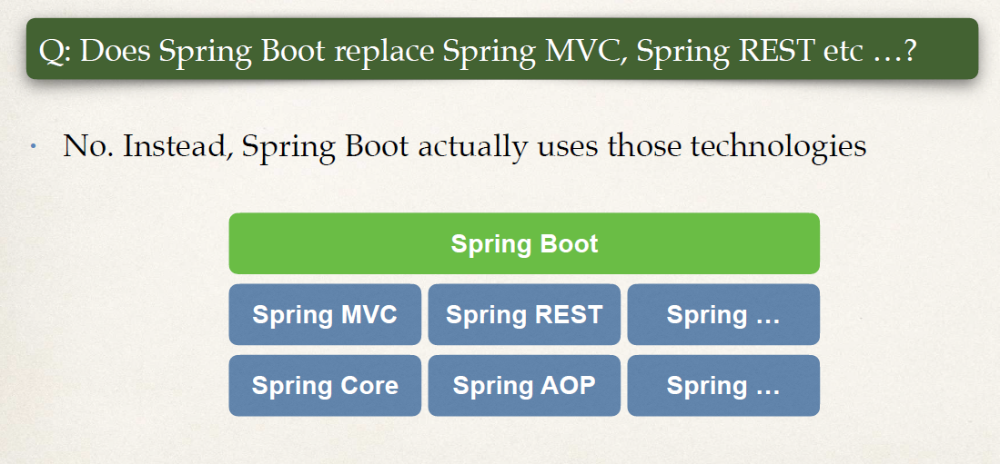
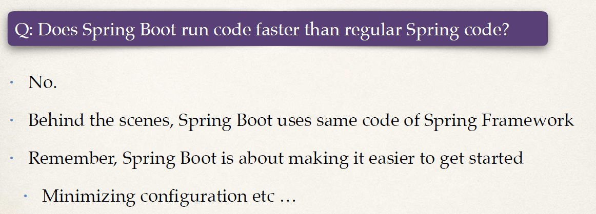
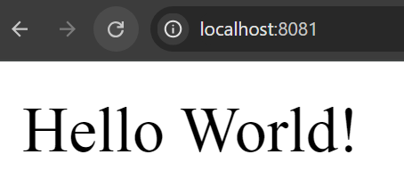

#   SpringBoot Intro
### The Problem
- Building a traditional Spring application is really HARD!!!
    - Q: Which JAR dependencies do I need?
    - Q: How do I set up configuration (xml or Java)?
    - Q: How do I install the server? (Tomcat, JBoss etc…)
### Spring Boot Solution
      • Make it easier to get started with Spring development
      • Minimize the amount of manual configuration
        • Perform auto-configuration based on props files and JAR classpath
      • Help to resolve dependency conflicts (Maven or Gradle)
      • Provide an embedded HTTP server so you can get started quickly
        • Tomcat, Jetty, Undertow, …
• Spring Boot uses Spring behind the scenes

• Spring Boot simply makes it easier to use Spring





```java
@RestController
public class FunRestController {

    // expose "/" that return "Hello World"

    @GetMapping("/")
    public String sayHello() {
        return "Hello World!";
    }
}

```
Rest Controller above

below i have application.properties

```properties
server.port=8081
```

output:

