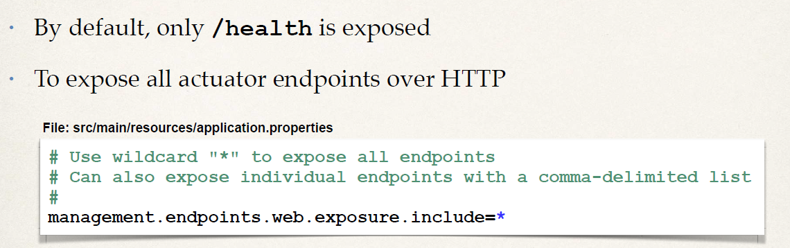

# Actuator
## Problem
- How can I monitor and manage my application?
- How can I check the application health?
- How can I access application metrics?

## Solution: Spring Boot Actuator
  - Exposes endpoints to monitor and manage your application
  - You easily get DevOps functionality out-of-the-box
  - Simply add the dependency to your POM file
  - REST endpoints are automatically added to your application

Add below code in pom.xml
```xml
		<!-- ADD SUPPORT FOR SPRING BOOT ACTUATOR -->
		<dependency>
			<groupId>org.springframework.boot</groupId>
			<artifactId>spring-boot-starter-actuator</artifactId>
		</dependency>
```

## Spring Boot Actuator
- Automatically exposes endpoints for metrics out-of-the-box
- Endpoints are prefixed with: /actuator

### Enabling Endpoints
By default, all endpoints except for shutdown are enabled. 
To configure the enablement of an endpoint, 
use its management.endpoint.<id>.enabled property. 
The following example enables the shutdown endpoint:

```properties
management.endpoint.shutdown.enabled=true
```

