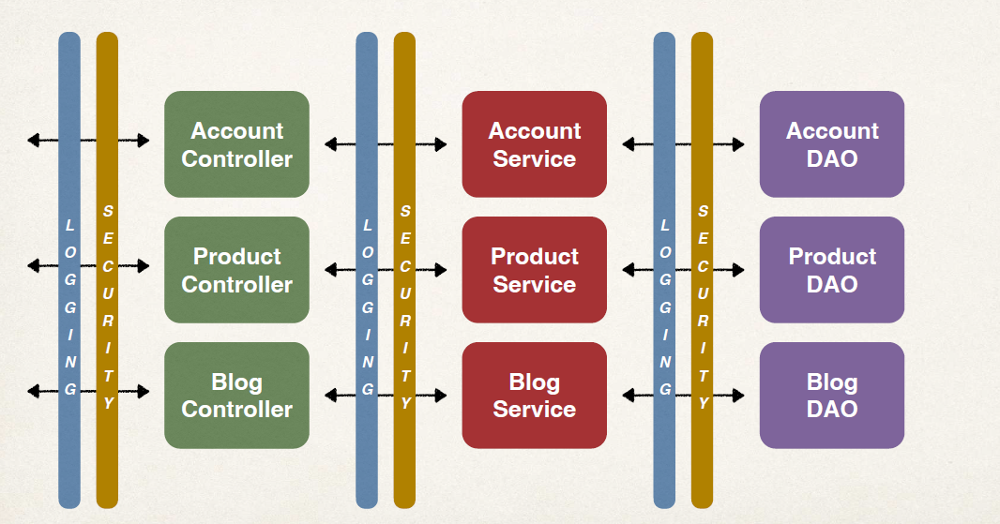
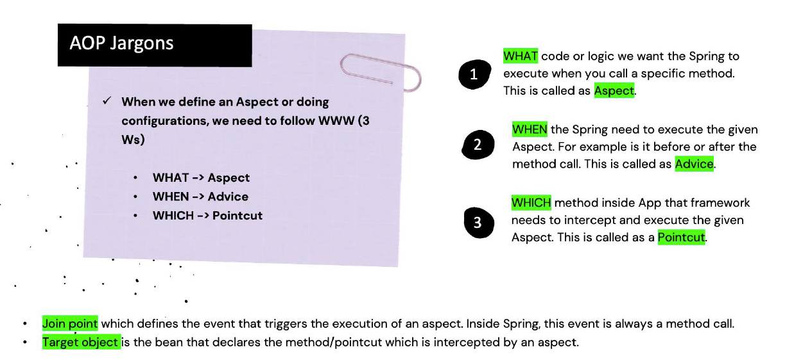
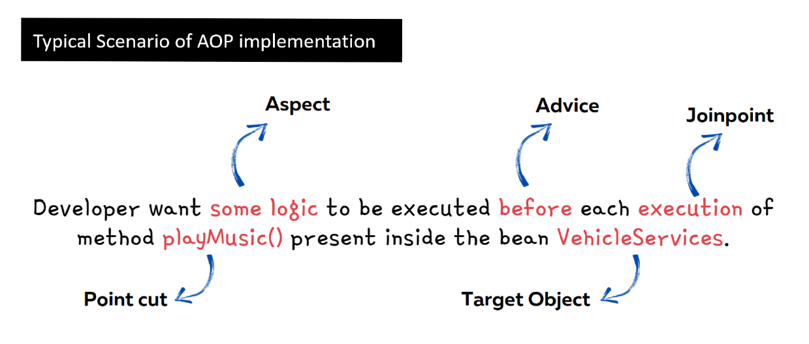
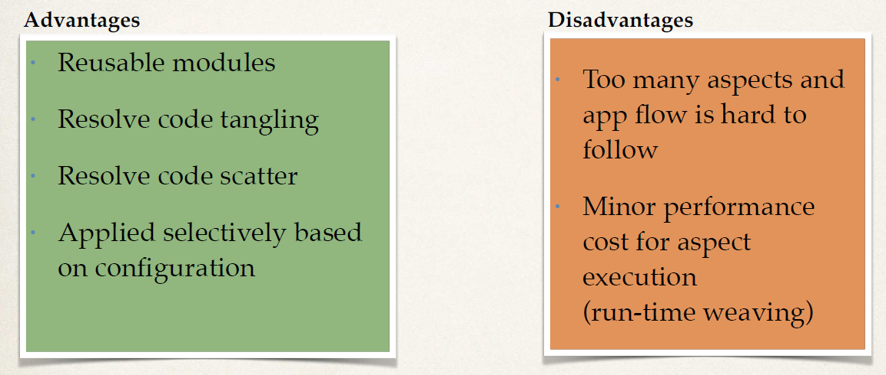

# AOP(Aspect oriented programming)

New Requirement - Logging
- Need to add logging to our DAO methods
- Add some logging statements before the start of the method
- Possibly more places … but get started on that ASAP!

```java
@Repository
public class AccountDAOImpl implements AccountDAO {

    @Override
    public void addAccount() {
        //logging here
        System.out.println(getClass() + ": DOING MY DB WORK: ADDING AN ACCOUNT");

    }
}
```

possibly you add logging here now security requirement came so you add security too for DAO
now need to add for all DAO and controleers

### Two Main Problems
#### Code Tangling
- For a given method: addAccount(…)
- We have logging and security code tangled in
####  Code Scattering
- If we need to change logging or security code
- We have to update ALL classes

__A solution can be inheritance!! bu then every class need to inherit 
bas class__

AOP encapsulates Cross Cutting concerns and put all code of security logging or extra things separate from
business logic!!


### Benefits of AOP
- Code for Aspect is defined in a single class
    - Much better than being scattered everywhere
    - Promotes code reuse and easier to change
- Business code in your application is cleaner
  - Only applies to business functionality: addAccount
  - Reduces code complexity
- Configurable
  - Based on configuration, apply Aspects selectively to different parts of app
  - No need to make changes to main application code … very important!
  


***

  - 
#### Understanding AOP Concepts
- __Aspect__ : The key unit of modularity in AOP, representing a concern that cuts across multiple classes. For example, an aspect for logging can be applied across various methods in different classes.
- __Advice__ : This is the action taken by an aspect at a particular join point. There are five types of advice:
  - Before : Executed before the method call.
  - After : Executed after the method call, regardless of its outcome.
  - AfterReturning : Executed after the method returns a result, but not if an exception occurs.
  - Around : Surrounds the method execution, allowing you to control the method execution and its result.
  - AfterThrowing : Executed if the method throws an exception.
- Join Point : A specific point in the execution of a program, 
such as method execution or exception handling, where an aspect can be applied.
- Pointcut : A predicate that matches join points. A pointcut expression specifies where an advice should be applied.
- Weaving : The process of linking aspects with the target object.
Weaving can occur at compile-time, load-time, or runtime. Spring AOP performs runtime weaving using proxy-based mechanisms.

```xml
	<dependency>
			<groupId>org.springframework.boot</groupId>
			<artifactId>spring-boot-starter-aop</artifactId>
		</dependency>
```
### Add above dependency 
Since this dependency is part of our pom.xml
- Spring Boot will automatically enable support for AOP
- No need to explicitly use __@EnableAspectJAutoProxy__ … we get it for free.can see it in some old legacy code

## @before code
```java
@Aspect // @aspect telling this is aspect this listen to events before ,after ans so on
@Component
public class MyDemoLoggingAspect {

    // this is where we add all of our related advices for logging

    // let's start with an @Before advice

    @Before("execution(public void addAccount())")//code inside() is called as Pointcut expression
    public void beforeAddAccountAdvice() {

        System.out.println("\n=====>>> Executing @Before advice on addAccount()");

    }
}

```

## Main class

```java


@SpringBootApplication
public class AopdemoApplication {

	public static void main(String[] args) {
		SpringApplication.run(AopdemoApplication.class, args);
	}

	@Bean
	public CommandLineRunner commandLineRunner(AccountDAO theAccountDAO) {

		return runner -> {

			demoTheBeforeAdvice(theAccountDAO);
		};
	}

	private void demoTheBeforeAdvice(AccountDAO theAccountDAO) {

		// call the business method
		theAccountDAO.addAccount();

		// do it again!
		System.out.println("\n let's call it again!\n");

		// call the business method again
		theAccountDAO.addAccount();
	}

}
```
## DAO layer code
```java
package com.luv2code.aopdemo.dao;

import org.springframework.stereotype.Repository;

@Repository
public class AccountDAOImpl implements AccountDAO {

    @Override
    public void addAccount() {

        System.out.println(getClass() + ": DOING MY DB WORK: ADDING AN ACCOUNT");

    }
}

```
we never call any aspect see just addAccount is called 2 times and see output
## Output:
```text
C:\Users\user\.jdks\openjdk-22\bin\java.exe "-javaagent:C:\Program Files\JetBrains\IntelliJ IDEA Community Edition 2024.1.4\lib\idea_rt.jar=57173:C:\Program Files\JetBrains\IntelliJ IDEA Community Edition 2024.1.4\bin" -Dfile.encoding=UTF-8 -Dsun.stdout.encoding=UTF-8 -Dsun.stderr.encoding=UTF-8 -classpath "C:\Users\user\Desktop\programs\SpringBoot notes\001.springboot step by step\10-spring-boot-aop\01-spring-boot-aop-before-advice\target\classes;C:\Users\user\.m2\repository\org\springframework\boot\spring-boot-starter-aop\3.3.2\spring-boot-starter-aop-3.3.2.jar;C:\Users\user\.m2\repository\org\springframework\spring-aop\6.1.11\spring-aop-6.1.11.jar;C:\Users\user\.m2\repository\org\springframework\spring-beans\6.1.11\spring-beans-6.1.11.jar;C:\Users\user\.m2\repository\org\aspectj\aspectjweaver\1.9.22.1\aspectjweaver-1.9.22.1.jar;C:\Users\user\.m2\repository\org\springframework\boot\spring-boot-starter\3.3.2\spring-boot-starter-3.3.2.jar;C:\Users\user\.m2\repository\org\springframework\boot\spring-boot\3.3.2\spring-boot-3.3.2.jar;C:\Users\user\.m2\repository\org\springframework\spring-context\6.1.11\spring-context-6.1.11.jar;C:\Users\user\.m2\repository\org\springframework\spring-expression\6.1.11\spring-expression-6.1.11.jar;C:\Users\user\.m2\repository\io\micrometer\micrometer-observation\1.13.2\micrometer-observation-1.13.2.jar;C:\Users\user\.m2\repository\io\micrometer\micrometer-commons\1.13.2\micrometer-commons-1.13.2.jar;C:\Users\user\.m2\repository\org\springframework\boot\spring-boot-autoconfigure\3.3.2\spring-boot-autoconfigure-3.3.2.jar;C:\Users\user\.m2\repository\org\springframework\boot\spring-boot-starter-logging\3.3.2\spring-boot-starter-logging-3.3.2.jar;C:\Users\user\.m2\repository\ch\qos\logback\logback-classic\1.5.6\logback-classic-1.5.6.jar;C:\Users\user\.m2\repository\ch\qos\logback\logback-core\1.5.6\logback-core-1.5.6.jar;C:\Users\user\.m2\repository\org\apache\logging\log4j\log4j-to-slf4j\2.23.1\log4j-to-slf4j-2.23.1.jar;C:\Users\user\.m2\repository\org\apache\logging\log4j\log4j-api\2.23.1\log4j-api-2.23.1.jar;C:\Users\user\.m2\repository\org\slf4j\jul-to-slf4j\2.0.13\jul-to-slf4j-2.0.13.jar;C:\Users\user\.m2\repository\jakarta\annotation\jakarta.annotation-api\2.1.1\jakarta.annotation-api-2.1.1.jar;C:\Users\user\.m2\repository\org\springframework\spring-core\6.1.11\spring-core-6.1.11.jar;C:\Users\user\.m2\repository\org\springframework\spring-jcl\6.1.11\spring-jcl-6.1.11.jar;C:\Users\user\.m2\repository\org\yaml\snakeyaml\2.2\snakeyaml-2.2.jar;C:\Users\user\.m2\repository\org\slf4j\slf4j-api\2.0.13\slf4j-api-2.0.13.jar" com.luv2code.aopdemo.AopdemoApplication

=====>>> Executing @Before advice on addAccount()
class com.luv2code.aopdemo.dao.AccountDAOImpl: DOING MY DB WORK: ADDING AN ACCOUNT

 let's call it again!


=====>>> Executing @Before advice on addAccount()
class com.luv2code.aopdemo.dao.AccountDAOImpl: DOING MY DB WORK: ADDING AN ACCOUNT

Process finished with exit code 0

```
see before calling DAO a statement is printed from aspect 


### Use case of before Advice
Most common
- logging, security, transactions
- Audit logging
- who, what, when, where
- API Management
- how many times has a method been called user
- analytics: what are peak times? what is average load? who is top user?

Lets see pointcut in next project