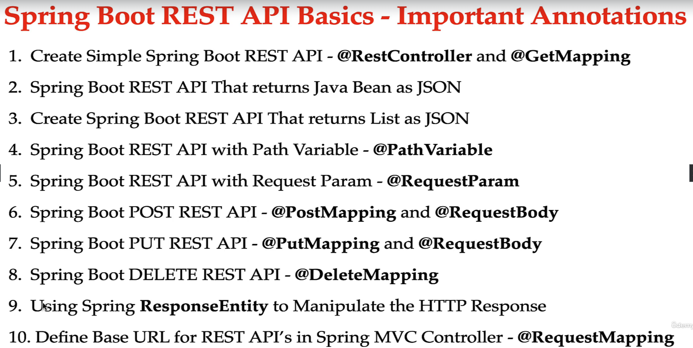

# SpringBoot REST API's
 We have created HomeController see below code

```java
@RestController
public class HelloWorldController {

    // HTTP GET Request
    // http://localhost:8080/hello-world

    @GetMapping("/hello-world")
    public String helloWorld(){
        
        return "Hello World!";
    }
}

```

### Important annotations
