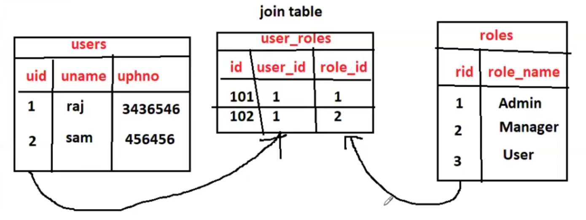

#  Association Mapping

=> It is used to represent Database tables relations in our entitiy classes.

=> We have several annotations to represents entities relations

    @OneToOne

    @OneToMany

    @ManyToOne

    @ManyToMany

@JoinColumn : To present foreign column


## Why we need to go for DB tables relations ?

Normalization : To get organize data in better manner (to avoid duplicate data)

=> In project we will have multiple tables to maintain data

=> Tables will have relationships

		(one table will have relation with one or many tables)


Ex :  emp table and address table

		one emp can have multiple addresses

		address will have emp_id to represent data belongs to which emp


- DB Relationships are divided into 4 types 

1) One to One

	Ex: person and passport (one person will have only one passport)	

    person has passport id only so from person we get passport only!!
    this is unidirectional relation!!

    now we want from passport we should get person too for that in passport put personId too!!


2) One to Many

	Ex:  emp and address (one emp can have multiple addresses)				
		 author and books (one author can publish multiple books)
		 university and colleges (one university can have multiple colleges)

3) Many to One

	Ex : address and emp (multiple addresses belongs to one emp)		 

4) Many To Many 	

	Ex: Multiple users can have multiple roles (join table required)

		(users_tbl,  roles_tbl, user_roles_tbl)

## FetchType

 It tell when to load the child record!!

 Like a post on Facebook has multiple comments ,when loading post we need comments or not!!
 Default is lazy!!as loading child with parent decrease query performance!!

1. Eager--> fetch child record with parent record we need to specify eager

2. Lazy --> default one!!

## Inverse 

Operation performed on parent must be put on child too!! we put ALL means all operations we put on parent should be put in child too!!

When parent is deleted and child is not that record is called as orphan record , these are of no use so we use  ALL!!

1. insert --> insert child along with parent

2. delete --> delete child along with parent!!

we need to think whether we need to delete child along with parent or not!!


## One To One Relationship


=> One person will have one passport

Note: One parent record will have one child record


When we insert parent => child is also getting inserted

When we retrieve parent => child is also getting retrieved (left join)

When we retrieve child => Parent also getting retrieved (left join)

When we delete parent => child + parent getting deleted 

## One To Many Relationship


Parent table record (one) will have relationship with child table records(many)

Ex : One emp can have multiple addresses

=> When parent inserted => child also inserted

=> When parent is retrieved ==> childs are not retrieved by default 

>Note: In one to many relationship default fetch type is LAZY 
(ONLY PARENT WILL COME)

=> If we want to retrieve child records also along with parent then we have to set fetch type as EAGER

==> When child is retrieved => childs + parent is getting retrieved (left join)

=> when parent is deleted ==> childs + parent is getting deleted

## Many To Many Relationship

user_tbl  : Contains users data

role_tbl  : Contains roles data



user_roles_tbl : Contains relations between users & roles

we need 3 tables here!! cannot be done by 2 tables!!


=> Multiple users will have multiple roles

=> To represent relation we will use third table which is called as join table.

=> Join table contains join_column and inverse_join_column

>Note: Don't use @Data & toString ( ) methods in entities, 
=> If we write toString ( ) method in entity which is having association mapping then we will run into StackOverFlowError.

## One to One Mapping
```yml
spring:
  datasource:
    username: ashokit
    password: AshokIT@123
    url: jdbc:mysql://localhost:3306/jrtp22
    driver-class-name: com.mysql.jdbc.Driver
  jpa:
    hibernate:
      ddl-auto: update
    show-sql: true

```

### Entity

```java
@Entity
@Data
public class Passport {
	
	@Id
	@GeneratedValue(strategy=GenerationType.IDENTITY)
	private Integer passportId;
	private String passportNum;
	private LocalDate issuedDate;
	private LocalDate expDate;
	
	@OneToOne
	@JoinColumn(name="person_id")
	private Person person;

}
```
```java
@Entity
@Data
public class Person {

	@Id
	@GeneratedValue(strategy = GenerationType.IDENTITY)
	private Integer personId;
	private String personName;
	private LocalDate dob;

	@OneToOne(mappedBy = "person", cascade = CascadeType.ALL)
	private Passport passport;

}
```
see how one to one mapped!! we have simple jpa repository 

###  Service

```java
public class PersonService {

	@Autowired
	private PersonRepo personRepo;

	@Autowired
	private PassportRepo passportRepo;

	public void savePersonWithPassport() {

		Passport passport = new Passport();
		passport.setPassportNum("K8HKHK6");
		passport.setIssuedDate(LocalDate.now());
		passport.setExpDate(LocalDate.now().plusYears(10));

		Person person = new Person();
		person.setPersonName("John");
		person.setDob(LocalDate.now().minusYears(20));

		passport.setPerson(person);
		person.setPassport(passport);

		personRepo.save(person);
	}

	public void deletePerson(int id) {
		personRepo.deleteById(id);
	}

	public void getPerson(int id) {
		personRepo.findById(id);
	}

	public void getPassport(int id) {
		passportRepo.findById(id);
	}

	public void deletePassport(int id) {
		passportRepo.deleteById(id);
	}
}
```
