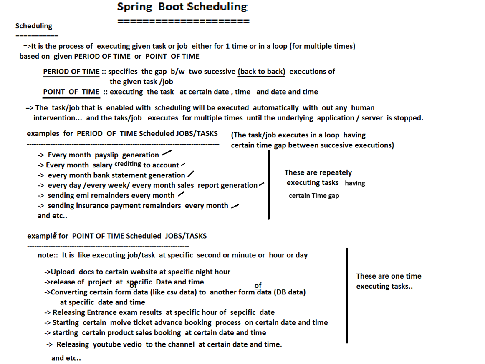
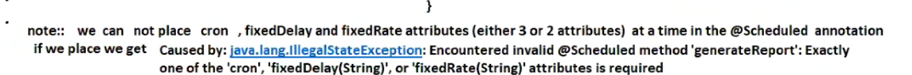
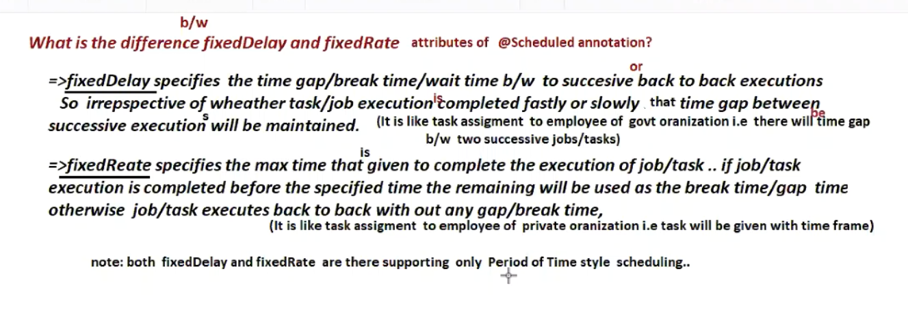
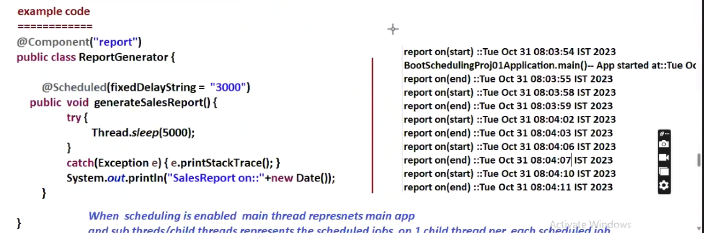
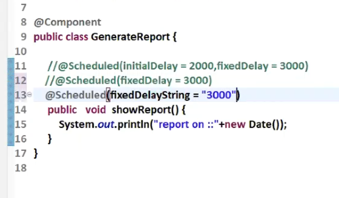
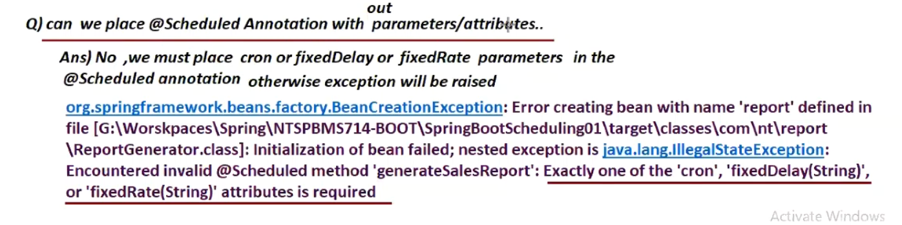

# Spring scheduling



Period of time - tells after gap job will execute

Point of time - tells when to execute 

Scheduling means we need not do it !! it will bed done automatically!!

Above you can see both point of time and period of time jobs example!!

In core java we can do scheduling too by TimerTask and Timer class!!In springboot for scheduling no need to add any starter ,it automatically comes with springboot starter!!

Springboot Starter =Autoconfiguration+ Spring jars +logging + Scheduling +yml processing + much more!!

>Just need to add @EnableScheduling on main class along with @SpringBootApplication Annotation!! 

```java
@SpringBootApplication
@EnableScheduling
public class SchedulingApplication {
    public static void main(String[] args) {
        SpringApplication.run(SchedulingApplication.class, args);
    }
}
```

>In Any spring Bean (which have  stereo type annotation) put @Scheduled on method (must be 0-param method)!

```java

@Component
public class ScheduledTasks {
    private static final Logger logger = LoggerFactory.getLogger(ScheduledTasks.class);

    @Scheduled(fixedRate = 5000)
    public void performTask() {
        logger.info("Task performed at {}", LocalDateTime.now());
    }
}
```

Spring Boot uses the following annotations to enable and configure scheduling:

- @EnableScheduling: This annotation enables scheduling functionality in your Spring Boot application. It is typically placed on your main application class or a configuration class.
- @Scheduled: This annotation is used to mark a method as a scheduled task. It supports several scheduling options, such as fixed-rate, fixed-delay, and cron expressions.

## Fixed-Rate Scheduling
```java
@Component
public class ScheduledTasks {
    private static final Logger logger = LoggerFactory.getLogger(ScheduledTasks.class);

    @Scheduled(fixedRate = 5000)
    public void printMessage() {
        logger.info("This message is printed every 5 seconds");
    }
}

```
With this configuration, the printMessage() method will be executed every 5 seconds.

## Cron Expression Scheduling

```java
@Component
public class ScheduledTasks {
    // ...

    @Scheduled(cron = "0 0/1 * * * ?")
    public void runCronJob() {
        logger.info("Cron job is running every minute");
    }
}
```

This cron expression (0 0/1 * * * ?) configures the runCronJob() method to run every minute.

## Advanced Scheduling Options
In addition to the basic scheduling options discussed earlier, Spring Boot Scheduling also provides advanced scheduling options that offer more flexibility and control over your tasks.

### Fixed-Delay Scheduling:
 Fixed-delay scheduling allows you to schedule tasks with a fixed delay between the completion of one task and the start of the next. This can be useful when you want to maintain a specific interval between tasks, regardless of how long each task takes to execute. To implement fixed-delay scheduling, use the fixedDelay attribute in the @Scheduled annotation:

 ```java
@Component
public class ScheduledTasks {
    // ...

    @Scheduled(fixedDelay = 10000)
    public void executeFixedDelayTask() {
        logger.info("Fixed delay task is running with a delay of 10 seconds");
    }
}
 ```

 In this example, the executeFixedDelayTask() method will run with a delay of 10 seconds between the end of one execution and the start of the next.
 ### FixedRate

specifies max time in which job be completed!!
if task completed before that time than gap be there!!

10 sec fixed rate and task takes 5 sec so 5 sec gap be there!!

if task takes more time Than no gap just back to back execution of task!!

> cannot use fixedDelay and fixedRate at a time!! or even cron with them will give IllegalStateException!!



 ### Initial Delay: 
 You can use the initialDelay attribute to specify a delay before the first execution of a scheduled task. This can be helpful when you want to allow your application to start up and initialize resources before the scheduled tasks begin. To add an initial delay, include the initialDelay attribute in the @Scheduled annotation:

 ```java
@Component
public class ScheduledTasks {
    // ...

    @Scheduled(fixedRate = 5000, initialDelay = 10000)
    public void executeTaskWithInitialDelay() {
        logger.info("Task with initial delay is running every 5 seconds after a 10-second delay");
    }
}
 ```
In this example, the executeTaskWithInitialDelay() method will run every 5 seconds, but the first execution will be delayed by 10 seconds after the application starts.

### Timezone: 
If you need to schedule tasks based on a specific timezone, you can use the zone attribute in the @Scheduled annotation. This is particularly useful when working with cron expressions, as it ensures that the task is executed according to the specified timezone:

```java
@Component
public class ScheduledTasks {
    // ...

    @Scheduled(cron = "0 0/1 * * * ?", zone = "America/New_York")
    public void executeTaskInTimeZone() {
        logger.info("Cron job is running every minute in the America/New_York timezone");
    }
}
```

In this example, the executeTaskInTimeZone() method will run every minute, but the time will be based on the "America/New_York" timezone.

By exploring advanced scheduling options like fixed-delay, initial delay, and timezone support, you can further optimize and tailor your scheduled tasks in Spring Boot applications. These advanced features, combined with the simplicity and ease of use of Spring Boot Scheduling, make it an excellent choice for managing your application’s scheduled tasks.

>EveryOne in industry prefers Cron expressions

While developing project , no need of any starters!!No need of even SpringWeb if need to make StandAlone application!!
## example 1
```java
@SpringBootApplication
@EnableScheduling
public class Scheduling1Application {

	public static void main(String[] args) {
		System.out.println("Application started at"+new Date());
		SpringApplication.run(Scheduling1Application.class, args);
		System.out.println("Application ended at"+new Date());
	}

}

```

```java

@Component
public class GenerateReport {
	@Scheduled(initialDelay = 2000,fixedDelay =3000 )
	public void showReport() {
		System.out.println("report on"+new Date());
	}
}

```


so we can put any return type on scheduled method!
```text

Application started atTue Oct 29 11:03:02 IST 2024


Application ended atTue Oct 29 11:03:05 IST 2024
report onTue Oct 29 11:03:07 IST 2024
report onTue Oct 29 11:03:10 IST 2024
report onTue Oct 29 11:03:13 IST 2024
report onTue Oct 29 11:03:16 IST 2024
report onTue Oct 29 11:03:19 IST 2024
report onTue Oct 29 11:03:22 IST 2024
report onTue Oct 29 11:03:25 IST 2024
report onTue Oct 29 11:03:28 IST 2024
report onTue Oct 29 11:03:31 IST 2024
report onTue Oct 29 11:03:34 IST 2024
report onTue Oct 29 11:03:37 IST 2024
report onTue Oct 29 11:03:40 IST 2024
shutdown requested.
```

you see initial delay and rest delay between all messages!!



Internally using threads concept only!!



>When scheduling enabled main thread is main app and sub thread/child thread represents the scheduled jobs on 1 child thread per scheduled job!!


> In Spring, if you're using the @Scheduled annotation to schedule jobs (the whole method is a job), each job runs in a separate thread by default. However, Spring doesn’t create a new thread for every scheduled job unless specifically configured to do so. Instead, it reuses threads from a shared task scheduler, but the way threads are managed depends on the configuration of the task scheduler.

>if a child task has taken more time than fixed rate then next thread has to wait until previous thread finishes!!as job is running on different thread than main but all child task are running on same thread

if you put parameter to @Scheduled we get error!!

>If initialDelay not specified then scheduling may start up with application startup so we always put initial delay!!

we can put fixed Delay as string value as below



can we place @Scheduled without any parameters?

