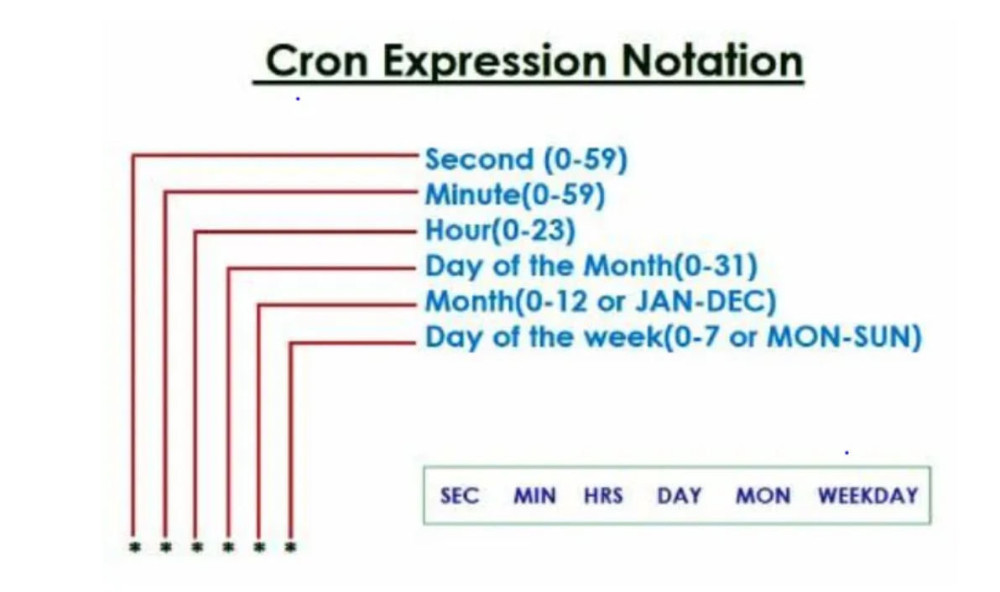

# Cron Expressions

There are 6 Asterisks(******) by default in cron expression as shown below. Further each asterisk has some meaning as they denote a value. These values can be assigned as Second, Minute, Hours, Day, Month, WeekDay respectively in sequence as shown below.
Possible values at proper place are also given below.

A Cron Expression can accept symbols : * — , / ?

---

Comma denotes passible values

0 0 4,6 * * *

Above expression denotes ‘execute given task every day 4:00:00AM and 6:00:00 AM

---
Dash (-) denotes a range which means consider all possible values between the range

0 0 4–6 * * *

To illustrate, above expression just denotes ‘execute given task every day 4:00:00AM, 5:00:00AM and 6:00:00 AM’

---

 Asterisk(*) denotes any/every/all value

 Forward slash(/) denotes period of time

 Question mark(?) denotes any value but it is applied only at Day & WeekDay when month value is given.

 ---

 Ex#1 : Write a cron expression that executes a task everyday at 8 AM

    0 0 8 * * *

 Ex#2 : Write a cron expression that executes a task everyday at 4 PM

    0 0 16 * * *   

 Ex#3 : Write a cron expression that executes a task at 9AM and 9PM every day

    0 0 9,21 * * *   

 Ex#4 :Write a cron expression that executes a task at 9AM and 8PM every day

    0 0 9,20 * * *   

 Ex#5 : Write a cron expression that executes a task at 8AM, 9AM, 10AM and 11AM every day

    0 0 8–11 * * *   

 Ex#6 : Write a cron expression that executes a task 4 times each after one hour, first at 9PM everyday

    0 0 21–00 * * *

Ex#7 : Write a cron expression that executes a task 4 times each after one hour, first at 9PM everyday

    0 0 21–00 * * * OR 0 0 21,22,23,00 * * * 

Ex#8 : Write a cron expression that executes a task 6:30AM and 9:30PM everyday

    0 30 6,21 * * *  

Ex#9 : Write a cron expression that executes a task at 0th minute and 0th second

    0 0 * * * * ( task will be executed at 00:00:00, 01:00:00, 02:00:00, 03:00:00, ……………….23:00:00)

Ex#10 : Write a cron expression that executes a task every minute at 15th second

    15 * * * * * ( task will be executed at 00:00:15, 00:01:15, 00:02:15, 00:03:15, ……………….00:59:15, 01:00:15, 01:01:15…..etc.)    

Ex#11 : Write a cron expression that executes a task 9AM 15th second(9:00:45 AM) every day

    15 0 9 * * *

Ex#12 : Write a cron expression that executes a task every year on Aug 25th 9AM

    0 0 9 25 8 *

Ex#13 : Write a cron expression that executes a task every month on 7th day at 9:30 AM

    0 30 9 7 * *

Ex#14 : Write a cron expression that executes a task every year on Feb 14th 9:00:00 AM
if given day(14th) is Sunday or Tuesday only.

    0 0 9 14 2 SUN,TUE

Ex#15 : Write a cron expression that executes a task every year in April everyday at 8AM.

    0 0 8 ? 4 ? OR 0 0 8 * 4 *

>Note : If month is given, we can use symbol ? in place of * for days & week days.  

Ex#16 : How to write a cron expression that executes a task every year to wish a happy new year.

    59 59 23 31 12 * OR 0 0 0 1 1 *

Ex#17 : How to write a cron expression that executes a task every year to wish happy birthday on 30th March.

    59 59 23 29 3 * OR 0 0 0 30 3 *

Ex#18 : How to write a cron expression that executes a task on the hour 9AM to 6PM weekdays.

    0 0 8–18 * * MON-FRI

## Examples Using Period of Time

>Use slash(/) for period of time at all positions except week days.

Ex#1 : How to write a cron expression that executes a task for every 15 sec gap.

    */15 * * * * *   

 Ex#2 : How to write a cron expression that executes a task for starting of execution at 0th sec of every minute
and also execute with 30 sec gap

    0/30 * * * * *

Ex#3 : How to write a cron expression that executes a task for Every day 11AM and repeat with a gap of 30 min

    0 0/30 11 * * * (task will be executed at 11:00:00 AM, 11:30:00 AM, then next day at 11:00:00 AM and so on…)   

 Ex#4 : How to write a cron expression that executes a task for Every hour 0th min & 0th sec with a gap of 20 secs

    0 0/20 * * * *

Ex#5 : At what time the task will be executed by cron expression : 0 0/30 8–10 * * *

    Ans: 8:00, 8:30, 9:00, 9:30, 10:00 and 10:30 every day

Ex#6 : At what time the task will be executed by cron expression : 0/20 30/10 10 * * *   

## Examples of Invalid cron expressions

Ex#1 : 0 * 10 * * *

Of course above cron expression is invalid. Once Asterisk Symbol (*) is used, then next position values are not allowed which makes expression invalid.

Ex#2 : * 0 10 * * * is invalid for the same reason as mentioned above.