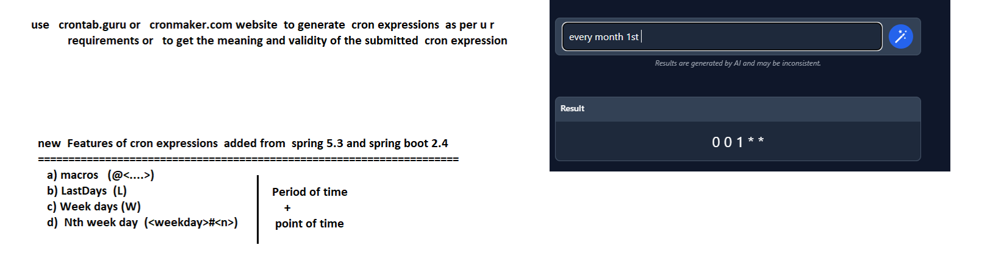
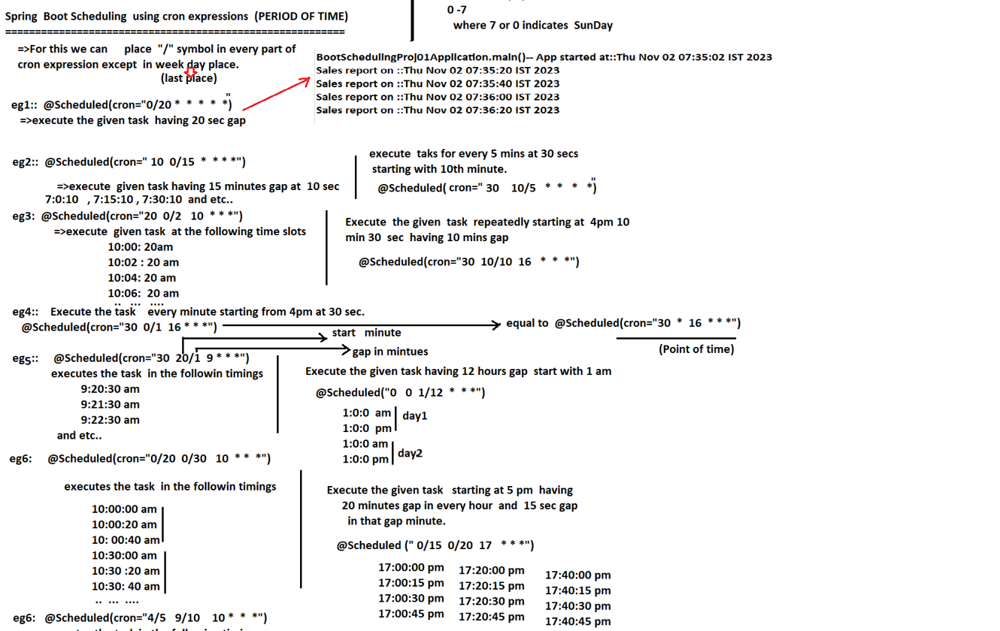
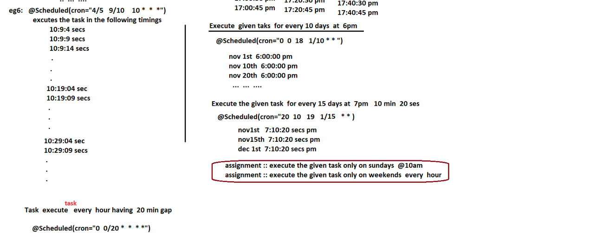

## Lec 3 and 4

Point of time means only once

Period of time means multiple time till som time ends!!

we have seen point of time example in images in last lecture!!

Cron Exp helps to get both

to get Cron Exp we can use several online sites!!

let's see period of time  now!!

 / means time-gap except weekday we can put it anywhere!!

 

 in eg 1 if you start at 35 second then also 40 th second be printed as cycle is predefined like 0/20 means start with 0 having 20 sec gap means 0,20,40 so no matter which second you start , it will be  printed it's cycle next  number!!