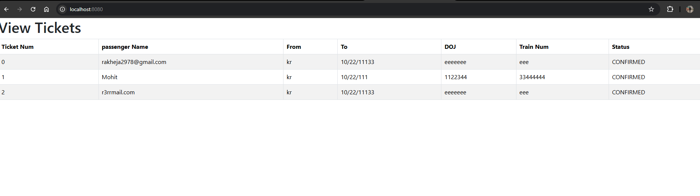
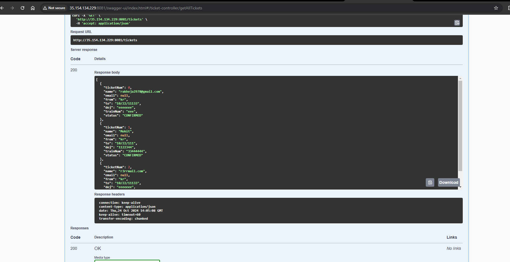

# MMT application consumer application development


=> The application which is accessing services from other applications is called as consumer application.


=> In Spring Boot, we can develop consumer in 3 ways

1) RestTemplate (synchronous - outdated)

2) WebClient  (Sync & Async) - Spring 5.x

3) FeignClient (Interservice communication) (if you are using microservice use it )

In consumer class ,we define classes based on the APIs we got from the producer!! so what entities they are
using we get from documentation , what is request and response to api we get by documentation so that how we
define the classes in consumer!! From documentation we understand what class to take and what variable class should have!!

Always remember these classes will be present in producer and consumer both whether consumer can 
be in angular,react or anything!!


## Rest Template
=> Predefined class in spring web mvc

=> We can send http requests using this class

=> It is used for consumer development

=> we have below methods

1) getForEntity(..)
2) postForEntity(..)
3) putForEntity(..)
4) deleteForEntity(..)

=> It supports only synchronous communication.		

=> Synchronous means, after sending request, consumer side thread will wait until we get response from provider.


Note: Asynchronous means after sending request, consumer side thread will not wait for provider response.

=> To work with Asynchronous communication we will use WebClient which introduced in spring 6.x version.

### Service

we are directly putting service no need of interface and then implementation!!

```java
@Service
public class MakeMyTripService {
	
	public Ticket bookTicket(Passenger p) {
		
		String apiUrl = "http://35.154.134.229:8080/ticket"; //put here your url
		RestTemplate rt = new RestTemplate();
		
		ResponseEntity<Ticket> forEntity = 
				rt.postForEntity(apiUrl, p, Ticket.class);
		//1st param-url 2nd request body data 3rd response type

		//if you do not put 3rd param you get json 3rd param tells Rest template
		//to convert to java here jackson api do not convert json to object and vice versa
		//here rest template do that

		//also 2nd parameter is converted to json by rest template and sent to provider
		Ticket body = forEntity.getBody();
		return body;
	}
	
	public List<Ticket> getAllTickets(){
		
		String apiUrl = "http://35.154.134.229:8080/tickets";
		RestTemplate rt = new RestTemplate();
		
		ResponseEntity<Ticket[]> forEntity =
				rt.getForEntity(apiUrl, Ticket[].class);
		
		// we use Ticket array Ticket[].class as json array will come as output 
		Ticket[] body = forEntity.getBody();
		
		List<Ticket> tickets = Arrays.asList(body);
		
		return tickets;
		
	}

}

```

### Controller

here we are using controller as ui is needed not using RestController

- @Controller is for rendering views (HTML/JSP), while @RestController is for returning REST API responses (like JSON).

- @RestController eliminates the need for @ResponseBody on each method, as it assumes that the controller is returning data directly.

RestController is used when no UI only rest services!!
```java
@Controller
public class MakeMyTripController {

	@Autowired
	private MakeMyTripService service;

	@PostMapping("/ticket")
	public String ticketBooking(@ModelAttribute("p") Passenger p, Model model) {
		//@ModelAttribute tells data transfer from html to java
		Ticket bookTicket = service.bookTicket(p);
		model.addAttribute("msg", "Your Ticket Booked, ID : "+ bookTicket.getTicketNum());
		return "bookTicket";
	}

	@GetMapping("/book-ticket")
	public String bookTicket(Model model) {
		model.addAttribute("p", new Passenger());
		return "bookTicket";
	}

	@GetMapping("/")
	public String index(Model model) {
		List<Ticket> allTickets = service.getAllTickets();
		model.addAttribute("tickets", allTickets);
		return "index";
		//model to send data from java to html
	}

}
```

### UI

go to getbootstrap.com for every element

##### bookTicket.html
```html
<!doctype html>
<html lang="en">

<head>
	<meta charset="utf-8">
	<meta name="viewport" content="width=device-width, initial-scale=1">
	<title>Bootstrap demo</title>
	<link href="https://cdn.jsdelivr.net/npm/bootstrap@5.3.2/dist/css/bootstrap.min.css" rel="stylesheet"
		integrity="sha384-T3c6CoIi6uLrA9TneNEoa7RxnatzjcDSCmG1MXxSR1GAsXEV/Dwwykc2MPK8M2HN" crossorigin="anonymous">
</head>

<body>

	<div class="container">

		<h1>Book Ticket Here</h1>
		<font color='green'>
			<p th:text="${msg}"></p>
		</font>

		<form th:action="@{/ticket}" th:object="${p}" method="post">
			<table>
				<tr>
					<td>Name</td>
					<td><input type="text" th:field="*{name}" /></td>
				</tr>
				<tr>
					<td>From</td>
					<td><input type="text" th:field="*{from}" /></td>
				</tr>
				<tr>
					<td>To</td>
					<td><input type="text" th:field="*{to}" /></td>
				</tr>
				<tr>
					<td>DOJ</td>
					<td><input type="text" th:field="*{doj}" /></td>
				</tr>
				<tr>
					<td>Train Num</td>
					<td><input type="text" th:field="*{trainNum}" /></td>
				</tr>
				<tr>
					<td></td>
					<td><input type="submit" value="Book Ticket" class="btn btn-primary" /></td>
				</tr>

			</table>
		</form>
		
		<a href="/" clas="btn btn-danger">View Tickets</a>
	</div>
	<script src="https://cdn.jsdelivr.net/npm/bootstrap@5.3.2/dist/js/bootstrap.bundle.min.js"
		integrity="sha384-C6RzsynM9kWDrMNeT87bh95OGNyZPhcTNXj1NW7RuBCsyN/o0jlpcV8Qyq46cDfL"
		crossorigin="anonymous"></script>
</body>
</html>
```
##### View Ticket index.html

```html

<!doctype html>
<html lang="en">

<head>
	<meta charset="utf-8">
	<meta name="viewport" content="width=device-width, initial-scale=1">
	<title>Bootstrap demo</title>
	<link href="https://cdn.jsdelivr.net/npm/bootstrap@5.3.2/dist/css/bootstrap.min.css" rel="stylesheet"
		integrity="sha384-T3c6CoIi6uLrA9TneNEoa7RxnatzjcDSCmG1MXxSR1GAsXEV/Dwwykc2MPK8M2HN" crossorigin="anonymous">
</head>

<body>

	<div class="container">
		<a href="book-ticket" class="btn btn-primary">Book Ticket</a>
		<h1>View Tickets</h1>

		<table class="table table-bordered table-striped">
			<thead>
				<tr>
					<th>Ticket Num</th>
					<th>Passenger Name</th>
					<th>From</th>
					<th>To</th>
					<th>DOJ</th>
					<th>Train Num</th>
					<th>Status</th>
				</tr>
			</thead>
			<tbody>
				<tr th:each="t : ${tickets}">
					<td th:text="${t.ticketNum}"></td>
					<td th:text="${t.name}"></td>
					<td th:text="${t.from}"></td>
					<td th:text="${t.to}"></td>
					<td th:text="${t.doj}"></td>
					<td th:text="${t.trainNum}"></td>
					<td th:text="${t.status}"></td>
				</tr>
			</tbody>
		</table>
	</div>
	<script src="https://cdn.jsdelivr.net/npm/bootstrap@5.3.2/dist/js/bootstrap.bundle.min.js"
		integrity="sha384-C6RzsynM9kWDrMNeT87bh95OGNyZPhcTNXj1NW7RuBCsyN/o0jlpcV8Qyq46cDfL"
		crossorigin="anonymous"></script>
</body>

</html>
```

output:
consumer:


producer:


This is called as Distributed application!! one application calling other application !!


you can see rest template articles on internet!! you need not know it all !! just know 
how to search on internet!!

