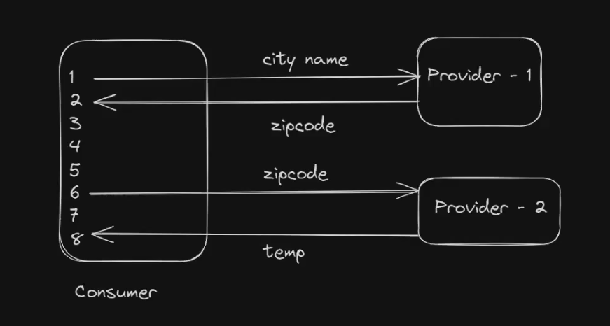
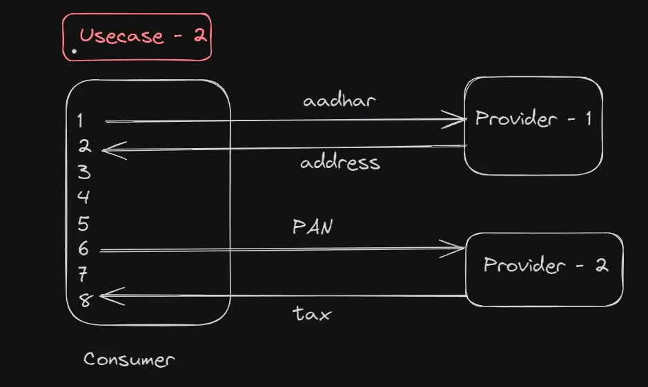

# Consumer development lec-8 webclient 

sync means consumer side thread will block until we get response from provider!!

sync means if line 10 calls the provider API then consumer will not execute line 11 till provider give us response!! so our thread will be waiting!!

In async we need not wait for line 10 to complete!!We create a subscriber  which handles response from provider!!

subscriber is just like a method which execute when we get response!!

using sync and async communication depends on the usage!!

suppose using 2 providers!!

provider-1 takes input city name and gives zip code!! then zip code is given to provider-2 which gives temperature!! here we need to wait for response of provider-1 as it give zip code and then zip code is used by provider-2 !! request-2 depends on request-1 ! so here we use sync communication!!

see case-2 request-2 is not dependent on request-1 so use async here!!

>Note: Webclient supports both sync & async communications.

=> WebClient is an interface which is part of 'web-flux' starter.

=> WebFlux starter will provide 'netty' as default embedded container.

