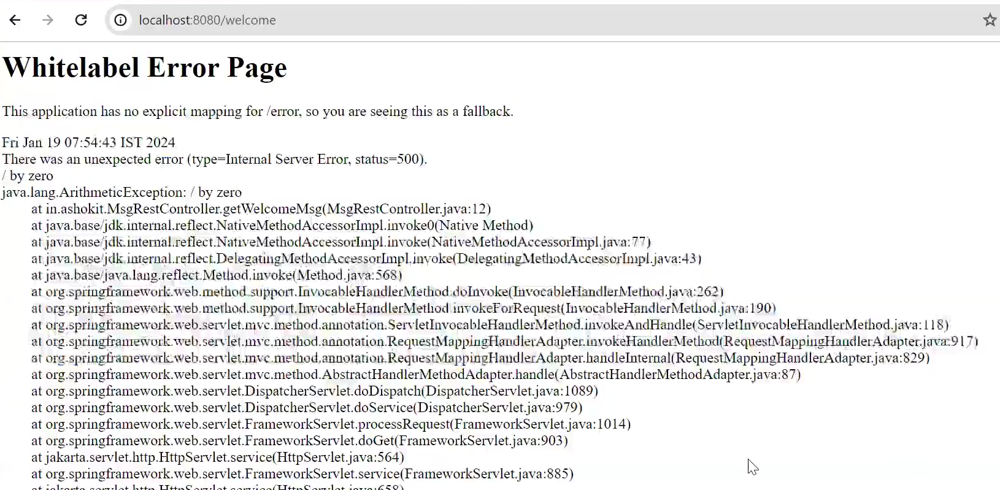
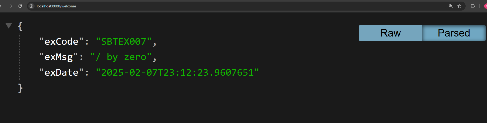
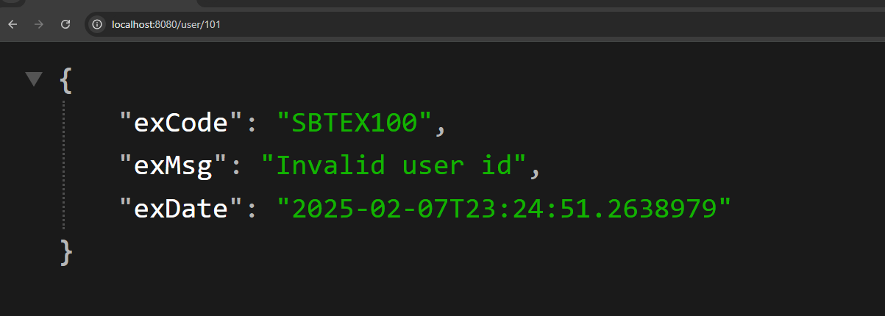

# Exception Handling in REST API

In java we use try , catch , throw ,throws whenever program terminated abnormally!!


1) Local Exception Handling : Specific to particular controller class

2) Global Exception Handling : Through out application

we created project 009 for this only two dependency 

1. Spring web 
2. devtools

Let us first create MsgController
```java
@RestController
public class MsgController {
	@GetMapping("/welcome")
	public String getMsg() {
		
		String msg = "Welcome To Ashok It";
		int i = 10/0;
		
		return msg;
		
	}
	

}

```

When we hit this APi we get error page That whitelabel error page of springboot!!



and on console we get this


```text

java.lang.ArithmeticException: / by zero
	at com.example.demo.Rest.MsgController.getMsg(MsgController.java:12) ~[classes/:na]
	at java.base/jdk.internal.reflect.DirectMethodHandleAccessor.invoke(DirectMethodHandleAccessor.java:103) ~[na:na]
	at java.base/java.lang.reflect.Method.invoke(Method.java:580) ~[na:na]
	at org.springframework.web.method.support.InvocableHandlerMethod.doInvoke(InvocableHandlerMethod.java:257) ~[spring-web-6.2.2.jar:6.2.2]
	at org.springframework.web.method.support.InvocableHandlerMethod.invokeForRequest(InvocableHandlerMethod.java:190) ~[spring-web-6.2.2.jar:6.2.2]
	at org.springframework.web.servlet.mvc.method.annotation.ServletInvocableHandlerMethod.invokeAndHandle(ServletInvocableHandlerMethod.java:118) ~[spring-webmvc-6.2.2.jar:6.2.2]
	at org.springframework.web.servlet.mvc.method.annotation.RequestMappingHandlerAdapter.invokeHandlerMethod(RequestMappingHandlerAdapter.java:986) ~[spring-webmvc-6.2.2.jar:6.2.2]
	at org.springframework.web.servlet.mvc.method.annotation.RequestMappingHandlerAdapter.handleInternal(RequestMappingHandlerAdapter.java:891) ~[spring-webmvc-6.2.2.jar:6.2.2]
	at org.springframework.web.servlet.mvc.method.AbstractHandlerMethodAdapter.handle(AbstractHandlerMethodAdapter.java:87) ~[spring-webmvc-6.2.2.jar:6.2.2]
	at org.springframework.web.servlet.DispatcherServlet.doDispatch(DispatcherServlet.java:1088) ~[spring-webmvc-6.2.2.jar:6.2.2]
	at org.springframework.web.servlet.DispatcherServlet.doService(DispatcherServlet.java:978) ~[spring-webmvc-6.2.2.jar:6.2.2]
	at org.springframework.web.servlet.FrameworkServlet.processRequest(FrameworkServlet.java:1014) ~[spring-webmvc-6.2.2.jar:6.2.2]
	at org.springframework.web.servlet.FrameworkServlet.doGet(FrameworkServlet.java:903) ~[spring-webmvc-6.2.2.jar:6.2.2]
	at jakarta.servlet.http.HttpServlet.service(HttpServlet.java:564) ~[tomcat-embed-core-10.1.34.jar:6.0]
	at org.springframework.web.servlet.FrameworkServlet.service(FrameworkServlet.java:885) ~[spring-webmvc-6.2.2.jar:6.2.2]
	at jakarta.servlet.http.HttpServlet.service(HttpServlet.java:658) ~[tomcat-embed-core-10.1.34.jar:6.0]
	at org.apache.catalina.core.ApplicationFilterChain.internalDoFilter(ApplicationFilterChain.java:195) ~[tomcat-embed-core-10.1.34.jar:10.1.34]
	at org.apache.catalina.core.ApplicationFilterChain.doFilter(ApplicationFilterChain.java:140) ~[tomcat-embed-core-10.1.34.jar:10.1.34]
	at org.apache.tomcat.websocket.server.WsFilter.doFilter(WsFilter.java:51) ~[tomcat-embed-websocket-10.1.34.jar:10.1.34]
	at org.apache.catalina.core.ApplicationFilterChain.internalDoFilter(ApplicationFilterChain.java:164) ~[tomcat-embed-core-10.1.34.jar:10.1.34]
	at org.apache.catalina.core.ApplicationFilterChain.doFilter(ApplicationFilterChain.java:140) ~[tomcat-embed-core-10.1.34.jar:10.1.34]
	at org.springframework.web.filter.RequestContextFilter.doFilterInternal(RequestContextFilter.java:100) ~[spring-web-6.2.2.jar:6.2.2]
	at org.springframework.web.filter.OncePerRequestFilter.doFilter(OncePerRequestFilter.java:116) ~[spring-web-6.2.2.jar:6.2.2]
	at org.apache.catalina.core.ApplicationFilterChain.internalDoFilter(ApplicationFilterChain.java:164) ~[tomcat-embed-core-10.1.34.jar:10.1.34]
	at org.apache.catalina.core.ApplicationFilterChain.doFilter(ApplicationFilterChain.java:140) ~[tomcat-embed-core-10.1.34.jar:10.1.34]
	at org.springframework.web.filter.FormContentFilter.doFilterInternal(FormContentFilter.java:93) ~[spring-web-6.2.2.jar:6.2.2]
	at org.springframework.web.filter.OncePerRequestFilter.doFilter(OncePerRequestFilter.java:116) ~[spring-web-6.2.2.jar:6.2.

```

we do not want that page to come and this big exception warning so we create our custom handler!!

Now we create a Exception class AppExceptionInfo class 

```java
public class AppExInfo {
	private String exCode;
	
	private String exMsg;
	
	private LocalDateTime exDate;

	public String getExCode() {
		return exCode;
	}

	public void setExCode(String exCode) {
		this.exCode = exCode;
	}

	public String getExMsg() {
		return exMsg;
	}

	public void setExMsg(String exMsg) {
		this.exMsg = exMsg;
	}

	public LocalDateTime getExDate() {
		return exDate;
	}

	public void setExDate(LocalDateTime exDate) {
		this.exDate = exDate;
	}
	
	
}

```

Then to handle Exception we create a Exception Handler

```java
@RestControllerAdvice // tells that this class will handle exception
public class ExceptionRestHandler {

	@ExceptionHandler(Exception.class) // In ExceptionHandler we tell which type of exception this method will handle
	public ResponseEntity<AppExInfo> handleAE(Exception e){
		
		AppExInfo info = new AppExInfo();
		
		info.setExCode("SBTEX007");
		info.setExMsg(e.getMessage());
		info.setExDate(LocalDateTime.now());
	
		return new ResponseEntity<>(info,HttpStatus.INTERNAL_SERVER_ERROR);
	}
}

```
Now see output



Now let us create our custom Exception

UserNotFoundException

```java

public class UserNotFoundException extends RuntimeException {

	
	
	public UserNotFoundException(String message) {
		super(message);
		// TODO Auto-generated constructor stub
	}


}

```

let us create a controller who throw this


```java
@RestController
public class UserController {
	
	@GetMapping("/user/{uid}")
	public String getNameById(@PathVariable("uid")  Integer uid) {
		
		if(uid <= 100) {
			return "Balu";
		}else {
			
			throw  new UserNotFoundException("Invalid user id");
		}
	}
	

}

```

To hande this we put one more method in handler

```java
@RestControllerAdvice
public class ExceptionRestHandler {

	
	@ExceptionHandler(UserNotFoundException.class)
	public ResponseEntity<AppExInfo> handleAE(UserNotFoundException e){
		
		AppExInfo info = new AppExInfo();
		
		info.setExCode("SBTEX100");
		info.setExMsg(e.getMessage());
		info.setExDate(LocalDateTime.now());
	
		return new ResponseEntity<>(info,HttpStatus.BAD_REQUEST);
	}
	
	@ExceptionHandler(Exception.class)
	public ResponseEntity<AppExInfo> handleAE(Exception e){
		
		AppExInfo info = new AppExInfo();
		
		info.setExCode("SBTEX007");
		info.setExMsg(e.getMessage());
		info.setExDate(LocalDateTime.now());
	
		return new ResponseEntity<>(info,HttpStatus.INTERNAL_SERVER_ERROR);
	}
}


```

Specific type exception method must come above method Expecting Exception.class method as all other Exceptions are subclass of Exception 

Output:

