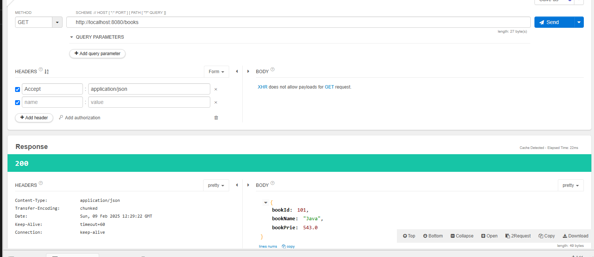
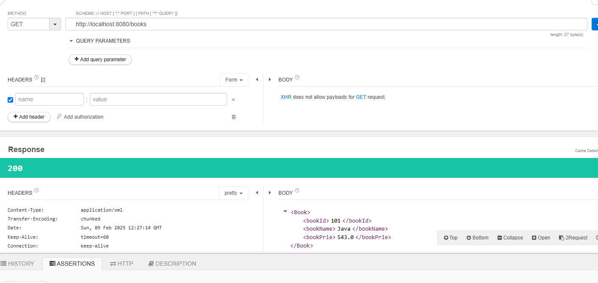
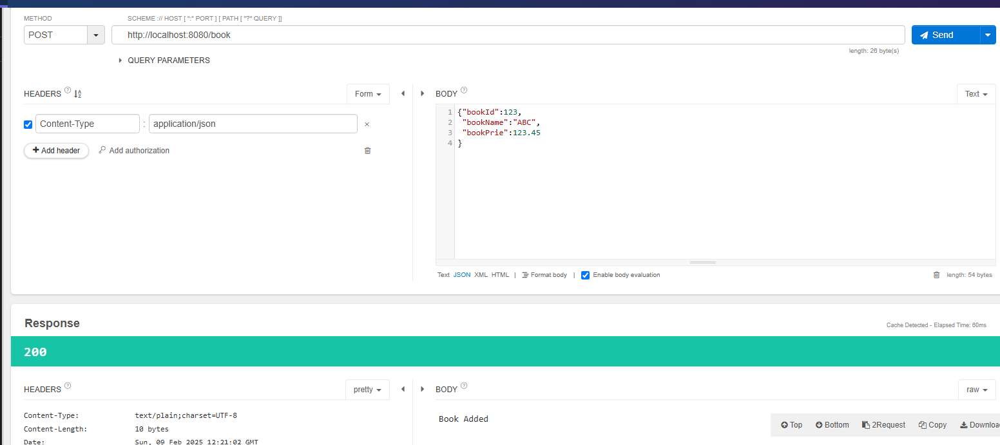
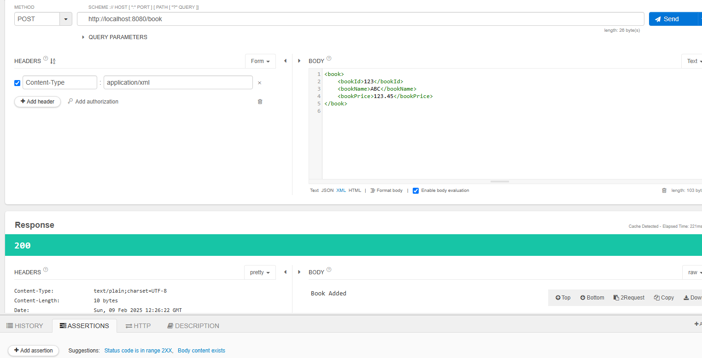

# Dealing with XML data

We have till now dealt will JSon data , now we want to deal with XML data as input and output!!

Suppose one consumer deals with json and other deals with XML!!


Our rest api should deal with both JSOn and XML!!
For JSON springboot internally uses Jackson ApI!! In order to deal with XMl ,java uses JAX-B API!!!
we need to add this dependency ,unlike jackson it is not given to us by default!!

-> Add below dependency in pom.xml file
```xml
		<dependency>
			<groupId>com.fasterxml.jackson.dataformat</groupId>
			<artifactId>jackson-dataformat-xml</artifactId>
		</dependency>
```

consumes : It represents input data format of provider (request body data)

	consumes = { "application/xml", "application/json" }

produces : It represents output data format of provider (response body data)

	produces = { "application/xml", "application/json" }

### Http Header

Accept Http Header: It represents in which format consumer expecting response from provider

	Ex: Accept = application/xml
		Accept = application/json

Content-Type Http Header: It represents in which format consumer sending data to provider

	Ex: Content-Type = application/xml
		Content-Type = application/json

## Controller

 ```java

@RestController
public class BookRestController {
	
	@PostMapping(
			value = "/book",
			consumes= {"application/xml", "application/json"},
			produces = "text/plain"
	)
	public String addBook(@RequestBody Book b) {
		System.out.println(b);
		// logic to save in db
		return "Book Added";
	}
	
	
	@GetMapping( 
			value = "/books",
			produces = {"application/xml", "application/json"}
	)
	public Book getBook() {
		Book book = new Book(101, "Java", 543.00);
		return book;
	}
}


 ```       

 ## Entity

 ```java

public class Book {

	private Integer bookId;
	
	private String bookName;
	
	private Double bookPrie;
	
	public Book() {
		
	}

	public Book(Integer bookId, String bookName, Double bookPrie) {
		
		this.bookId = bookId;
		this.bookName = bookName;
		this.bookPrie = bookPrie;
	}

	public Integer getBookId() {
		return bookId;
	}

	public void setBookId(Integer bookId) {
		this.bookId = bookId;
	}

	public String getBookName() {
		return bookName;
	}

	public void setBookName(String bookName) {
		this.bookName = bookName;
	}

	public Double getBookPrie() {
		return bookPrie;
	}

	public void setBookPrie(Double bookPrie) {
		this.bookPrie = bookPrie;
	}

	@Override
	public String toString() {
		return "Book [bookId=" + bookId + ", bookName=" + bookName + ", bookPrie=" + bookPrie + "]";
	}
	
	
}

 ```
## Output of get API in JSON

Consumer needs to tell which type of response it needs that is told in accept header as given in the below image!!

we cannot send this Get request by browser as we need to tell header too so using talend!!




## output of get APi in xml

By default output given in XML when we put xml dependency!!If we do not add then default is JSON!!




## Output  input is json

 

## Output input is xml

 

 See 010 in code!!

