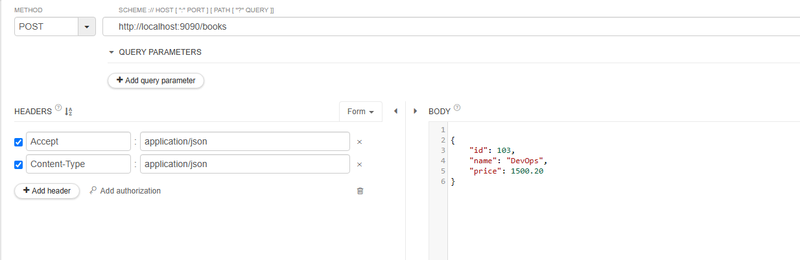
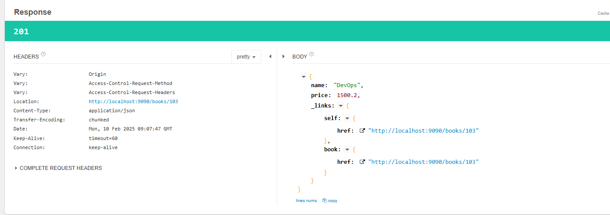
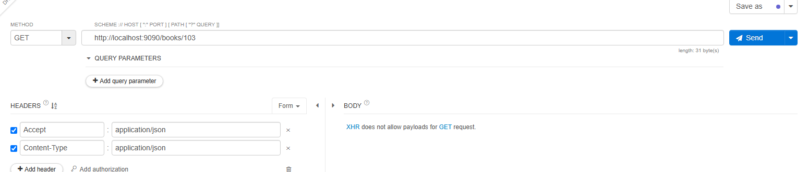
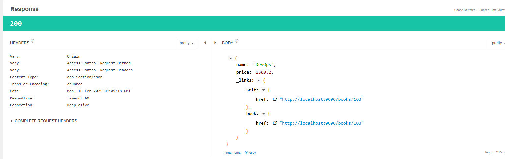
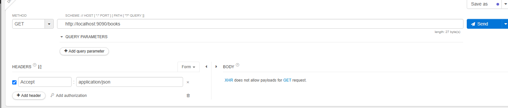
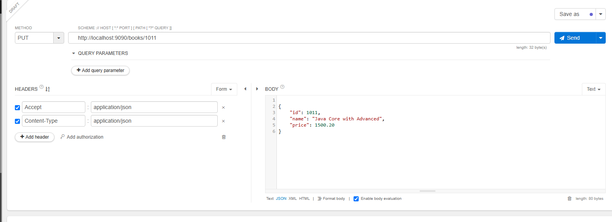

# Spring Data REST

It helps to expose Repository not via Rest ApI but directly!!

No need to create Rest Controller!!

This we use when we have only CRUD operations and no business logic required!!

=> It is used to simplify REST API development

		RestController + JpaRepository = RestRepositoryResource


1) Create Spring starter project with below dependencies

		a) rest-repositories (data-rest)
		b) data-jpa
		c) mysql-connector-j
		d) devtools

2) Configure datasource properties 

```properties
spring.application.name=011-spring-data-rest

server.port=9090
spring.datasource.username=root
spring.datasource.password=root
spring.datasource.url=jdbc:mysql://localhost:3306/mohit?createDatabaseIfNotExist=true

spring.jpa.hibernate.ddl-auto=update
spring.jpa.show-sql=true


```

3) Create Entity class for table mapping

```java
@Entity
@Table(name = "book_tbl")
public class Book {

	@Id
	private Integer id;
	private String name;
	private Double price;

}
```
4) Create Rest Repository to expose REST API methods (Not a normal repository)

```java
@RepositoryRestResource(path = "books")
public interface BookRepository extends JpaRepository<Book, Integer>{


}
```
The @RepositoryRestResource annotation is used in Spring Data REST to expose repository methods as RESTful endpoints automatically. Your annotation:

`@RepositoryRestResource(path = "books")`
means that Spring Data REST will expose your repository under the /books endpoint.

5) Run the application and test it using POSTMAN

No need to have any method just put json in post and repository will put in DB


```json
POST : http://localhost:9090/books

{
    "id": 103,
    "name": "DevOps",
    "price": 1500.20
}
```



response




In put just put id and updated json

GEt api





Getall Books--> if you do not give id



Response
```json
{
    "_embedded": {
        "books": [
            {
                "name": "Spring Boot in Action",
                "price": null,
                "_links": {
                    "self": {
                        "href": "http://localhost:9090/books/1"//telling link to get this json
                    },
                    "book": {
                        "href": "http://localhost:9090/books/1"
                    }
                }
            },
            {
                "name": "DevOps",
                "price": 1500.2,
                "_links": {
                    "self": {
                        "href": "http://localhost:9090/books/103"
                    },
                    "book": {
                        "href": "http://localhost:9090/books/103"
                    }
                }
            },
            {
                "name": "Java",
                "price": 1500.2,
                "_links": {
                    "self": {
                        "href": "http://localhost:9090/books/1011"
                    },
                    "book": {
                        "href": "http://localhost:9090/books/1011"
                    }
                }
            }
        ]
    },
    "_links": {
        "self": {
            "href": "http://localhost:9090/books?page=0&size=20"
        },
        "profile": {
            "href": "http://localhost:9090/profile/books"
        },
        "search": {
            "href": "http://localhost:9090/books/search"
        }
    },
    "page": {
        "size": 20,
        "totalElements": 3,
        "totalPages": 1,
        "number": 0
    }
}

```
this links 
```json
    "_links": {
        "self": {
            "href": "http://localhost:9090/books?page=0&size=20"
        },
        "profile": {
            "href": "http://localhost:9090/profile/books"
        },
        "search": {
            "href": "http://localhost:9090/books/search"
        }
    },
```
are called as hypermedia !! This link concept is called as HATEOs concept which is exposing data as hyperlink!!


HATEOAS (Hypermedia as the Engine of Application State) is a principle in RESTful API design where clients interact with a REST API through dynamically provided links rather than relying on fixed URIs.


- Hypermedia-Driven: API responses include links (URLs) to other resources or actions that the client can take.
- Decouples Clients from APIs: The client doesn't need to hardcode API routes; it discovers available actions dynamically.
- Enhances API Discoverability: Like navigating a website, clients can explore the API by following links.
- Follows REST Maturity Model (Level 3): HATEOAS is the highest level (Level 3) in Richardson's REST Maturity Model.
Example in a REST API
A traditional API response without HATEOAS:

```json
{
  "id": 1,
  "name": "John Doe",
  "email": "john.doe@example.com"
}
```
With HATEOAS, links to related actions are included:


```json
{
  "id": 1,
  "name": "John Doe",
  "email": "john.doe@example.com",
  "_links": {
    "self": { "href": "/users/1" },
    "update": { "href": "/users/1", "method": "PUT" },
    "delete": { "href": "/users/1", "method": "DELETE" }
  }
}
```

```json
//in put we need to pass id in url!!

PUT : http://localhost:9090/books/103

{
    "id": 103,
    "name": "DevOps",
    "price": 2500.20
}


GET : http://localhost:9090/books

GET : http://localhost:9090/books/101
```
till now no need for anything but now we want to find by name so we need to write custom method in Repository!!

```java
@RepositoryRestResource(path = "books")
public interface BookRepository extends JpaRepository<Book, Integer>{
	//Custom operation 
	public List<Book> findByName(@Param("name") String name);

}
```

```json

GET : http://localhost:9090/books/search/findByName?name=Java
```
Response
```json
{
    "_embedded": {
        "books": [
            {
                "name": "Java",
                "price": 1500.2,
                "_links": {
                    "self": {
                        "href": "http://localhost:9090/books/1011"
                    },
                    "book": {
                        "href": "http://localhost:9090/books/1011"
                    }
                }
            }
        ]
    },
    "_links": {
        "self": {
            "href": "http://localhost:9090/books/search/findByName?name=Java"
        }
    }
}

```
```json
//delete api
DELETE : http://localhost:9090/books/101

```

## How to disable HTTP Requests in Data REST application ?

=> Add below class in Data REST Application to disable PUT and DELETE methods.

>Note: With below configuration our api will not accept PUT and DELETE methods.

```java
@Configuration
public class MyDataRestConfig implements RepositoryRestConfigurer {
	
	@Override
	public void configureRepositoryRestConfiguration(RepositoryRestConfiguration config, CorsRegistry cors) {

		HttpMethod[] unsupportedMethods = { HttpMethod.PUT, HttpMethod.DELETE };
		
		config.getExposureConfiguration()
			  .forDomainType(Book.class)
			  .withItemExposure((metadata, http) -> http.disable(unsupportedMethods)) //disable for single record
			  .withCollectionExposure((metadata,http) -> http.disable(unsupportedMethods)); //disable for multiple record
		
	}
}

```

We try put request



```text
2025-02-10T16:12:03.119+05:30  INFO 10588 --- [011-spring-data-rest] [nio-9090-exec-1] o.s.web.servlet.DispatcherServlet        : Completed initialization in 4 ms
Hibernate: select b1_0.id,b1_0.name,b1_0.price from book_tbl b1_0 where b1_0.id=?
2025-02-10T16:12:03.219+05:30  WARN 10588 --- [011-spring-data-rest] [nio-9090-exec-1] .m.m.a.ExceptionHandlerExceptionResolver : Resolved [org.springframework.web.HttpRequestMethodNotSupportedException: Request method 'PUT' is not supported]
```

Notes:

1. We go for web-starter for  restController and RestTemplate

2. To use WebClient use web-flux (reactive-web)

3. When you want simple CRUD operation ,no business logic use spring-data-rest

## Async communication

In sync communication our application get blocked till we get response from provider!!
we do not want that !! we want our application should work while getting the response!!

To go with async communication we cannot go with rest template!!so for this we can use Web client!! so we use Reactive web dependency which has web flux!!

Rest template is class but web client is interface so cannot call new Webclient()!! so we call 
factory method create() for webClient!!
```java
@Service
public class QuoteService {
	
	private static final String QUOTE_ENDPOINT  = "https://type.fit/api/quotes";
	
	public void getQuoteV2() {
		
		WebClient client = WebClient.create();
		
		 System.out.println("Rest api call started...");
		 	
			client.get()
				  .uri(QUOTE_ENDPOINT)
				  .header("Accept", "application/json")
				  .retrieve()
				  .bodyToMono(String.class)
				  .subscribe(QuoteService::handleResponse);
			
		  System.out.println("Rest api call completed...");
	}
	
	public static void handleResponse(String s) {
		System.out.println(s);
		// logic
	}
	
	public void getQuoteV1() {
		
		WebClient client = WebClient.create();
		
		 System.out.println("Rest api call started...");
		 	
		  Mono<String> bodyToMono = client.get()
										  .uri(QUOTE_ENDPOINT)
										  .retrieve()// gives json
										  .bodyToMono(String.class);// convert json to given class
		  
		  System.out.println(bodyToMono.block());//to block
		  
		  System.out.println("Rest api call completed...");
	}

}


```
Main class

```java
@SpringBootApplication
public class Application {

	public static void main(String[] args) {
		ConfigurableApplicationContext run = SpringApplication.run(Application.class, args);
		
		QuoteService bean = run.getBean(QuoteService.class);
		
		bean.getQuoteV1();
	}

}

```

output of above sync call

```text
2025-02-14T12:22:13.861+05:30  INFO 78092 --- [011-spring-data-rest-1] [           main] com.mohit.app.Application                : Started Application in 7.091 seconds (process running for 8.932)
Rest api call started...
[
  {
    "id": 1,
    "name": "Leanne Graham",
    "username": "Bret",
    "email": "Sincere@april.biz",
    "address": {
      "street": "Kulas Light",
      "suite": "Apt. 556",
      "city": "Gwenborough",
      "zipcode": "92998-3874",
      "geo": {
        "lat": "-37.3159",
        "lng": "81.1496"
      }
    },
    "phone": "1-770-736-8031 x56442",
    "website": "hildegard.org",
    "company": {
      "name": "Romaguera-Crona",
      "catchPhrase": "Multi-layered client-server neural-net",
      "bs": "harness real-time e-markets"
    }
  },
  {
    "id": 2,
    "name": "Ervin Howell",
    "username": "Antonette",
    "email": "Shanna@melissa.tv",
    "address": {
      "street": "Victor Plains",
      "suite": "Suite 879",
      "city": "Wisokyburgh",
      "zipcode": "90566-7771",
      "geo": {
        "lat": "-43.9509",
        "lng": "-34.4618"
      }
    },
    "phone": "010-692-6593 x09125",
    "website": "anastasia.net",
    "company": {
      "name": "Deckow-Crist",
      "catchPhrase": "Proactive didactic contingency",
      "bs": "synergize scalable supply-chains"
    }
  },
  {
    "id": 3,
    "name": "Clementine Bauch",
    "username": "Samantha",
    "email": "Nathan@yesenia.net",
    "address": {
      "street": "Douglas Extension",
      "suite": "Suite 847",
      "city": "McKenziehaven",
      "zipcode": "59590-4157",
      "geo": {
        "lat": "-68.6102",
        "lng": "-47.0653"
      }
    },
    "phone": "1-463-123-4447",
    "website": "ramiro.info",
    "company": {
      "name": "Romaguera-Jacobson",
      "catchPhrase": "Face to face bifurcated interface",
      "bs": "e-enable strategic applications"
    }
  },
  {
    "id": 4,
    "name": "Patricia Lebsack",
    "username": "Karianne",
    "email": "Julianne.OConner@kory.org",
    "address": {
      "street": "Hoeger Mall",
      "suite": "Apt. 692",
      "city": "South Elvis",
      "zipcode": "53919-4257",
      "geo": {
        "lat": "29.4572",
        "lng": "-164.2990"
      }
    },
    "phone": "493-170-9623 x156",
    "website": "kale.biz",
    "company": {
      "name": "Robel-Corkery",
      "catchPhrase": "Multi-tiered zero tolerance productivity",
      "bs": "transition cutting-edge web services"
    }
  },
  {
    "id": 5,
    "name": "Chelsey Dietrich",
    "username": "Kamren",
    "email": "Lucio_Hettinger@annie.ca",
    "address": {
      "street": "Skiles Walks",
      "suite": "Suite 351",
      "city": "Roscoeview",
      "zipcode": "33263",
      "geo": {
        "lat": "-31.8129",
        "lng": "62.5342"
      }
    },
    "phone": "(254)954-1289",
    "website": "demarco.info",
    "company": {
      "name": "Keebler LLC",
      "catchPhrase": "User-centric fault-tolerant solution",
      "bs": "revolutionize end-to-end systems"
    }
  },
  {
    "id": 6,
    "name": "Mrs. Dennis Schulist",
    "username": "Leopoldo_Corkery",
    "email": "Karley_Dach@jasper.info",
    "address": {
      "street": "Norberto Crossing",
      "suite": "Apt. 950",
      "city": "South Christy",
      "zipcode": "23505-1337",
      "geo": {
        "lat": "-71.4197",
        "lng": "71.7478"
      }
    },
    "phone": "1-477-935-8478 x6430",
    "website": "ola.org",
    "company": {
      "name": "Considine-Lockman",
      "catchPhrase": "Synchronised bottom-line interface",
      "bs": "e-enable innovative applications"
    }
  },
  {
    "id": 7,
    "name": "Kurtis Weissnat",
    "username": "Elwyn.Skiles",
    "email": "Telly.Hoeger@billy.biz",
    "address": {
      "street": "Rex Trail",
      "suite": "Suite 280",
      "city": "Howemouth",
      "zipcode": "58804-1099",
      "geo": {
        "lat": "24.8918",
        "lng": "21.8984"
      }
    },
    "phone": "210.067.6132",
    "website": "elvis.io",
    "company": {
      "name": "Johns Group",
      "catchPhrase": "Configurable multimedia task-force",
      "bs": "generate enterprise e-tailers"
    }
  },
  {
    "id": 8,
    "name": "Nicholas Runolfsdottir V",
    "username": "Maxime_Nienow",
    "email": "Sherwood@rosamond.me",
    "address": {
      "street": "Ellsworth Summit",
      "suite": "Suite 729",
      "city": "Aliyaview",
      "zipcode": "45169",
      "geo": {
        "lat": "-14.3990",
        "lng": "-120.7677"
      }
    },
    "phone": "586.493.6943 x140",
    "website": "jacynthe.com",
    "company": {
      "name": "Abernathy Group",
      "catchPhrase": "Implemented secondary concept",
      "bs": "e-enable extensible e-tailers"
    }
  },
  {
    "id": 9,
    "name": "Glenna Reichert",
    "username": "Delphine",
    "email": "Chaim_McDermott@dana.io",
    "address": {
      "street": "Dayna Park",
      "suite": "Suite 449",
      "city": "Bartholomebury",
      "zipcode": "76495-3109",
      "geo": {
        "lat": "24.6463",
        "lng": "-168.8889"
      }
    },
    "phone": "(775)976-6794 x41206",
    "website": "conrad.com",
    "company": {
      "name": "Yost and Sons",
      "catchPhrase": "Switchable contextually-based project",
      "bs": "aggregate real-time technologies"
    }
  },
  {
    "id": 10,
    "name": "Clementina DuBuque",
    "username": "Moriah.Stanton",
    "email": "Rey.Padberg@karina.biz",
    "address": {
      "street": "Kattie Turnpike",
      "suite": "Suite 198",
      "city": "Lebsackbury",
      "zipcode": "31428-2261",
      "geo": {
        "lat": "-38.2386",
        "lng": "57.2232"
      }
    },
    "phone": "024-648-3804",
    "website": "ambrose.net",
    "company": {
      "name": "Hoeger LLC",
      "catchPhrase": "Centralized empowering task-force",
      "bs": "target end-to-end models"
    }
  }
]
Rest api call completed...

````

### Main app-async one
```java
@SpringBootApplication
public class Application {

	public static void main(String[] args) {
		ConfigurableApplicationContext run = SpringApplication.run(Application.class, args);
		
		QuoteService bean = run.getBean(QuoteService.class);
		
		bean.getQuoteV2();
	}

}

```

### Output 
see here application not waiting for response , we just subscribed we are not waiting for the response!!

```text

2025-02-14T12:24:47.552+05:30  INFO 38472 --- [011-spring-data-rest-1] [           main] com.mohit.app.Application                : Started Application in 3.301 seconds (process running for 4.74)
Rest api call started...
Rest api call completed...
[
  {
    "id": 1,
    "name": "Leanne Graham",
    "username": "Bret",
    "email": "Sincere@april.biz",
    "address": {
      "street": "Kulas Light",
      "suite": "Apt. 556",
      "city": "Gwenborough",
      "zipcode": "92998-3874",
      "geo": {
        "lat": "-37.3159",
        "lng": "81.1496"
      }
    },
    "phone": "1-770-736-8031 x56442",
    "website": "hildegard.org",
    "company": {
      "name": "Romaguera-Crona",
      "catchPhrase": "Multi-layered client-server neural-net",
      "bs": "harness real-time e-markets"
    }
  },
  {
    "id": 2,
    "name": "Ervin Howell",
    "username": "Antonette",
    "email": "Shanna@melissa.tv",
    "address": {
      "street": "Victor Plains",
      "suite": "Suite 879",
      "city": "Wisokyburgh",
      "zipcode": "90566-7771",
      "geo": {
        "lat": "-43.9509",
        "lng": "-34.4618"
      }
    },
    "phone": "010-692-6593 x09125",
    "website": "anastasia.net",
    "company": {
      "name": "Deckow-Crist",
      "catchPhrase": "Proactive didactic contingency",
      "bs": "synergize scalable supply-chains"
    }
  },
  {
    "id": 3,
    "name": "Clementine Bauch",
    "username": "Samantha",
    "email": "Nathan@yesenia.net",
    "address": {
      "street": "Douglas Extension",
      "suite": "Suite 847",
      "city": "McKenziehaven",
      "zipcode": "59590-4157",
      "geo": {
        "lat": "-68.6102",
        "lng": "-47.0653"
      }
    },
    "phone": "1-463-123-4447",
    "website": "ramiro.info",
    "company": {
      "name": "Romaguera-Jacobson",
      "catchPhrase": "Face to face bifurcated interface",
      "bs": "e-enable strategic applications"
    }
  },
  {
    "id": 4,
    "name": "Patricia Lebsack",
    "username": "Karianne",
    "email": "Julianne.OConner@kory.org",
    "address": {
      "street": "Hoeger Mall",
      "suite": "Apt. 692",
      "city": "South Elvis",
      "zipcode": "53919-4257",
      "geo": {
        "lat": "29.4572",
        "lng": "-164.2990"
      }
    },
    "phone": "493-170-9623 x156",
    "website": "kale.biz",
    "company": {
      "name": "Robel-Corkery",
      "catchPhrase": "Multi-tiered zero tolerance productivity",
      "bs": "transition cutting-edge web services"
    }
  },
  {
    "id": 5,
    "name": "Chelsey Dietrich",
    "username": "Kamren",
    "email": "Lucio_Hettinger@annie.ca",
    "address": {
      "street": "Skiles Walks",
      "suite": "Suite 351",
      "city": "Roscoeview",
      "zipcode": "33263",
      "geo": {
        "lat": "-31.8129",
        "lng": "62.5342"
      }
    },
    "phone": "(254)954-1289",
    "website": "demarco.info",
    "company": {
      "name": "Keebler LLC",
      "catchPhrase": "User-centric fault-tolerant solution",
      "bs": "revolutionize end-to-end systems"
    }
  },
  {
    "id": 6,
    "name": "Mrs. Dennis Schulist",
    "username": "Leopoldo_Corkery",
    "email": "Karley_Dach@jasper.info",
    "address": {
      "street": "Norberto Crossing",
      "suite": "Apt. 950",
      "city": "South Christy",
      "zipcode": "23505-1337",
      "geo": {
        "lat": "-71.4197",
        "lng": "71.7478"
      }
    },
    "phone": "1-477-935-8478 x6430",
    "website": "ola.org",
    "company": {
      "name": "Considine-Lockman",
      "catchPhrase": "Synchronised bottom-line interface",
      "bs": "e-enable innovative applications"
    }
  },
  {
    "id": 7,
    "name": "Kurtis Weissnat",
    "username": "Elwyn.Skiles",
    "email": "Telly.Hoeger@billy.biz",
    "address": {
      "street": "Rex Trail",
      "suite": "Suite 280",
      "city": "Howemouth",
      "zipcode": "58804-1099",
      "geo": {
        "lat": "24.8918",
        "lng": "21.8984"
      }
    },
    "phone": "210.067.6132",
    "website": "elvis.io",
    "company": {
      "name": "Johns Group",
      "catchPhrase": "Configurable multimedia task-force",
      "bs": "generate enterprise e-tailers"
    }
  },
  {
    "id": 8,
    "name": "Nicholas Runolfsdottir V",
    "username": "Maxime_Nienow",
    "email": "Sherwood@rosamond.me",
    "address": {
      "street": "Ellsworth Summit",
      "suite": "Suite 729",
      "city": "Aliyaview",
      "zipcode": "45169",
      "geo": {
        "lat": "-14.3990",
        "lng": "-120.7677"
      }
    },
    "phone": "586.493.6943 x140",
    "website": "jacynthe.com",
    "company": {
      "name": "Abernathy Group",
      "catchPhrase": "Implemented secondary concept",
      "bs": "e-enable extensible e-tailers"
    }
  },
  {
    "id": 9,
    "name": "Glenna Reichert",
    "username": "Delphine",
    "email": "Chaim_McDermott@dana.io",
    "address": {
      "street": "Dayna Park",
      "suite": "Suite 449",
      "city": "Bartholomebury",
      "zipcode": "76495-3109",
      "geo": {
        "lat": "24.6463",
        "lng": "-168.8889"
      }
    },
    "phone": "(775)976-6794 x41206",
    "website": "conrad.com",
    "company": {
      "name": "Yost and Sons",
      "catchPhrase": "Switchable contextually-based project",
      "bs": "aggregate real-time technologies"
    }
  },
  {
    "id": 10,
    "name": "Clementina DuBuque",
    "username": "Moriah.Stanton",
    "email": "Rey.Padberg@karina.biz",
    "address": {
      "street": "Kattie Turnpike",
      "suite": "Suite 198",
      "city": "Lebsackbury",
      "zipcode": "31428-2261",
      "geo": {
        "lat": "-38.2386",
        "lng": "57.2232"
      }
    },
    "phone": "024-648-3804",
    "website": "ambrose.net",
    "company": {
      "name": "Hoeger LLC",
      "catchPhrase": "Centralized empowering task-force",
      "bs": "target end-to-end models"
    }
  }
]

```
