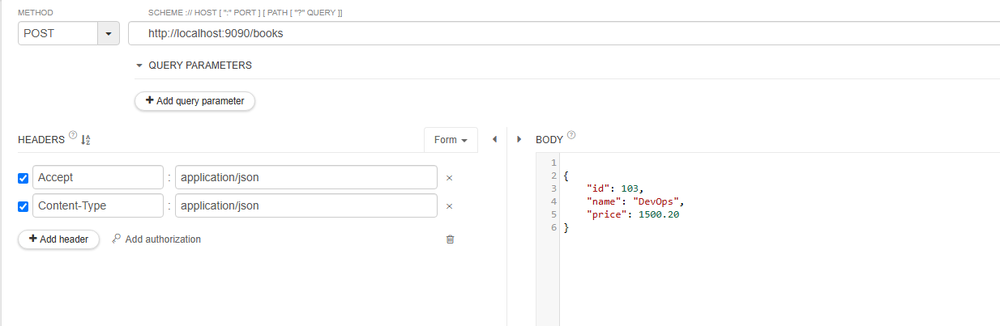
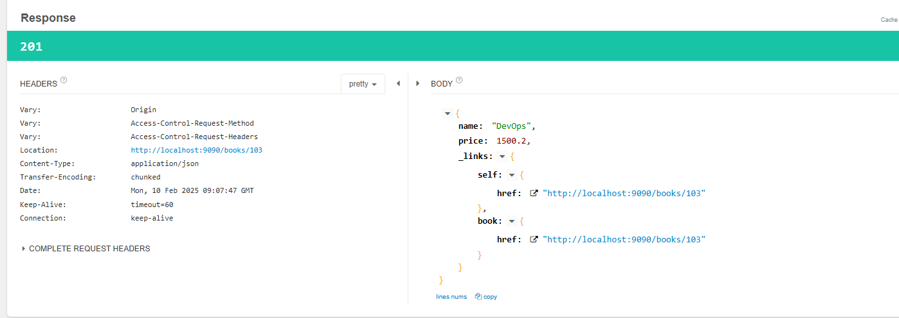
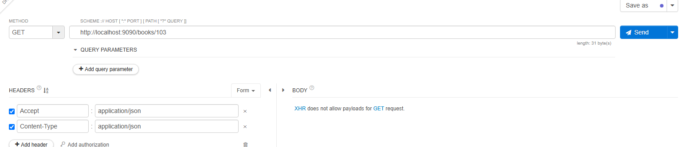
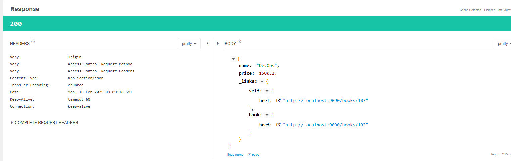
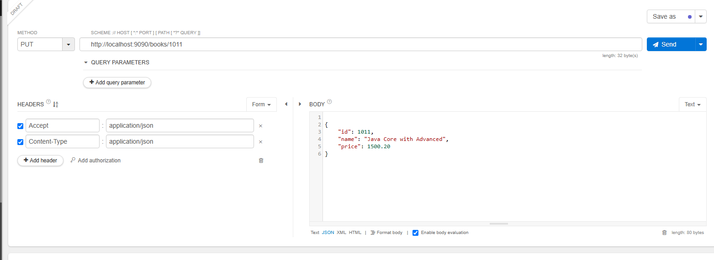

# Spring Data REST

It helps to expose Repository not via Rest ApI but directly!!

No need to create Rest Controller!!

This we use when we have only CRUD operations and no business logic required!!

=> It is used to simplify REST API development

		RestController + JpaRepository = RestRepositoryResource


1) Create Spring starter project with below dependencies

		a) rest-repositories (data-rest)
		b) data-jpa
		c) mysql-connector-j
		d) devtools

2) Configure datasource properties 

```properties
spring.application.name=011-spring-data-rest

server.port=9090
spring.datasource.username=root
spring.datasource.password=root
spring.datasource.url=jdbc:mysql://localhost:3306/mohit?createDatabaseIfNotExist=true

spring.jpa.hibernate.ddl-auto=update
spring.jpa.show-sql=true


```

3) Create Entity class for table mapping

```java
@Entity
@Table(name = "book_tbl")
public class Book {

	@Id
	private Integer id;
	private String name;
	private Double price;

}
```
4) Create Rest Repository to expose REST API methods (Not a normal repository)

```java
@RepositoryRestResource(path = "books")
public interface BookRepository extends JpaRepository<Book, Integer>{


}
```
The @RepositoryRestResource annotation is used in Spring Data REST to expose repository methods as RESTful endpoints automatically. Your annotation:

`@RepositoryRestResource(path = "books")`
means that Spring Data REST will expose your repository under the /books endpoint.

5) Run the application and test it using POSTMAN

No need to have any method just put json in post and repository will put in DB


```json
POST : http://localhost:9090/books

{
    "id": 103,
    "name": "DevOps",
    "price": 1500.20
}
```



response




In put just put id and updated json

GEt api





Getall Books--> if you do not give id


Response
```json
{
    "_embedded": {
        "books": [
            {
                "name": "Spring Boot in Action",
                "price": null,
                "_links": {
                    "self": {
                        "href": "http://localhost:9090/books/1"//telling link to get this json
                    },
                    "book": {
                        "href": "http://localhost:9090/books/1"
                    }
                }
            },
            {
                "name": "DevOps",
                "price": 1500.2,
                "_links": {
                    "self": {
                        "href": "http://localhost:9090/books/103"
                    },
                    "book": {
                        "href": "http://localhost:9090/books/103"
                    }
                }
            },
            {
                "name": "Java",
                "price": 1500.2,
                "_links": {
                    "self": {
                        "href": "http://localhost:9090/books/1011"
                    },
                    "book": {
                        "href": "http://localhost:9090/books/1011"
                    }
                }
            }
        ]
    },
    "_links": {
        "self": {
            "href": "http://localhost:9090/books?page=0&size=20"
        },
        "profile": {
            "href": "http://localhost:9090/profile/books"
        },
        "search": {
            "href": "http://localhost:9090/books/search"
        }
    },
    "page": {
        "size": 20,
        "totalElements": 3,
        "totalPages": 1,
        "number": 0
    }
}

```
this links 
```json
    "_links": {
        "self": {
            "href": "http://localhost:9090/books?page=0&size=20"
        },
        "profile": {
            "href": "http://localhost:9090/profile/books"
        },
        "search": {
            "href": "http://localhost:9090/books/search"
        }
    },
```
are called as hypermedia !! This link concept is called as HATEOs concept which is exposing data as hyperlink!!


HATEOAS (Hypermedia as the Engine of Application State) is a principle in RESTful API design where clients interact with a REST API through dynamically provided links rather than relying on fixed URIs.


- Hypermedia-Driven: API responses include links (URLs) to other resources or actions that the client can take.
- Decouples Clients from APIs: The client doesn't need to hardcode API routes; it discovers available actions dynamically.
- Enhances API Discoverability: Like navigating a website, clients can explore the API by following links.
- Follows REST Maturity Model (Level 3): HATEOAS is the highest level (Level 3) in Richardson's REST Maturity Model.
Example in a REST API
A traditional API response without HATEOAS:

```json
{
  "id": 1,
  "name": "John Doe",
  "email": "john.doe@example.com"
}
```
With HATEOAS, links to related actions are included:


```json
{
  "id": 1,
  "name": "John Doe",
  "email": "john.doe@example.com",
  "_links": {
    "self": { "href": "/users/1" },
    "update": { "href": "/users/1", "method": "PUT" },
    "delete": { "href": "/users/1", "method": "DELETE" }
  }
}
```

```json
//in put we need to pass id in url!!

PUT : http://localhost:9090/books/103

{
    "id": 103,
    "name": "DevOps",
    "price": 2500.20
}


GET : http://localhost:9090/books

GET : http://localhost:9090/books/101
```
till now no need for anything but now we want to find by name so we need to write custom method in Repository!!

```java
@RepositoryRestResource(path = "books")
public interface BookRepository extends JpaRepository<Book, Integer>{
	//Custom operation 
	public List<Book> findByName(@Param("name") String name);

}
```

```json

GET : http://localhost:9090/books/search/findByName?name=Java
```
Response
```json
{
    "_embedded": {
        "books": [
            {
                "name": "Java",
                "price": 1500.2,
                "_links": {
                    "self": {
                        "href": "http://localhost:9090/books/1011"
                    },
                    "book": {
                        "href": "http://localhost:9090/books/1011"
                    }
                }
            }
        ]
    },
    "_links": {
        "self": {
            "href": "http://localhost:9090/books/search/findByName?name=Java"
        }
    }
}

```
```json
//delete api
DELETE : http://localhost:9090/books/101

```

## How to disable HTTP Requests in Data REST application ?

=> Add below class in Data REST Application to disable PUT and DELETE methods.

>Note: With below configuration our api will not accept PUT and DELETE methods.

```java
@Configuration
public class MyDataRestConfig implements RepositoryRestConfigurer {
	
	@Override
	public void configureRepositoryRestConfiguration(RepositoryRestConfiguration config, CorsRegistry cors) {

		HttpMethod[] unsupportedMethods = { HttpMethod.PUT, HttpMethod.DELETE };
		
		config.getExposureConfiguration()
			  .forDomainType(Book.class)
			  .withItemExposure((metadata, http) -> http.disable(unsupportedMethods)) //disable for single record
			  .withCollectionExposure((metadata,http) -> http.disable(unsupportedMethods)); //disable for multiple record
		
	}
}

```

We try put request



```text
2025-02-10T16:12:03.119+05:30  INFO 10588 --- [011-spring-data-rest] [nio-9090-exec-1] o.s.web.servlet.DispatcherServlet        : Completed initialization in 4 ms
Hibernate: select b1_0.id,b1_0.name,b1_0.price from book_tbl b1_0 where b1_0.id=?
2025-02-10T16:12:03.219+05:30  WARN 10588 --- [011-spring-data-rest] [nio-9090-exec-1] .m.m.a.ExceptionHandlerExceptionResolver : Resolved [org.springframework.web.HttpRequestMethodNotSupportedException: Request method 'PUT' is not supported]
```

Notes:

1. We go for web-starter for  restController and RestTemplate

2. To use WebClient use web-flux (reactive-web)

3. When you want simple CRUD operation ,no business logic use spring-data-rest
