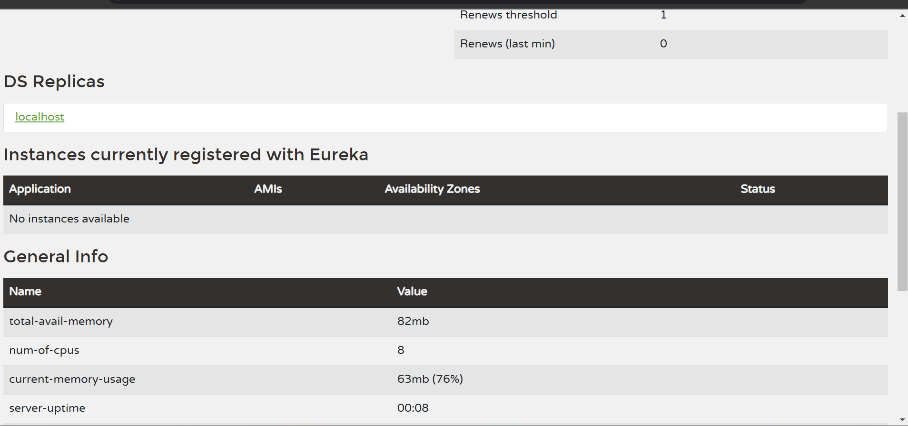
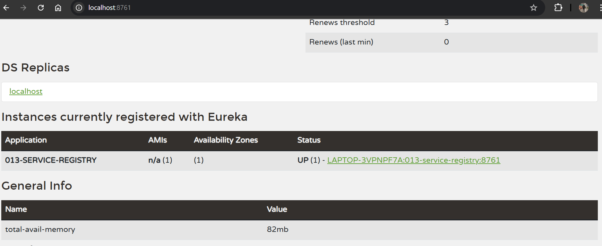
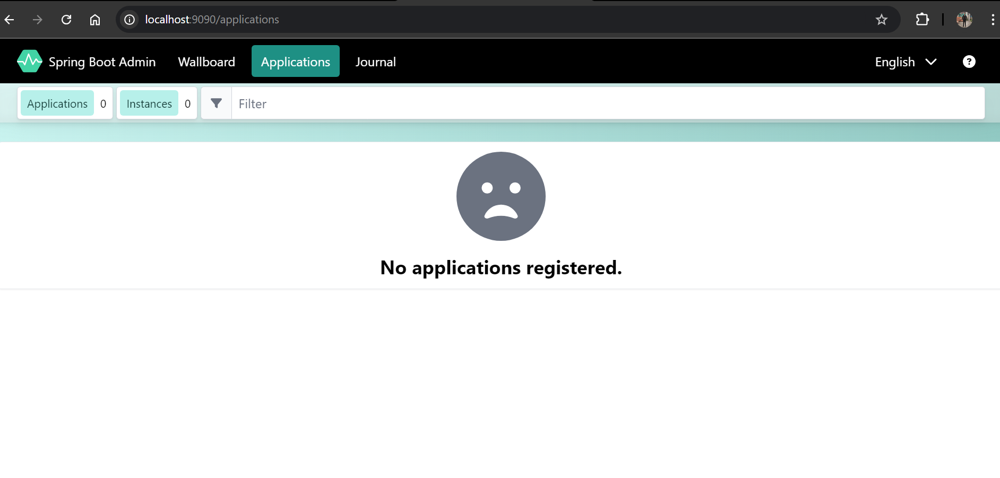
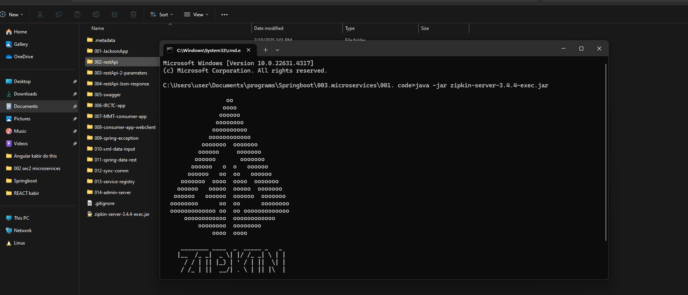
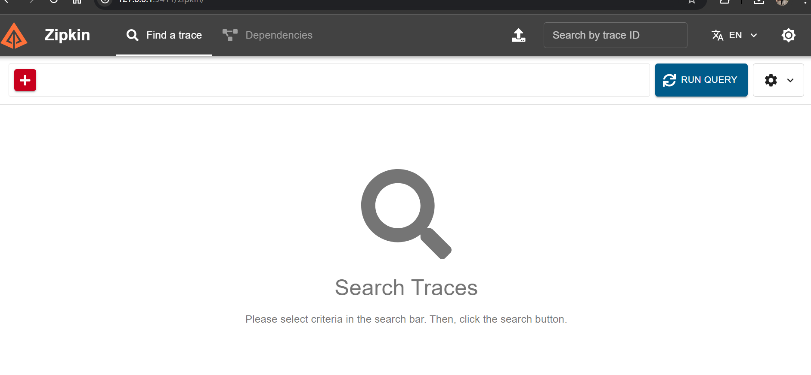

## Microservices

Let us create service registry project!!
see 013 
### Steps to develop Service Registry Application (Eureka Server)


1) Create Service Registry application with below dependency and also dev-tools

	 - EurekaServer (spring-cloud-starter-netflix-eureka-server)

    This is not that netflix providing movies , this one is different!! 

    our backend apis are eureka client their we will select eureka client!!

2) Configure @EnableEurekaServer annotation in boot start class

3) Configure below properties in application.yml file (recommended port number for eureka is 8761 as if on different port we need to register client manually else client can be registered automatically! client search eureka at port 8761)

    ```text
    server:
    port: 8761
    
    eureka:
    client:
        register-with-eureka: false
    ```
    >Note: If Service-Registry project port is 8761 then clients can discover service-registry and will register automatically with service-registry. If service-registry project running on any other port number then we have to register clients with service-registry manually.

4) Once application started we can access Eureka Dashboard using below URL

		URL : http://localhost:8761/


```xml
	<properties>
		<java.version>17</java.version>
		<spring-cloud.version>2024.0.0</spring-cloud.version>
	</properties>
	<dependencies>
		<dependency>
			<groupId>org.springframework.cloud</groupId>
			<artifactId>spring-cloud-starter-netflix-eureka-server</artifactId>
		</dependency>
```

see version in interview they can ask which version of spring cloud you are using!!!

output:



we do not have any service now so nothing is shown here!!

if we comment out 


```xml
spring.application.name=013-service-registry
server.port=8761
#eureka.client.register-with-eureka=false
```

then output:



current eureka service is also acting as client we do not want that!! so we uncomment!!as microservices should only act as client for eureka!! we do not want server to be client too so we uncomment!!

see 014 for this!!

### Steps to develop Spring Admin-Server


1) Create Boot application with admin-server dependency (provided by codecentric )
	(select it while creating the project)

2) Configure @EnableAdminServer annotation at start class

3) Change Port Number (Optional)

4) Run the boot application

5) Access application URL in browser (We can see Admin Server UI)

```xml
	<properties>
		<java.version>17</java.version>
		<spring-boot-admin.version>3.4.1</spring-boot-admin.version>
	</properties>
```

output :



no services as of now!!

### Steps to work with Zipkin Server
we no need to develop this we just need to run jar!!it is used for distributed tracing!!

1) Download Zipkin Jar file 

		URL : https://zipkin.io/pages/quickstart.html

2) Put it in workspace and then Run zipkin jar file 

		$ java -jar <jar-name>

	
3) Zipkin Server Runs on Port Number 9411

4) Access zipkin server dashboard

		URL : http://localhost:9411/



We can run multiple query here!!

These 3 servers are independent services!!


