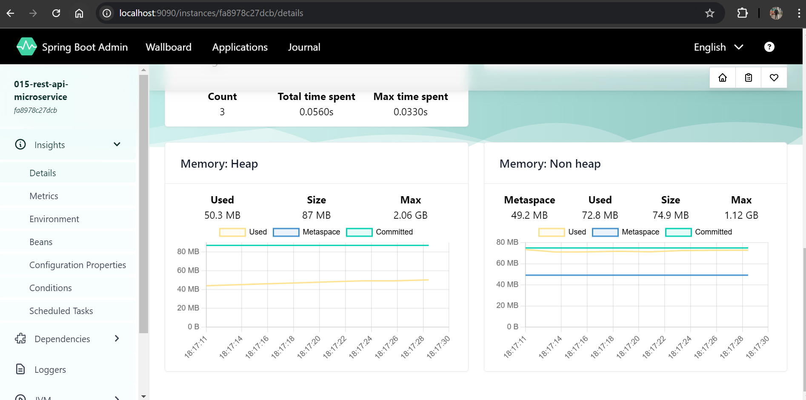
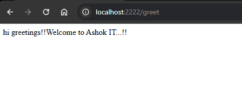

## Steps to develop WELCOME-API

 see 015

1) Create Spring Boot application with below dependencies

		- eureka-discovery-client
		- starter-web
		- devtools
		- actuator
		- zipkin
		- admin-client

2) Configure @EnableDiscoveryClient annotation at boot start class

3) Create RestController with required method

4) Configure below properties in application.yml file


```yml
server:
  port: 1111

spring:
  application:
    name: WELCOME-API

  boot:
    admin:
      client:
        url: http://localhost:9090/     
eureka:
  client:
    serviceUrl:
      defaultZone: http://localhost:8761/eureka 

management:
  endpoints:
    web:
      exposure:
        include: '*'
```

we using pom.xml

```xml
# not configuring eureka as our eureka runs on default recomended port!!
spring.application.name=015-rest-api-microservice

server.port=1111

spring.boot.admin.client.url=http://localhost:9090/

management.endpoints.web.exposure.include=*
```
we not telling eureka server location as using default port number for eureka!!

5) Run the application and check in Eureka Dashboard (It should display in eureka dashboard)

6) Check Admin Server Dashboard (It should display) (we can access application details from here)

	Ex: Beans, loggers, heap dump, thred dump, metrics, mappings etc...


7) Send Request to REST API method

8) Check Zipkin Server UI and click on Run Query button
	(it will display trace-id with details)

when we run this see all 3 servers!!


see status up and running!! se here service in registered !! it tells how many service we have in a project!!

let us see admin server!!



all actuator heap memory ,tack space and other all are present here!!It all do management!!

By admin server you can change log level without restarting server!!


Eureka is service registry tell name ,instance ,url and up or not for application 

Admin use actuators so tell about application ,used for monitoring and managing!!

Let us see zipkin!!


tells how many service in background is working and how much time taken by rest api!!


now next api should communicate via Feignclient!!

 see 016

## Steps to develop GREET-API

1) Create Spring Boot application with below dependencies

		- eureka-discovery-client
		- starter-web
		- devtools
		- actuator
		- zipkin
		- admin-client
		- openfeign

    in pom.xml you see micrometer dependency that is used by zipkin!!

2) Configure @EnableDiscoveryClient annotation at boot start class

3) Create RestController with required method

    ```java
    @RestController
    public class WelcomeRestController {

      @GetMapping("/greet")
      public String getWelcome() {

      String msg = "hi greetings!!Welcome to Ashok IT...!!";
      return msg;
      
      }
    }

    ```

4) Configure below properties in application.yml file

    ```yml
    server:
      port: 2222

    spring:
      application:
        name: GREET-API

      boot:
        admin:
          client:
            url: http://localhost:9090/

    management:
      endpoints:
        web:
          exposure:
            include: '*'
    ```

5) Run the application and check in Eureka Dashboard (It should display in eureka dashboard)

6) Check Admin Server Dashboard (It should display) (we can access application details from here)

	Ex: Beans, loggers, heap dump, thred dump, metrics, mappings etc...

7) Send Request to REST API method

8) Check Zipkin Server UI and click on Run Query button
	(it will display trace-id with details)

 ## Output:


Now we want greet api should communicate with welcome api!!

we changed rest controller of greet api


we want greet api should get `welcome to ashokit` from welcome!! with Feignclient we can do load balancing!!


## Interservice communication

With Feignclient we need not tell logic to tell other service ,we just need to tell interface , Feignclient
will give implementation and tell how to communicate!!

>Note:FeignClient communicate by name of service not with url!! With name it get URl of that api 
from service registry!!


=> Add @EnableFeignClients dependency in GREET-API boot start class

=> Create FeignClient interface like below
```java
@FeignClient(name="015-rest-api-microservice")
public interface WelcomeClient {
	
	@GetMapping("/welcome")
	public String invokeWelcomeApi();
}

```
when we call this invokeWelcomeApi() ,then Feignclient will go to WELCOME-API and get to /welcome method!!

=> Inject feign client into GreetRestController like below

```java

@RestController
public class WelcomeRestController {

	@Autowired
	private WelcomeClient welcomeClient;
	
	@GetMapping("/greet")
	public String getWelcome() {
		
	String welcomeMsg = welcomeClient.invokeWelcomeApi();
	String msg = "hi greetings!!";
	
	
	return msg.concat(welcomeMsg);
	
	}
}

```


main application
```java
@SpringBootApplication
@EnableFeignClients
public class Application {

	public static void main(String[] args) {
		SpringApplication.run(Application.class, args);
	}

}

```

=> Run the applications and access greet-api method

(It should give combined response)


output: 



Next we see load balancing and api gateway!!
