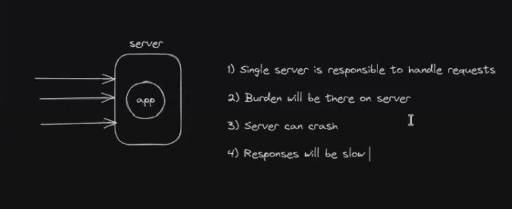
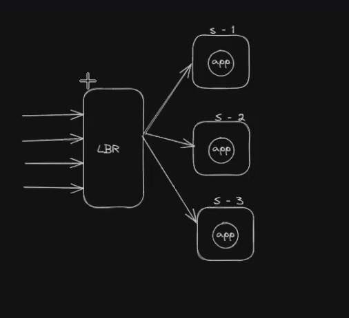
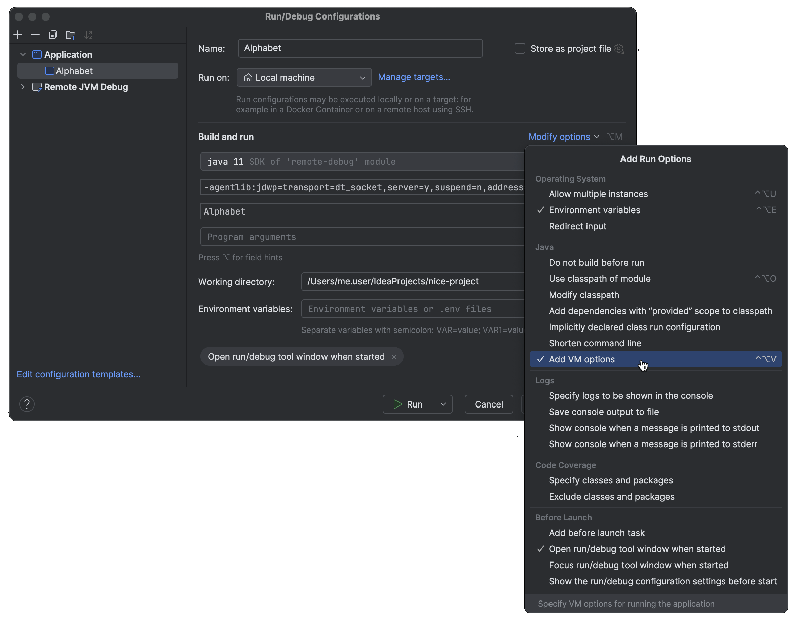
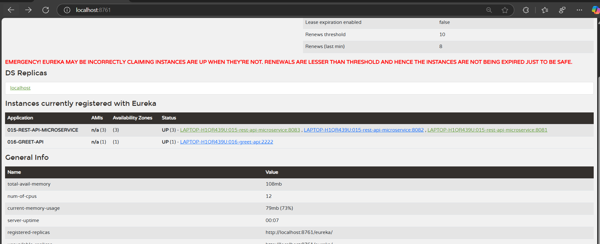
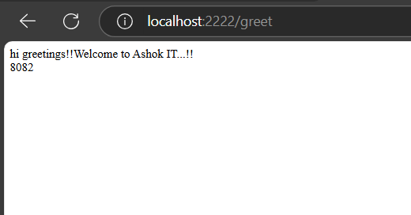
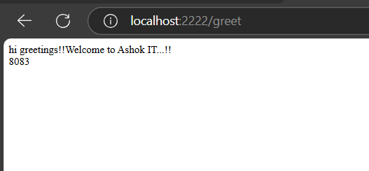

# Load Balancing 



We know what load balancing is!!



to use load balancer we can use AWS ,GCP etc but load balancer is costly!!
Setting up load balancer is done by AWS team!!Load balancer decide which server to access 
is called as __server side load balancer__!!

Application needs to decide which server to access that is done by FeignClient!!
Using FeignClient say it is __Client Side Load balancer__ !!

see 015-rest-api 

```properties
spring.application.name=015-rest-api-microservice

server.port=1111

spring.boot.admin.client.url=http://localhost:9090/

management.endpoints.web.exposure.include=*

```
we should remove this port number as application will run itself on different port number!!

To run on different instances we need to run on different port number!!
To put different port number at Runtime in intellij 



add this!! in intellij we need to enble parallel run!!

after that we have run on multiple servers!!



now greet api is running in one server !! and welcome 015-rest-api is in 3 servers so 
here greeet api uses a concept called as ribbon for load balancing no need to do any
configuration!!





see how load balacing happening ,it is happening in round robin fashion!!This is what we 
call Client side load balancing , this we cannot acheive by RestTemplate as their we 
need to tell fixed URL!!

here we have dynamic URL!!

=> Distribute requests to multiple servers

=> Run welcome-api in multiple instances.

1) Remove port number configuration welcome api yml file

2) Make changes in rest controller to display port number in response.

3) Right click => Run as => run configuration=> VM Arguments => -Dserver.port=8081 and apply and run it.

4) Right click => Run as => run configuration => VM Arguments => -Dserver.port=8082 and apply and run it.

## cloud gateway

1) Create Spring boot application with below dependencies

   	-> eureka-client
   	-> cloud-gateway
   	-> devtools

2) Configure @EnableDiscoveryClient annotation at boot start class

3) Configure API Gateway Routings in application.yml file like below

```yml
server:
  port: 3333

spring:
  cloud:
    gateway:
      routes:
      - id: welcome-api
        uri: lb://WELCOME-API
        predicates:
        - Path=/welcome
      - id: greet-api
        uri: lb://GREET-API
        predicates:
        - Path=/greet
        
  application:
    name: CLOUD-API-GATEWAY
```

In API gateway we will have 3 types of logics

1) Routes

2) Predicates

3) Filters

-> Routing is used to defined which request should be processed by which REST API in backend. Routes will be configured using Predicate.

-> Predicate : This is a Java 8 Function Predicate. The input type is a Spring Framework ServerWebExchange. This lets you match on anything from the HTTP request, such as headers or parameters or url-patterns.

-> Filters are used to manipulate incoming request and outgoing response of our application.

Note: Using Filters we can implement security also for our application.