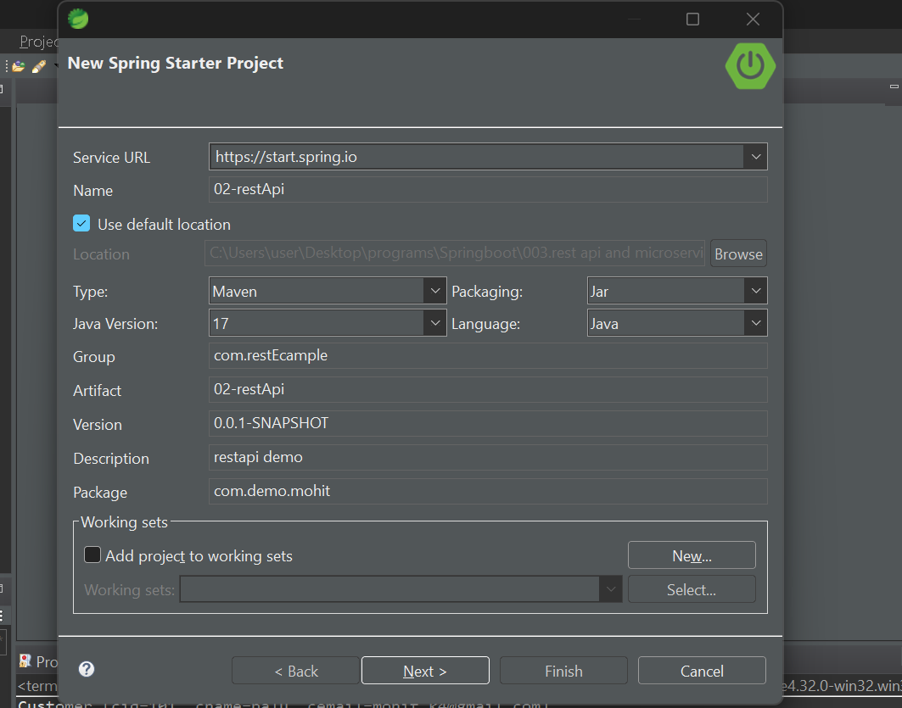
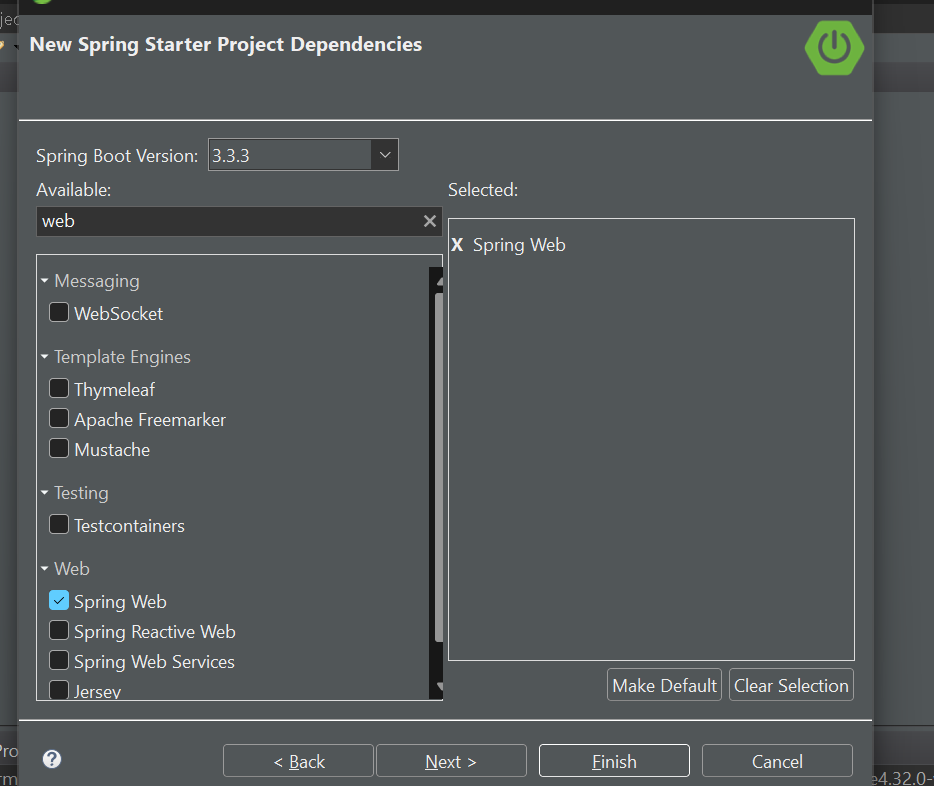

 # REST API development using Spring Boot


-> We need to use "web-starter" dependency in pom.xml

-> As part of REST API (Provider (which provide response)) development we will use below annotations


1) @RestController   : To make our class as distributed component (B2B)

2) @RequestParam : To read query parameters from URL (Key-Value  after ?)

3) @PathVariable : To read path parameters (as a variable)

4) @RequestBody : To read data from request body (as java class)

5) @GetMapping : To map rest controller method to HTTP GET request

6) @PostMapping : To map rest controller method to HTTP POST request

7) @PutMapping : To map rest controller method to HTTP PUT request

8) @DeleteMapping : To map rest controller method to HTTP DELETE request

## Generate a springboot project in sts
- go to file>new>spring starter project


- add details and click on next


- add dependencies


spring web starter gives tomcat as default embedded server

now everything is created for you no need to create main() just create controller
 ### ex1
```java
@RestController
public class MsgRestController {

	@GetMapping("/welcome")
	public String getWelcomeMsg() {
		String msg = "Welcome to REST API..!!";
		return msg;
	}

	@GetMapping("/greet")
	public String getGreetMsg(@RequestParam("name") String name) {
		String msg = name + ", Good Morning..!!";
		return msg;
	}

}

````

output: 

we need to test provider by some api testing tool like postman we are here using talend Api tester


 see how url looks after ? we have key value pair

### output:

   
 => HTTP will act as mediator between consumer and provider  
## ex2

```java
@RestController
public class MsgRestController {
	
	@GetMapping("/greet")
	public String getGreetMsg(@RequestParam("name") String name) {
		String msg = name+", Good Morning..!!";
		return msg;
	}

	@GetMapping("/welcome/{name}")
	public ResponseEntity<String> getWelcomeMsg(@PathVariable("name") String name) {
		String msg = name+", Welcome to REST API..!!";
		return new ResponseEntity<>(msg, HttpStatus.OK);
	}
	
	@GetMapping("/action")
	public ResponseEntity<Void> doAction() {
		System.out.println("doAction () metdod called...");
		return new ResponseEntity<>(HttpStatus.NO_CONTENT);
	}

}
```
Model is not required as model is required to send data to UI!!
but here we do not have UI!!

1) @RequestParam : To read query parameters from URL (Key-Value  after ?)

2) @PathVariable : To read path parameters (as a variable) send value directly!!

3) @RequestBody : To read data from request body (as java class)
## For Requestparam


## For PathaVariable 


RestController means only backend logic!!used for B2B communication (from application to application)!!

## RestController= controller + Response body!!

## HTTP Methods


1) GET : Method is responsible to send data to consumer

2) POST : Method is responsible to create a resource/record

3) PUT : Method is responsible to update a record

4) DELETE : Method is responsible to delete a record

Note:  Rest Controller class methods will be mapped to HTTP methods

## Request Structure

HttpRequest has 2 part 
1. header - for some metadata
2. body - has business data or payload (in xml or json)

suppose make myTrip send request to IRCTC !!

here makeMytrip is consumer and IRCTC is provider!!

body is not there is Get request!!

Consumer can send body only in POST, PUT or DELETE request !!

> Note: GET method will not have request body.

>in GET request when you see postman and open body tab you see there
is not body for this request!! so should use PathParameter or 
query paramter as no body here !! cannot use RequestBody with GET!!

Body in postman is for class files!! 
and other one is for query parameters!!

=> POST, PUT and DELETE methods will have request body.

=> Request Body is used to send payload from consumer to provider in the form xml or json.

=> Response Body is used to send payload from Provider to consumer.

> So we send data in Body only!! either request and response!!
both consumer and provider use HTTp request where each send data in body!!

Ex:

1) MakeMyTrip will send passenger data to IRCTC in request body 
   (xml/json)

2) IRCTC will send ticket data to MakeMyTrip in response body 
   (xml/json)   

>xml/json not object is used because of interoperability!! as 
consumer might be using dot net who do not understand object!!
xml/json is universal!!

### HTTP Status Codes


>Provider will send response to consumer using HTTP Status code.


1. 2xx (200 - 299) : Success (OK)

2. 4xx (400 - 499) : Client Error (consumer sending incorrect info like wrong url ,wrong parameter )

3. 5xx (500 - 599) : Server Error

400(bad request) something wrong with request!!check the request you want to send !! see query parameter ,path parameters passed correctly or not!! 

404(resource not found) if you do not have a method for http request

405(method not allowed) if you put wrong http method e.g http request is get and you put post!!

500 internal server error - your method has problem it is not executed fully

if you do not put any status code springboot automatically decides status code!!

but now we want to send status code by ourself so we use ResponseEntity 

here both examples are from above code (from ex2)!!
 ex1: directly send response
```java
	@GetMapping("/action")
	public ResponseEntity<Void> doAction() {
		System.out.println("doAction () metdod called...");
		return new ResponseEntity<>(HttpStatus.NO_CONTENT);
	}

```

no content is used when we do not want to send any content just void return type

ex2: response and message
```java

	@GetMapping("/welcome/{name}")
	public ResponseEntity<String> getWelcomeMsg(@PathVariable("name") String name) {
		String msg = name+", Welcome to REST API..!!";
		return new ResponseEntity<>(msg, HttpStatus.OK);
	}
	
```

to give status code we use ResponseEntity!! there are various ways to send ResponseEntity you can see that while development!!

can see various status code in http.class

```java

public enum HttpStatus implements HttpStatusCode {
    CONTINUE(100, HttpStatus.Series.INFORMATIONAL, "Continue"),
    SWITCHING_PROTOCOLS(101, HttpStatus.Series.INFORMATIONAL, "Switching Protocols"),
    PROCESSING(102, HttpStatus.Series.INFORMATIONAL, "Processing"),
    EARLY_HINTS(103, HttpStatus.Series.INFORMATIONAL, "Early Hints"),
    /** @deprecated */
    @Deprecated(
        since = "6.0.5"
    )
    CHECKPOINT(103, HttpStatus.Series.INFORMATIONAL, "Checkpoint"),
    OK(200, HttpStatus.Series.SUCCESSFUL, "OK"),
    CREATED(201, HttpStatus.Series.SUCCESSFUL, "Created"),
    ACCEPTED(202, HttpStatus.Series.SUCCESSFUL, "Accepted"),
    NON_AUTHORITATIVE_INFORMATION(203, HttpStatus.Series.SUCCESSFUL, "Non-Authoritative Information"),
    NO_CONTENT(204, HttpStatus.Series.SUCCESSFUL, "No Content"),
    RESET_CONTENT(205, HttpStatus.Series.SUCCESSFUL, "Reset Content"),
    PARTIAL_CONTENT(206, HttpStatus.Series.SUCCESSFUL, "Partial Content"),
    MULTI_STATUS(207, HttpStatus.Series.SUCCESSFUL, "Multi-Status"),
    ALREADY_REPORTED(208, HttpStatus.Series.SUCCESSFUL, "Already Reported"),
    IM_USED(226, HttpStatus.Series.SUCCESSFUL, "IM Used"),
    MULTIPLE_CHOICES(300, HttpStatus.Series.REDIRECTION, "Multiple Choices"),
    MOVED_PERMANENTLY(301, HttpStatus.Series.REDIRECTION, "Moved Permanently"),
    FOUND(302, HttpStatus.Series.REDIRECTION, "Found"),
    /** @deprecated */
    @Deprecated
    MOVED_TEMPORARILY(302, HttpStatus.Series.REDIRECTION, "Moved Temporarily"),
    SEE_OTHER(303, HttpStatus.Series.REDIRECTION, "See Other"),
    NOT_MODIFIED(304, HttpStatus.Series.REDIRECTION, "Not Modified"),
    /** @deprecated */
    @Deprecated
    USE_PROXY(305, HttpStatus.Series.REDIRECTION, "Use Proxy"),
    TEMPORARY_REDIRECT(307, HttpStatus.Series.REDIRECTION, "Temporary Redirect"),
    PERMANENT_REDIRECT(308, HttpStatus.Series.REDIRECTION, "Permanent Redirect"),
    BAD_REQUEST(400, HttpStatus.Series.CLIENT_ERROR, "Bad Request"),
    UNAUTHORIZED(401, HttpStatus.Series.CLIENT_ERROR, "Unauthorized"),
    PAYMENT_REQUIRED(402, HttpStatus.Series.CLIENT_ERROR, "Payment Required"),
    FORBIDDEN(403, HttpStatus.Series.CLIENT_ERROR, "Forbidden"),
    NOT_FOUND(404, HttpStatus.Series.CLIENT_ERROR, "Not Found"),
    METHOD_NOT_ALLOWED(405, HttpStatus.Series.CLIENT_ERROR, "Method Not Allowed"),
    NOT_ACCEPTABLE(406, HttpStatus.Series.CLIENT_ERROR, "Not Acceptable"),
    PROXY_AUTHENTICATION_REQUIRED(407, HttpStatus.Series.CLIENT_ERROR, "Proxy Authentication Required"),
    REQUEST_TIMEOUT(408, HttpStatus.Series.CLIENT_ERROR, "Request Timeout"),
   
 
    INTERNAL_SERVER_ERROR(500, HttpStatus.Series.SERVER_ERROR, "Internal Server Error"),
    NOT_IMPLEMENTED(501, HttpStatus.Series.SERVER_ERROR, "Not Implemented"),
    BAD_GATEWAY(502, HttpStatus.Series.SERVER_ERROR, "Bad Gateway"),
    SERVICE_UNAVAILABLE(503, HttpStatus.Series.SERVER_ERROR, "Service Unavailable"),
    GATEWAY_TIMEOUT(504, HttpStatus.Series.SERVER_ERROR, "Gateway Timeout"),
    HTTP_VERSION_NOT_SUPPORTED(505, HttpStatus.Series.SERVER_ERROR, "HTTP Version not supported"),
    VARIANT_ALSO_NEGOTIATES(506, HttpStatus.Series.SERVER_ERROR, "Variant Also Negotiates"),
    INSUFFICIENT_STORAGE(507, HttpStatus.Series.SERVER_ERROR, "Insufficient Storage"),
    LOOP_DETECTED(508, HttpStatus.Series.SERVER_ERROR, "Loop Detected"),
    BANDWIDTH_LIMIT_EXCEEDED(509, HttpStatus.Series.SERVER_ERROR, "Bandwidth Limit Exceeded"),
    NOT_EXTENDED(510, HttpStatus.Series.SERVER_ERROR, "Not Extended"),
    NETWORK_AUTHENTICATION_REQUIRED(511, HttpStatus.Series.SERVER_ERROR, "Network Authentication Required");


    public boolean is1xxInformational() {
        return this.series() == HttpStatus.Series.INFORMATIONAL;
    }

    public boolean is2xxSuccessful() {
        return this.series() == HttpStatus.Series.SUCCESSFUL;
    }

    public boolean is3xxRedirection() {
        return this.series() == HttpStatus.Series.REDIRECTION;
    }

    public boolean is4xxClientError() {
        return this.series() == HttpStatus.Series.CLIENT_ERROR;
    }

    public boolean is5xxServerError() {
        return this.series() == HttpStatus.Series.SERVER_ERROR;
    }

    public boolean isError() {
        return this.is4xxClientError() || this.is5xxServerError();
    }

}


```
## Project to get JSON response

1) Create springboot app with web-starter

2) Create Binding class to represent data

```java
public class Customer {

	private Integer cid;
	private String cname;
	private String cemail;

}
```

```java

@RestController
public class CustomerRestController {

	@DeleteMapping(value = "/customer/{cid}", produces = "text/plain")
	public String deleteCustomer(@PathVariable Integer cid) {
		// db logic to delete
		return "Customer Deleted";
	}

	@PutMapping(value = "/customer", consumes = "application/json", produces = "text/plain")
	public String updateCustomer(@RequestBody Customer c) {
		System.out.println(c);
		// TODO: DB logic to update the record
		return "Customer Updated";
	}

	@PostMapping(value = "/customer", produces = "text/plain", consumes = "application/json")
	public ResponseEntity<String> addCustomer(@RequestBody Customer c) {
		System.out.println(c);
		// TODO: DB logic to insert record
		String body = "Customer Added";
		return new ResponseEntity<>(body, HttpStatus.CREATED);
	}

	@GetMapping(value = "/customer", produces = "application/json")
	public Customer getCustomer() {
		// logic to get record from db
		Customer c = new Customer(1, "john", "john@gmail.com");
		return c;
	}

	@GetMapping(value = "/customers", produces = "application/json")
	public List<Customer> getCustomers() {
		// logic to get records from db
		Customer c1 = new Customer(1, "john", "john@gmail.com");
		Customer c2 = new Customer(2, "smith", "smith@gmail.com");
		Customer c3 = new Customer(3, "david", "david@gmail.com");
		List<Customer> customers = Arrays.asList(c1, c2, c3);
		return customers;
	}

}

```
See above GET request is not having RequestBody!! 
