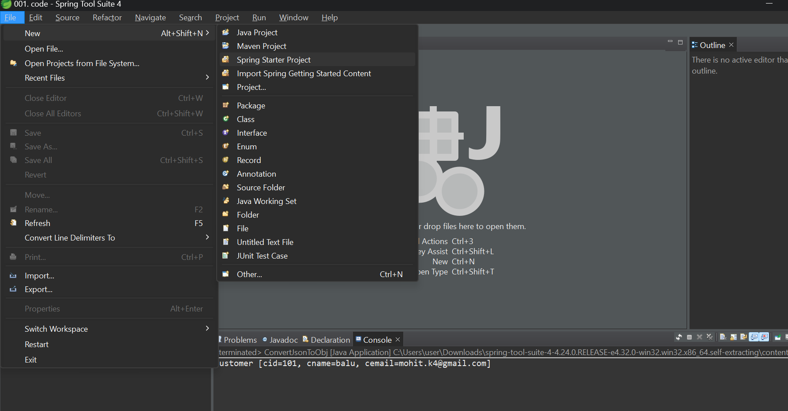
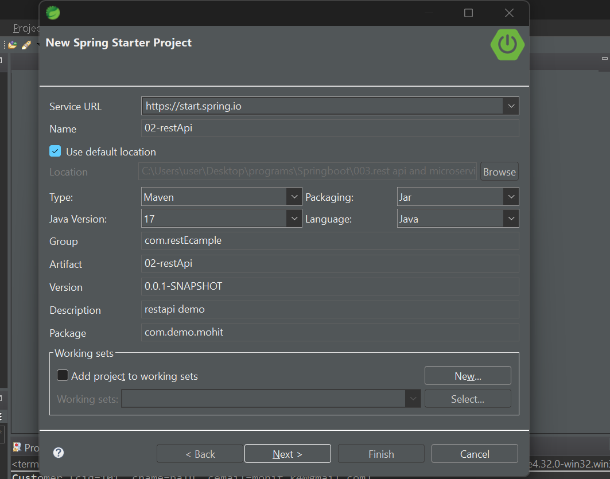
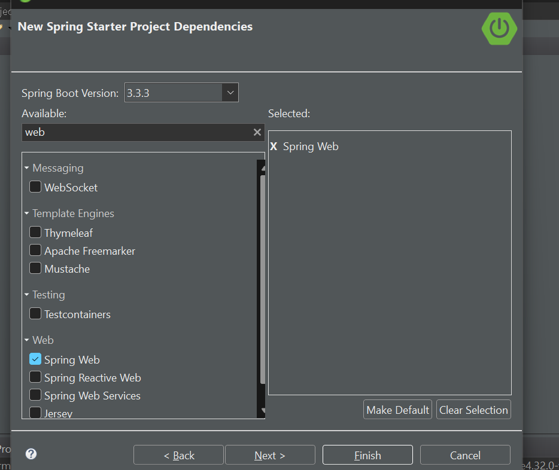
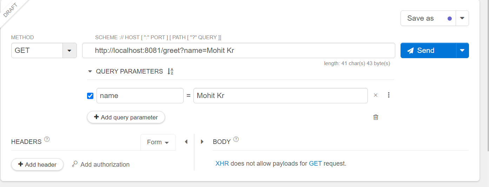
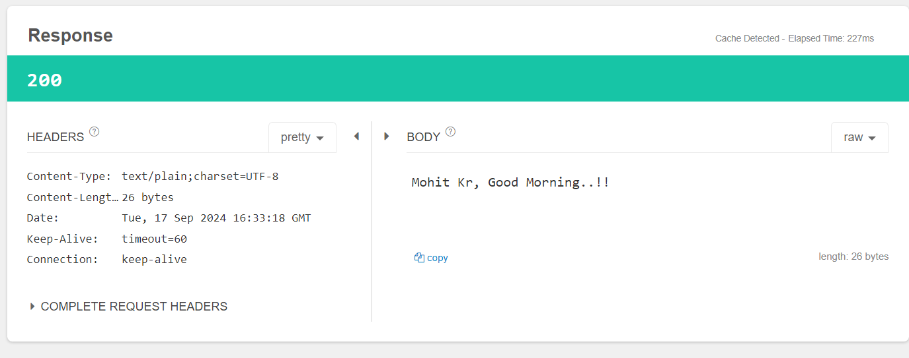

 ### REST API development using Spring Boot


-> We need to use "web-starter" dependency in pom.xml

-> As part of REST API (Provider (which provide response)) development we will use below annotations


1) @RestController   : To make our class as distributed component (B2B)

2) @RequestParam : To read query parameters from URL (Key-Value  after ?)

3) @PathVariable : To read path parameters (as a variable)

4) @RequestBody : To read data from request body (as java class)

5) @GetMapping : To map rest controller method to HTTP GET request

6) @PostMapping : To map rest controller method to HTTP POST request

7) @PutMapping : To map rest controller method to HTTP PUT request

8) @DeleteMapping : To map rest controller method to HTTP DELETE request

### to generate a springboot project in sts
- go to file>new>spring starter project



- add details and click on next


- add dependencies


spring web starter gives tomcat as default embedded server

now everything is created for you no need to create main() just create controller

```java
@RestController
public class MsgRestController {

	@GetMapping("/welcome")
	public String getWelcomeMsg() {
		String msg = "Welcome to REST API..!!";
		return msg;
	}

	@GetMapping("/greet")
	public String getGreetMsg(@RequestParam("name") String name) {
		String msg = name + ", Good Morning..!!";
		return msg;
	}

}

````

output: 

we need to test provider by some api testing tool like postman we are here using talend Api tester


 see how url looks after ? we have key value pair

## output:

   
 => HTTP will act as mediator between consumer and provider  

### HTTP Methods


1) GET : Method is responsible to send data to consumer

2) POST : Method is responsible to create a resource/record

3) PUT : Method is responsible to update a record

4) DELETE : Method is responsible to delete a record

Note:  Rest Controller class methods will be mapped to HTTP methods

Note: GET method will not have request body.

=> POST, PUT and DELETE methods will have request body.

=> Request Body is used to send payload from consumer to provider in the form xml or json.

=> Response Body is used to send payload from Provider to consumer.

Ex:

1) MakeMyTrip will send passenger data to IRCTC in request body 
   (xml/json)

2) IRCTC will send ticket data to MakeMyTrip in response body 
   (xml/json)   


#### HTTP Status Codes


=> Provider will send response to consumer using HTTP Status code.


2xx (200 - 299) : Success (OK)

4xx (400 - 499) : Client Error

5xx (500 - 599) : Server Error


