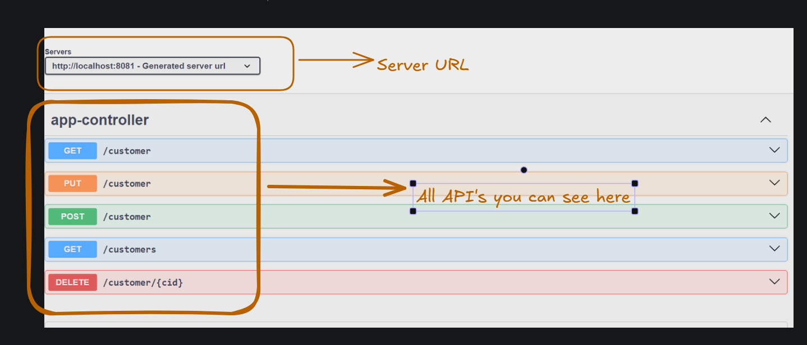
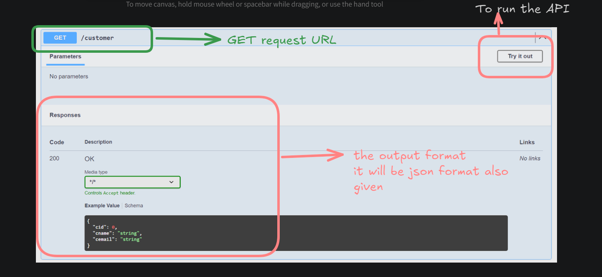
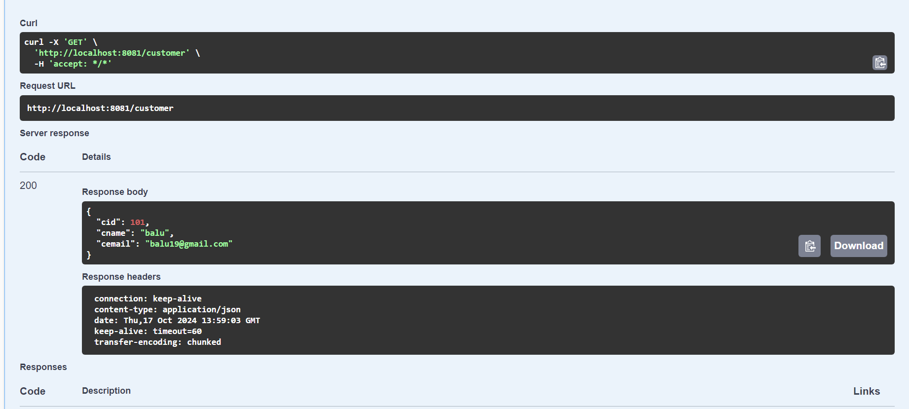
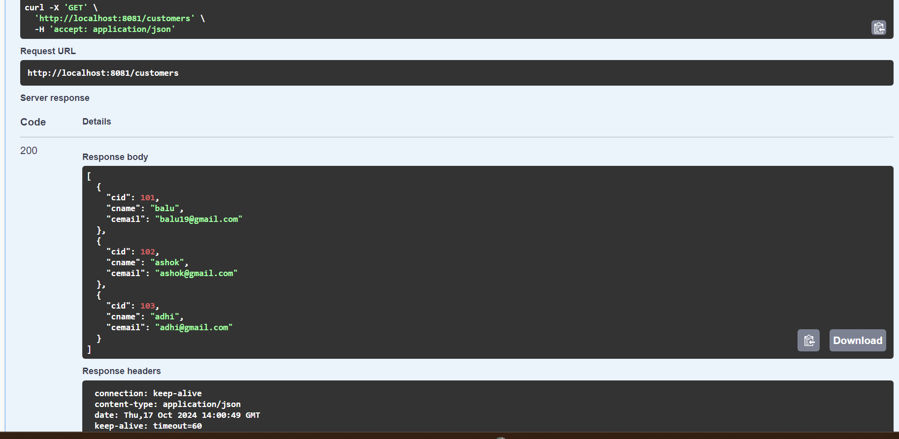
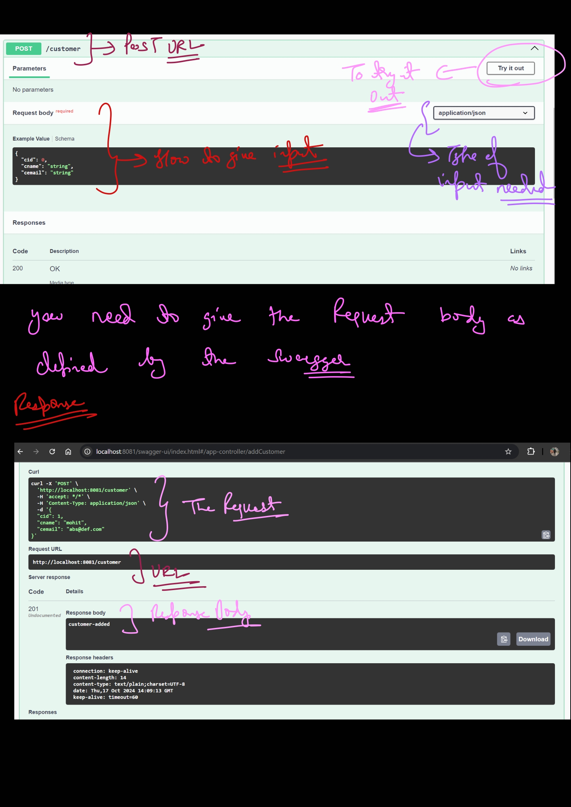

## Swagger
=> It is used to generate documentation for REST API.

=> Provider app dev team should provide swagger documentation to consumer app dev team.

=> Swagger documentation will show provider information 

1) Where is provider (URL)
2) How is provider (what operations available)
3) Input format
4) Output format...

Note: Using Swagger, we can test provider functionality also.			

=> Consumer app team will understand provider details using swagger documentation.


=> Add below dependency in pom.xml file

```xml
<dependency>
    <groupId>org.springdoc</groupId>
    <artifactId>springdoc-openapi-starter-webmvc-ui</artifactId>
    <version>2.5.0</version>
</dependency>
```

this dependency is not present in the sts ! so need to put externally in pom.xml!!


=> Run the application and access swagger-ui page with below url

URL : http://localhost:8080/swagger-ui.html


using previous project only just put this dependency!!see project 05-swagger!!

## Controller
```java

@RestController
public class AppController {

	@DeleteMapping("/customer/{cid}")
	public String deleteCustomer(@PathVariable Integer cid) {
		//db logic to delete
		return "Customer-Deleted"
;	}
	
	@PutMapping("/customer")
	public String UpdateCustomer(@RequestBody Customer c) {
		System.out.println(c);
		//db logic to update the record
		return "customer-updated";
	}
	
	
	@PostMapping("/customer")
	public ResponseEntity<String> addCustomer(@RequestBody Customer c) {
		System.out.println(c);
		//db logic to insert record
		String body = "customer-added";
		return new ResponseEntity<>(body, HttpStatus.CREATED);
	}
	
	@GetMapping("/customer")
	public Customer getCustomer() {
		//logic to get record from db
		Customer c = new Customer(101, "balu", "balu19@gmail.com");
		return c;
	}
	
	@GetMapping(value = "/customers", produces = "application/json")
	public List<Customer> getCustomers(){
		//logic to get records from db
		Customer c1 = new Customer(101, "balu", "balu19@gmail.com");
		Customer c2 = new Customer(102, "ashok", "ashok@gmail.com");
		Customer c3  = new Customer(103, "adhi", "adhi@gmail.com");
		
		List<Customer> customers = Arrays.asList(c1,c2,c3);
		return customers;
	}
}

```




# get request
```java
	@GetMapping("/customer")
	public Customer getCustomer() {
		//logic to get record from db
		Customer c = new Customer(101, "balu", "balu19@gmail.com");
		return c;
	}
```


on execution you see this



response body +header 

this is easier than postman as no need to write url and everything!!

on this request

```java
	@GetMapping(value = "/customers", produces = "application/json")
	public List<Customer> getCustomers(){
		//logic to get records from db
		Customer c1 = new Customer(101, "balu", "balu19@gmail.com");
		Customer c2 = new Customer(102, "ashok", "ashok@gmail.com");
		Customer c3  = new Customer(103, "adhi", "adhi@gmail.com");
		
		List<Customer> customers = Arrays.asList(c1,c2,c3);
		return customers;
	}
```


# post request



 now we understood how api looks on try it out we can out the json !! and run the API by clicking on execute!!

 >Input and output type is decided by Swagger by produces and consumes you put in request!!


 In get Request as we do not have Request Body we use Query parameter or path variable!!

 