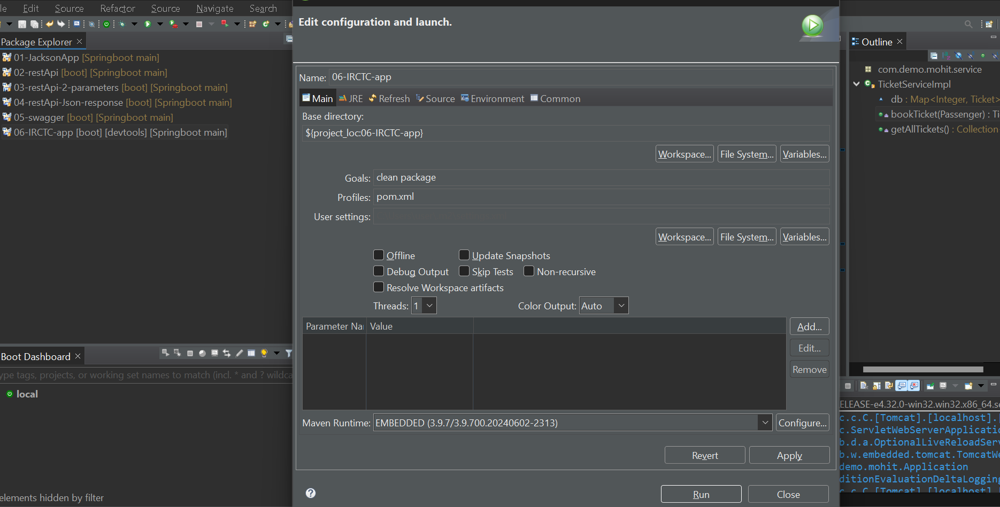
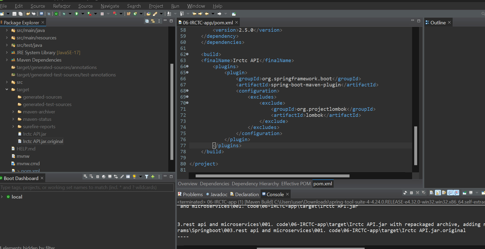
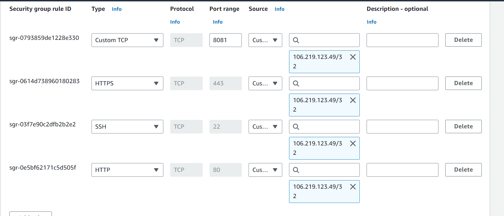
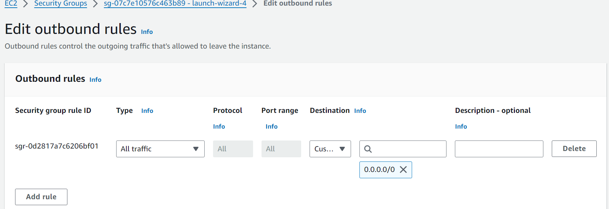

# Springboot app on aws (IRCTC app  development)

=> Develop IRCTC api to book train tickets for passengers

=> We need to have below 2 functionalities in IRCTC API

1) book-ticket   (POST Request method)

	input : passenger data

	output : ticket data

2) get all tickets (GET request method)

	input : N/A

	output : all tickets data

 


### Step-1 ) Identify request structure and create req binding class

Request : passenger info

- name
- email
- doj
- from
- to
- trainNum

### Step-2 ) Identify response structure and create resp binding class

Response : Ticket info

 - ticket-num
- name
- doj
- from
- to
- trainNum
- status


### Step-3 ) Creae Boot application with required classes

1) Passenger.java
2) Ticket.java
3) TicketService.java
4) TicketServiceImpl.java
5) TicketRestController.java


### Step-4) Run the application and test it using swagger ui
   
```java
public class Passenger {

	private String name;
	private String email;
	private String from;
	private String to;
	private String doj;
	private String trainNum;
    
    }


 public class Ticket {
	
	private Integer ticketNum;
	private String name;
	private String email;
	private String from;
	private String to;
	private String doj;
	private String trainNum;
	private String status;
 }   
```
 ## controller

 ```java

@RestController
public class TicketRestController {

	@Autowired
	private TicketService service;
	
	@PostMapping(value="/ticket",
			consumes="application/json",
			produces="application/json"
			)
	
	public ResponseEntity<Ticket> bookTicket(@RequestBody  Passenger p){
		Ticket ticket = service.bookTicket(p);
		return new ResponseEntity<>(ticket,HttpStatus.CREATED);
	}
	
	@GetMapping(value="/tickets",
			produces="application/json"
			)
	public ResponseEntity<Collection<Ticket>> getAllTickets(){
		Collection<Ticket> allTickets = service.getAllTickets();
		return new ResponseEntity<>(allTickets,HttpStatus.OK);
	}
 ```
 ## service
```java

@Service
public class TicketServiceImpl implements TicketService {

	
	Map<Integer, Ticket> db = new HashMap<>();
	
	@Override
	public Ticket bookTicket(Passenger p) {
		
		Ticket t = new Ticket();
		
		Random r = new Random();
		
		int id = r.nextInt(6);
		
		t.setTicketNum(id);
		
		BeanUtils.copyProperties(p, t);
		t.setStatus("CONFIRMED");
		db.put(id, t);
		return t;
	}

	@Override
	public Collection<Ticket> getAllTickets() {
		return db.values();
	}

}

```
can see code in 06-IRCTC-app

to get jar of application
run as>maven build 

then set goals as given in below picture


in pom.xml we put final name as can see in line 63


then can run the build and you see .jar in target folder with name you have given!! take .jar not .jar.original and we upload that to our ec2 machine!!
# Deploying Provider API in AWS cloud


Reference Video : https://youtu.be/cRQPgbwOWq0?si=9b0Yuye0iFPoUB1W

1) Login into aws cloud account

2) Create Linux VM in aws cloud using EC2 service

3) Connect with Linux VM using MobaXterm

4) Upload our api jar file using mobaxterm !! 

5) Install java in linux vm

	$ sudo yum install java

6) Run jar file

	nohup java -jar <jarfile>	&

nohup and at last & symbol so that even after closing mobaxterm you will be able to access the application

7) Access our application documentation like below

	URL : http://public-ip:8080/swagger-ui/index.html


 we have set up our one service!
## inbound rules
see inbound rules i have set



22 for ssh connection and port 8081 for application connection!!
  rest two i can delete!!

  deleetd http and https rules even than also can access the apis!!

  ## outbound rules
  

  By default, Outbound Rules in an AWS Security Group are configured to allow all outbound traffic. This means that an EC2 instance can initiate connections to any IP address and port on the internet or other services, without any restrictions.

Default Outbound Rule Configuration:
- Type: All traffic
- Protocol: All
- Port Range: All
- Destination: 0.0.0.0/0 (which allows all IP addresses)
This rule allows your instance to:

Access the internet (for updates, external APIs, etc.)
Communicate with other services (like AWS services, databases, etc.)
If your application needs to communicate with other services (e.g., APIs or databases outside the EC2 instance), the default outbound rule will allow that traffic. You typically don't need to modify outbound rules unless you want to restrict where your EC2 instance can connect to.


In core java if main method then stand alone app then jar packaging!!
if no main then web app so packaged as war!!


> In springboot every application will be packaged as jar as springboot runs from main method!!

> if you're using Lombok in a Spring Boot application along with Swagger (via Springdoc OpenAPI or Swagger annotations), there are a few things to consider

>Challenges with Lombok and Swagger
Swagger relies on reflection to generate API documentation from your model classes (e.g., request and response objects). Lombok-generated methods like getters, setters, and constructors are not visible in the bytecode until after compilation, which may cause some fields to be missing in the generated Swagger documentation.