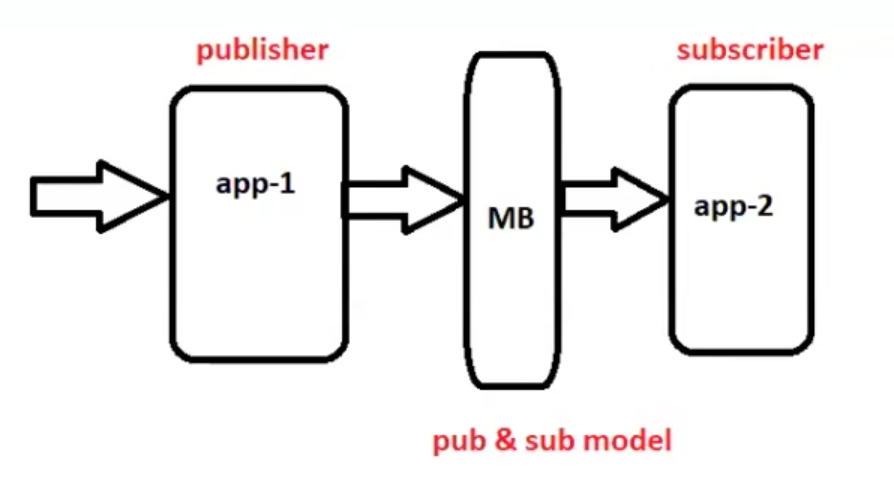
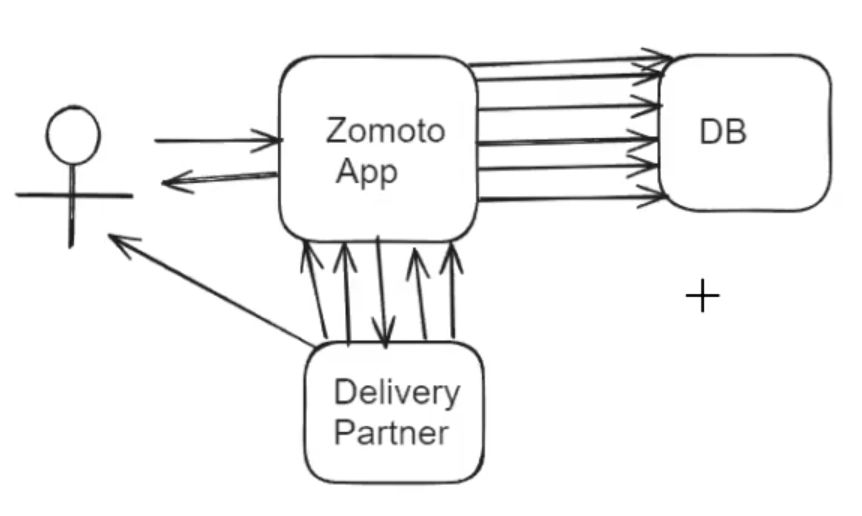
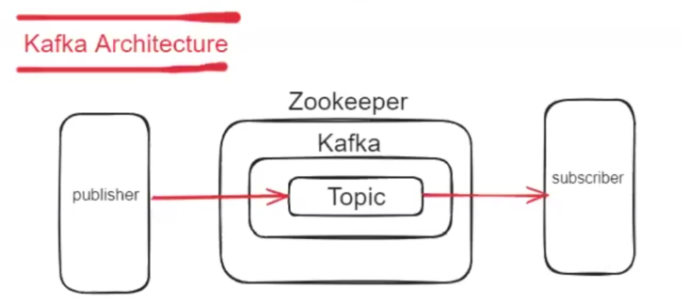
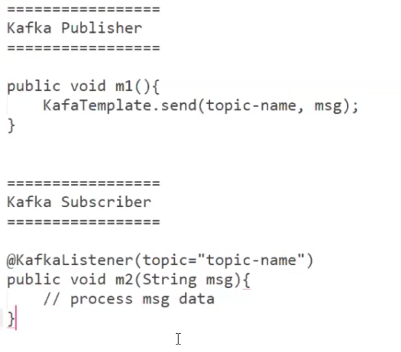

# Apache Kafka

used to send message from one application to other through a mediator called as message broker!! one who puts or produces message is publisher and one who consumes is subscriber!!

MB--> message broker

## why do not app-1 send message to app-2 directly?
app-1 call app-2 through rest API!!

suppose you book food from zomato app!! zomato puts your order in DB then zomato assign delivery partner to your order!! zomato puts delivery partner to database!! then delivery partner app and zomato app communicate for various status update for delivery!! each time zomato puts status update in database!! so here problem is the database have a lot of calls by zomato app regarding one order!!there are approx 1 crore order in a day So there will be many calls so database will crash!!

Actually 3 status important for zomato !!
- order placed
- order delivered
- order not delivered

but there are many events generated
 - delivery boy confirmed
 - order picked up
 - order take 5 min 
- order delay
- delivery partner calling

for all these events if we put DB call then it will increase burden and decrease throughput! as every Db call is costly operation!! to avoid this we use __message broker__!!

in real time zomato application is designed as 
order service where order is placed!!

when order placed it put that in DB!!

now all events will be store in message broker!!
once message stored in message broker!! now from message broker after some time zomato service will read all the events and process them!! and update the summary  only once in DB!!

once order is delivered there  is no use of events!! previously also when we storing in DB the rest all events stored in message broker are not important for zomato!!

these are temporary stored in message broker!!

same you can see in uber , ola ,swiggy application!!

also you search something on facebook then you open amazon !! you see those thing in recommendation!! this is because facebook shared your data with amazon through message broker!!
so message broker is used to share real time data feeds!!

## Kafka
=> Kafka is a Message broker

=> Kafka is used as Streaming platform

=> Kafka is used for realtime data processing

=> Kafka works based on pub & sub model

publisher : App which is producing msgs

subscriber : App which is consuming msgs

## Kafka Architecture

1) Zookeeper

2) Kafka Server

3) Kafka Topic

4) Publisher App

5) Subscriber (Consumer/Listener)

to set up kafka we need environment which is set by software called zookeeper which is a server!! first we need to start zookeeper server than only we can use kafka!!

then on kafka we start a topic !! topic is nothing but a queue!! publisher puts message in topic!! consumer consumes message from topic!!

once consumer consumed the message the message is deleeted from topic !! if you want to other consumers to see message use partitions!!

## Steps for apache kafka in windows

Step-1 : Download Zookeeper from below URL

   URL : http://mirrors.estointernet.in/apache/zookeeper/

Step-2 : Download Apache Kafka from below URL

   URL : http://mirrors.estointernet.in/apache/kafka/

Step-3 : Set Path to ZOOKEEPER in Environment variables upto bin folder

### Note: Copy zookeeper.properties and server.properties files from kafka/config folder to kafka/bin/windows folder. ###

Step-4 : Start Zookeeper server using below command from kafka/bin/windows folder

Command : zookeeper-server-start.bat zookeeper.properties

Step-5: Start Kafka Server using below command from kafka/bin/windows folder

Command : kafka-server-start.bat server.properties

Note: If kafka server is getting stopped, delete kafka logs from c:/tmp/ folder.    

Step-6 : Create Kafka Topic using below command from kafka/bin/windows folder

Command : kafka-topics.bat --create --bootstrap-server localhost:9092 --replication-factor 1 --partitions 1 --topic ashokit_topic

Step-7 : View created Topics using below command

Command : kafka-topics.bat --list --bootstrap-server localhost:9092

## install kafka on linux ec2 instance!!

https://medium.com/@nimeshaamarasingha/install-apache-kafka-in-aws-ec2-instance-d530c387d265

https://medium.com/@khasnobis.sanjit890/installing-apache-kafka-in-aws-ec2-instance-own-your-kafka-server-for-0-0992-per-hour-32cd78e7cf27

as a developer you will not be able to set up kafka and create topic !! you message kafka admin and you tell them about create topic and he will tell topic name and topic!!

## Code skeleton

some configuration is needed so that it (both consumer and producer) can connect to kafka server!!

## Create kafka producer

