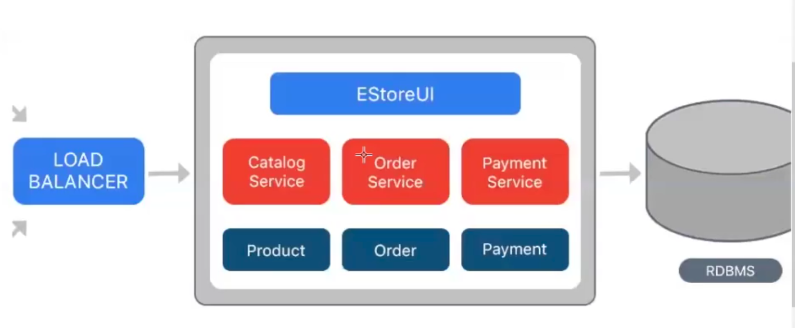
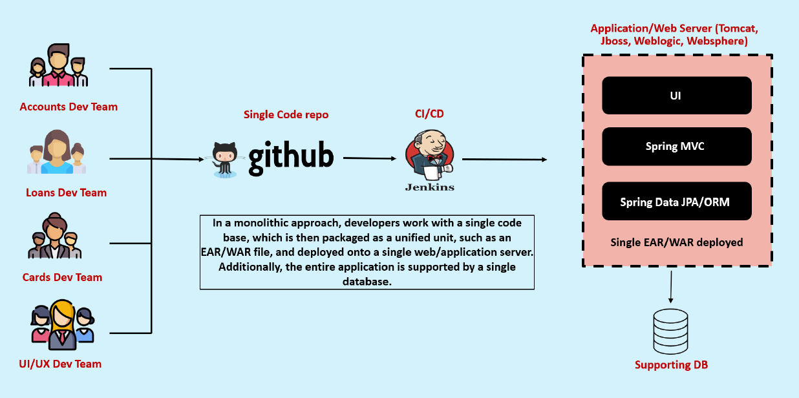
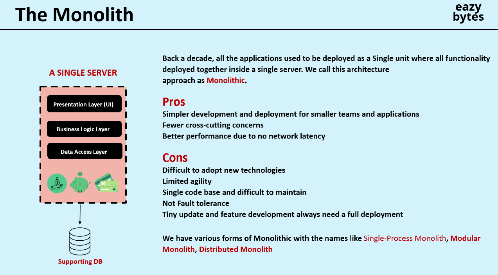
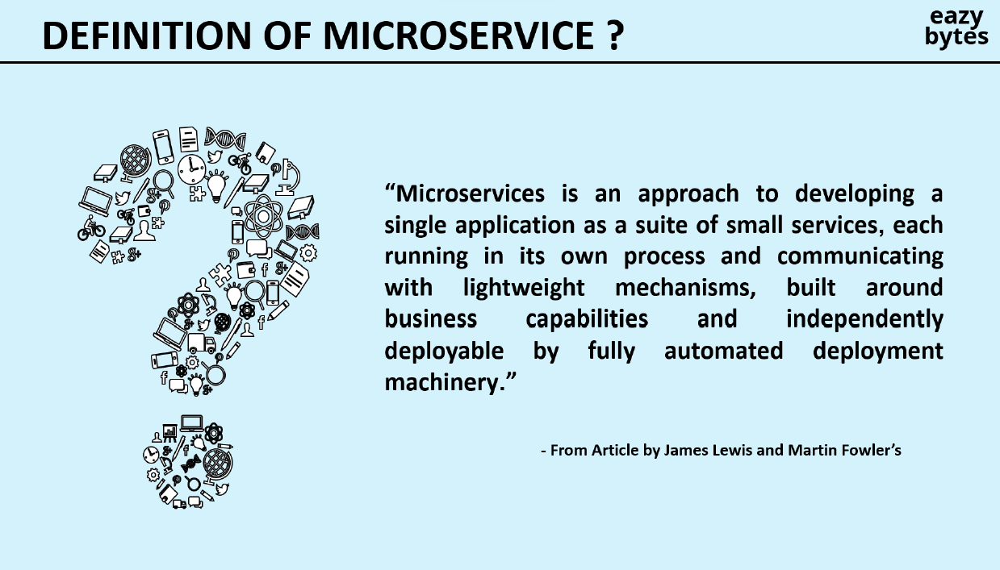
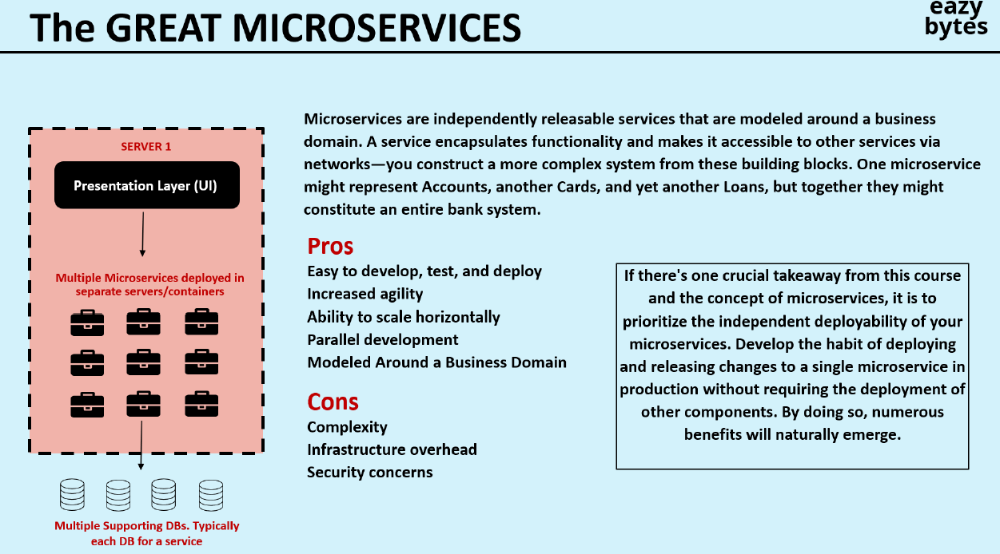
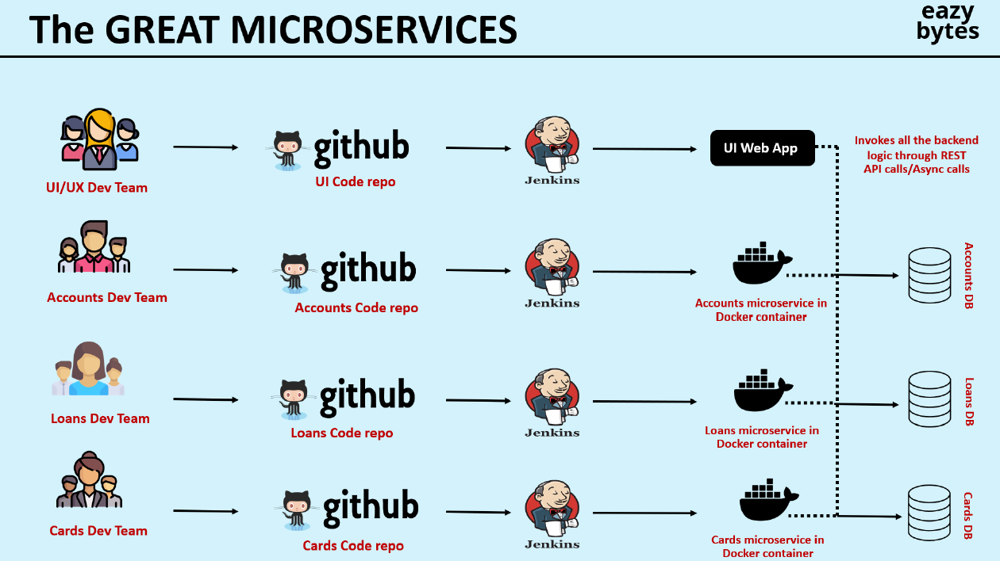

# Microservices

## Monolithic 

 see all services catalog service, order service all in 1 project!!

=> Develop all functionalities in single app

=> Application will be packaged as one fat jar / fat war 

=> App will be deployed in single server

#### Drawbacks of monolithic
1) Single Point of failure
2) Re-Deploy entire app even small change in a service
3) Maintenance of the app as so many services in one app
4) Burden on server

## Microservices

you can call a service as group of restAPi!! so in springboot we use @RestController for that!!

=> Microservices is a not a technology

=> Microservices is not a framework

=> Microservices is not an API

=> Microservices is an architectural design pattern (it will tell how to develop the project)

=> Microservices design pattern is universal

=> The main aim of microservices is to develop app with loosely coupling

=> Microservices based application means collection of loosely coupled rest apis.

=> Microservices means independently deployable and executable services.

#### Advantages

1) Loosely Coupled
2) Easy Maintenance
3) Load will be distributed to multiple servers
4) Technology Independency
5) High Availability as no single point of failure

all teams will have their own service repo!! and each deployed on separate server!!

#### Challenges
1) Bounded Context (deciding no.of rest apis to develop)(architect take this decision)
2) Duplicate Configuration (suppose 3 microservice need same database so all 3 services will be putting duplicate configurations!!)
3) Visibility (as a developer you will not get complete picture of project! management will not give chance to work on entire project!! as you tell secrets to other company!)
(where request is coming to whom we are giving response we do not know we just told that this is rest API this is json input develop!!)

### Architecture
-> There is no standard architecture for Microservices development

-> People are customizing microservices project architecture according to their requirement.

components in microservices: 
1) Service Registry or discovery server
2) Admin Server
3) Zipkin Server
4) Backend Services (REST APIs)
5) Load balancers
6) API Gateway
7) Feign Client
8) Config Server
8) Apache Kafka
10) Redis Cache
11) Docker (containerization)

not every microservice architecture will have these component!!

now on we are going to use SpringCloud dependency which give some of these components!!

### Service Registry or discovery server

-> Service Registry is used to maintain list of services available in the project.

-> It provides information about registered services like

- Name of service
- url of service
- status of service (up and running or not)

-> It provides no. of instances available for each service.

-> We can use Eureka Server as a service registry

-> Eureka server provided by Spring Cloud Netflix library

---

### Admin Server

-> for every service actuator endpoint will be available

-> Actuators(we know about them)  are used to monitor and manage our applications

-> Monitoring and managing all the apis separately is a challenging task

-> Admin Server Provides an user interface to monitor and manage all the apis at one place using actuator endpoints.

---

### Zipkin Server

-> It is Used for Distributed tracing

-> Using zipkin server, we can monitor which api is taking more time to process request.

-> Using Zipkin we can understand how many apis involved in request processing.

---

### Backend apis

-> Backend apis contains business logic

-> Backend apis are also called as REST APIs / services / microservices

- Ex: payment-api, cart-api, flights-api, hotels-api

>Note: Backend api can register as client for Service Registry, Admin server & Zipkin server (The 3 servers are optional)

-> Backend Apis acts as client for Eureka ,Admin server and Zipkin server

---

### FeignClient

-> It is provided by spring cloud libraries

-> It is used for Inter Service Communication (one api of a service want to communicate with api of another service)

-> Inter service communication means one api is accessing another api using Service Registry. 

>Note: External communication means accessing third party apis.

-> When we are using FeignClient we no need mention URL of the api to access. Using service name feign client will get service URL from service registry.

-> Apis can act as provider as well as consumer here!! FeignClient can also be used for connecting 3rd party application apis!!

---
### Load balancer

-> if load on a API increase we can put load balancer and run API on multiple servers

-> if rest template or web client is used then we need to tell 10 url's. as they connect to same server with same URL!!

-> with FeignClient load balancer comes inbuilt!! so instances of a service can increase or decrease according to load so can have multiple URL's accordingly!! so with feignClient we not use use URL as a URl will go to particular server only!! so feignClient get URL from service Registry!!

-> Feign Client uses Ribbon to perform Client side load balancing. Ribbon decide which URL give to the FeignClient!! so that is why Eureka is called as discovery server as used to discover url of a service!! 

---
### API Gateway

-> API Gateway is used to manage our project backend apis

-> API Gateway acts as mediator between user requests and backend apis

-> API Gateway acts as entrypoint for all backend apis

-> In API Gateway we will have 2 types of logics

1) Request Filter : To validate the request (go / no-go)

2) Request Router : forward request to particular backend-api based on URL Pattern

	- /hotels => hotels - api

	 - /flights => flights - api

	- /trains => trains - api

---

### Config Server

-> Config Server is part of Spring Cloud Library

-> Config Server is used to externalize config properties of application

Note: In realtime we will keep app config properties outside of the project to simplify application maintenance.

---

### Apache Kafka

-> Kafka is a message broker

-> Kafka works based on Publisher - Subscriber model

-> To send msgs from one app to another app we will use Kafka as a mediator.

-> Using Kafka we can develop Event Driven Microservices based applications.

---

### Redis Cache

-> In our application we will have 2 types of tables

1) Transaction tables (app will insert/update/delete records)

2) Non-Transactional tables (app will only retrieve records)

Note: It is not recommended to load non-transactional tables data from db every time.

-> To reduce no.of round trips between Java app and Database we will use cache.

-> Redis is used for distributed cache implementation.

---