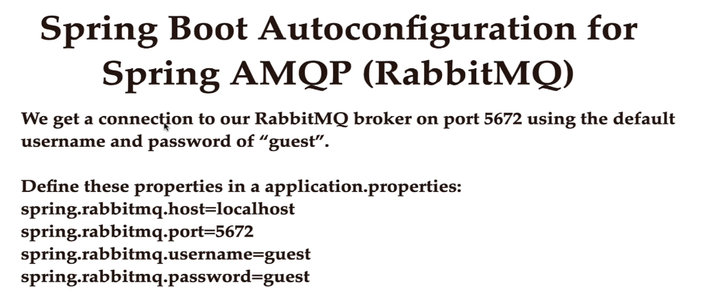

# Springboot and rabbotMq

## Dependencies


## Configuration



In host you need to tell where rabbitmq server is!!

### Pom.xml

```xml
spring.application.name=demo

server.port=8081
spring.rabbitmq.host=ec2-13-201-222-66.ap-south-1.compute.amazonaws.com
spring.rabbitmq.port=5672
spring.rabbitmq.username=guest
spring.rabbitmq.password=guest

rabbitmq.queue.name=queue_mohit
rabbitmq.exchange.name=exchnage-Mohit
rabbitmq.routing.key=abcd


```


```java

@Configuration
public class RabbitMQConfig {

    @Value("${rabbitmq.queue.name}")
    private String queue;

    @Value("${rabbitmq.exchange.name}")
    private String exchange;

    @Value("${rabbitmq.routing.key}")
    private String routingKey;

    // spring bean for rabbitmq queue
    @Bean
    public Queue queue(){
        return new Queue(queue);
    }
    // spring bean for rabbitmq exchange
    @Bean
    public TopicExchange exchange(){
        return new TopicExchange(exchange);
    }
    // binding between queue and exchange using routing key
    @Bean
    public Binding binding(){
        return BindingBuilder
                .bind(queue())
                .to(exchange())
                .with(routingKey);
    }
}

```
here creating queue and exchnage and binding them !! this is common for both producer and consumer!!

## Producer

### Controller

```java
@RestController
public class Controller {

    private Producer producer;

    public Controller(Producer producer) {

        this.producer = producer;
    }


    @GetMapping("/publish")
    public ResponseEntity<String> sendMessage
    (@RequestParam("message") String message){
    	System.out.println("In controller");
        producer.sendMessage(message);
        return ResponseEntity.ok("Message sent to RabbitMQ ...");
    }
}
```
RabbitTemplate is used to send message to queue!!

### producer

```java
@Service
public class Producer {


    @Value("${rabbitmq.exchange.name}")
    private String exchange;

    @Value("${rabbitmq.routing.key}")
    private String routingKey;

    private static final Logger LOGGER =
            LoggerFactory.getLogger(Producer.class);

    private RabbitTemplate rabbitTemplate;

    public Producer(RabbitTemplate rabbitTemplate) {

        this.rabbitTemplate = rabbitTemplate;
    }

    public void sendMessage(String message){
        LOGGER.info(String.format("Message sent -> %s", message));
        rabbitTemplate.convertAndSend(exchange, routingKey, message);
    }
}
```
## Consumer

here need to tell queue name from which consumer need to listen
```java

@Service
public class Consumer {

    private static final Logger LOGGER = LoggerFactory.getLogger(Consumer.class);

    @RabbitListener(queues = {"${rabbitmq.queue.name}"})
    public void consume(String message){

        LOGGER.info(String.format("Received message -> %s", message));
}

}
```

- We annotate the consume method with @RabbitListener to specify the queue from which to consume messages.
- When a message is received, the “consume” method will be invoked and the consumer can continue processing the consumed message.