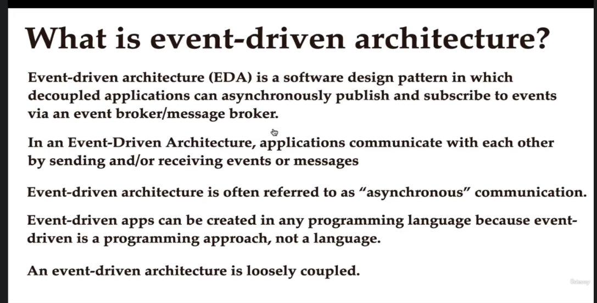
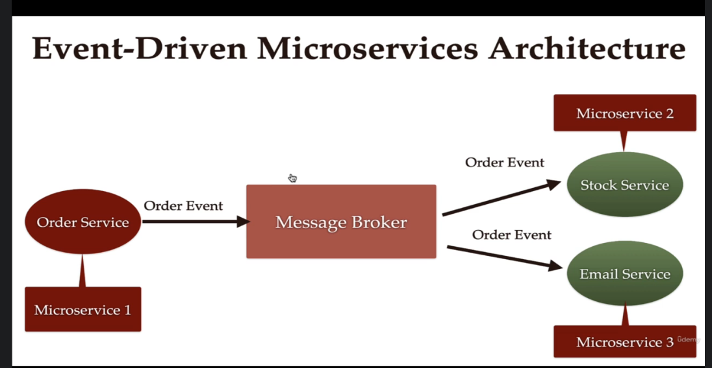

# Notes
## What is Event-Driven Architecture?
Event-driven architecture is a software design pattern that allows decoupled applications to asynchronously publish and subscribe to events through an event broker (modern messaging-oriented middleware).

Event-driven architecture is a method of developing enterprise IT systems that allows information to flow in real time between applications, microservices, and connected devices as events occur throughout the business.

The event-driven architecture enables loose coupling of applications by introducing a middleman known as an event broker. This means that applications and devices do not need to know where they are sending information or where the information they are consuming comes from

whenever prder service get order it create a event! then consumer service comes online it can get the message!!

> It is asyncronous communication

We use message broker like Kafka,RabbitMQ to coomunicate between microservices!!

## What does the term "event" mean in EDA?
A change in state is called an event. In an event-driven architecture, everything that happens within and to your enterprise is an event — customer requests, inventory updates, sensor readings, and so on.

## Benefits of EDA
- Buffering and fault-tolerance. Events might be consumed at a different rate to their production and producers mustn’t slow down for the consumers to catch up.
- Decoupling of producers and consumers, avoiding unwieldy point-to-point integrations. It’s easy to add new producers and consumers to the system. It’s also easy to change the implementations of producers and consumers, provided that the contracts/schemas constraining the event records are honoured.
- Massive scalability. It is often possible to partition event streams into unrelated substreams and process these in parallel. We can also scale the number of consumers to meet the load demands if the backlog of events grows. Platforms like Kafka enable the processing of events in strict order while simultaneously allowing massive parallelism across the stream.
