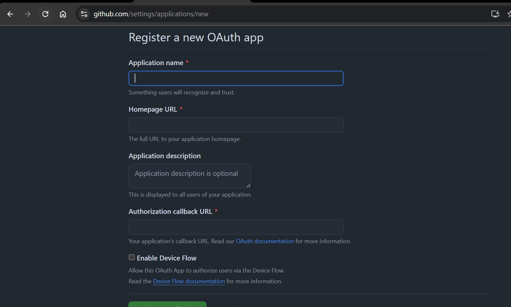
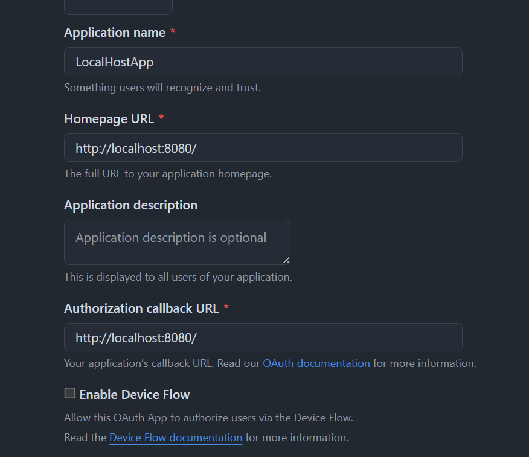
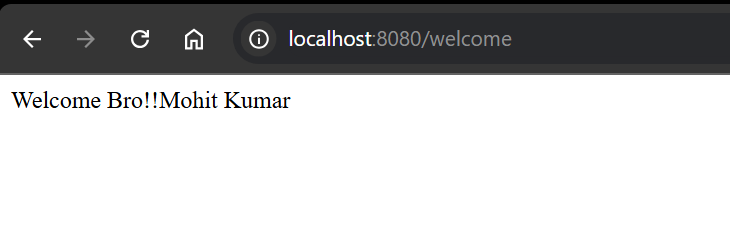

# OAuth 2.0 notes

official website --> https://oauth.net/2/

OAuth 2.0 is the industry-standard protocol for authorization. OAuth 2.0 focuses on client developer simplicity while providing specific authorization flows for web applications, desktop applications, mobile phones, and living room devices. This specification and its extensions are being developed within the IETF OAuth Working Group.

Suppose you want to login to some place , now we login by google or facebook to login to some site!!

when you click on sign in with google!! google ask you for authentication then you click on allow ,this allows website to access your details that google allows , not your personal info that google have!!
and then google issues a token to that site !!

If you want user to be secured using some social media site then we use this OAuth!!

we going to access our website by github login!!

###  1) Create Spring Boot application with below dependencies

		a) web-starter
		b) security-starter
		c) oauth-client


### 2) Create OAuth app in Github.com

	(Login --> Profile -> Settings --> Developer Settings --> OAuth Apps --> Create App --> Copy Client ID & Client Secret)





### 3) Configure GitHub OAuth App client id & client secret in application.yml file like below


spring:
  security:
    oauth2:
      client:
        registration:
          github:
            clientId: 
            clientSecret: 


### 4) Create Rest Controller with method

@RestController
public class WelcomeRestController {

	@GetMapping("/")
	public String welcome() {
		return "Welcome to Ashok IT";
	}
}

#### 5) Run the application and test it.

now our application can get some details from github like name 

```java
	
	@GetMapping("/welcome")
	public String welcome(@AuthenticationPrincipal OAuth2User user) {
		return "Welcome Bro!!"+user.getAttribute("name");
	}
	
```
After login see output



As soon as you log out from Github , it will logout from application too!! Or credntials afre validated by github here!!


>Assignment : Spring Boot with oAuth using google account. Get username also from google and display that in response.

