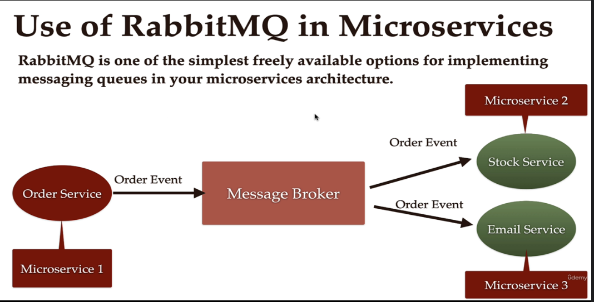
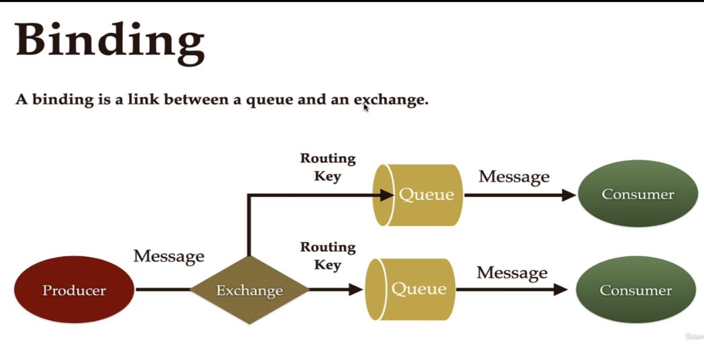

## Udemy and youtube lecture

Producer need not wait , producer put message on queue and consumer when comes online will get message!!! so it is used to communicate asynchronously!!

Exchange and queue is part of rabbitMq broker!!

- Producer : application that send message to broker
- Consumer : application consumes message from broker

Exchnage route message to particular queue based on rules

key is like key to queue!!

## install rabbitmq on ec2

>Note:Using Amazon linux 2 AMI
1. install epel-release
    
    - sudo yum install epel-release
    - sudo amazon-linux-extras install epel

    can use anyone of two

2. install these
    - sudo yum install erlang
    - sudo yum install rabbitmq-server

3. list out rabbit mq plugins
    - sudo rabbitmq-plugins list

4. enable raabitmq management  to see UI
    - sudo rabbitmq-plugins enable rabbitmq_management
    - to check can list as on step 3 can see e (enable ) on rabbitmq management

5. enable rabbitmq-server
    - sudo systemctl enable rabbitmq-server

6. start and stop server    
    - sudo systemctl start rabbitmq-server
    - sudo systemctl stop rabbitmq-server

- after it starts enable port 15672 on inbound rules

- use either public-ip:15672 or machine public dns:15672 to access rabbitmq server UI!!

default username and password is __guest__

## whereis rabbitmq installed
- sudo chown -R ec2-user: /var/log/rabbitmq

## Exploring the rabbitmq interface

using this we can create queue , exchnage  and bindings!!

In connections you see all connection whenver we try to connect to this rabbitmq server!!

Channels : message are communicated over channel we see it later

Exchnage : to give exchnage info , just click on add new exchnage give name , type : direct and you see your exchange name added to table above!!

Queue : Just add a queue name and add 

then go back on exchnage and click on exchange you created and add binding to queue you created

first added q name and routing key is like password (put anything for practice) click on bind !! to unbind you need to just click!!

On queues too , you will be able to see bindings!!

on exchnage to publish message 

on queue we have get messages

