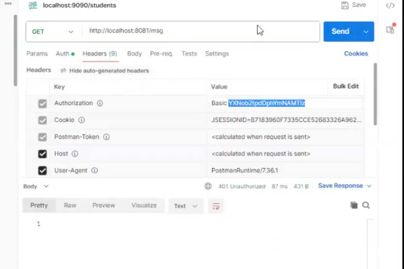

# Notes Spring Security-1

1) Authentication (verifying credentials)

2) Authorization (can this user access specific functionality) like admin have all functionality of application , normal user do not have all functionality open!!


-> Security is very important for every web application

-> To protect our application & application data we need to implement security logic

-> Spring Security concept we can use to secure our web applications / REST APIs


-> To secure our spring boot application we need to add below starter in pom.xml file

```xml
		<dependency>
			<groupId>org.springframework.boot</groupId>
			<artifactId>spring-boot-starter-security</artifactId>
		</dependency>

```
For spring security we should know these following topics:
- Basic Auth (Just to know how spring security credentials)
- In memory user credentials auth
-  JDBC auth
- OAuth 2.0 (using one application account access other application like using google account login to our application)
-  JWT(Json web token)( Very important for microservices)

>Note: When we add this dependency in pom.xml file then by default our application will be secured with basic authentication. It will generate random password to access our application. 

Note: Generated Random Password will be printed on console.

-> We need to use below credentials to access our application

Username : user

Password : \<copy the pwd from console>

-> When we access our application url in browser then it will display "Login Form" to authenticate our request.

-> To access secured REST API from postman, we need to set Auth values in POSTMAN to send the request

Auth : Basic Auth

Username : user
				
                
Password : \<copy-from-console>

You will see it will be added in Header as you see header parameters will increase as you add BasicAuth!!in Header Basic:username:password will be encoded and send to server!!and on server credentials are matched !!



you see selected part that is encoded username and password!!

It will not ask login each time you open in each tab!!If you open in another browser it will ask for login password!! so it is using cookies in browser for your browser!!

>Assignment : Devlop application using restTemplate and webClient to access secure application , now we need to send key Authorization and value Basic Username:Password
## How to override Spring Security Default Credentials

-> To override Default credentials we can configure security credentials in application.properties file or application.yml file like below

```properties
spring.security.user.name=ashokit
spring.security.user.password=ashokit@123
```

-> After configuring credentials like above, we need to give above credentials to access our application / api.

## How to secure specific URL Patterns


-> When we add 'security-starter' in pom.xml then it will apply security filter for all the HTTP methods of our application.

-> But in reality we need to secure only few methods not all methods in our application.

	For Example

				/ login-page --> security not required
		
				/ transfer ---> security required

				/ balance ---> security required

				/ about-us ---> security not required

				/ contact-us ---> security not required


-> In order to achieve above requirement we need to Customize Security Configuration in our project like below

```java
@Configuration
@EnableWebSecurity
public class SecurityConfigurer {

	@Bean
	public SecurityFilterChain securityFilterChain(HttpSecurity http) throws Exception {
		http.authorizeHttpRequests((authorize) -> authorize
						.requestMatchers("/contact", "/swagger-ui.html").permitAll()
						.anyRequest().authenticated()
			)
				.httpBasic(withDefaults())
				.formLogin(withDefaults());
		return http.build();
	}
}
```
Security is applied to all urls , to avoid some of the URLs we use above way!!

>Note: this method name can be anything!!

## Spring Security In-Memory Authentication

Using previous approach we can not configure multiple users, so we want soething to configure multiple users!!

-> In Memory Authentication means storing user credentials in the program for Authentication Purpose.

-> This is not recommended for production.

```java
	@Bean
	public InMemoryUserDetailsManager inMemoryUsers() {
		
		UserDetails ashokUser = User.withDefaultPasswordEncoder()
									.username("ashok")
									.password("ashok")
									.authorities("ADMIN")
									.build();
		
		
		UserDetails johnUser = User.withDefaultPasswordEncoder()
									.username("john")
									.password("john")
									.authorities("USER")
									.build();
		
		return new InMemoryUserDetailsManager(ashokUser, johnUser);
		
	}
```

## Spring Boot Security with JDBC Authentication


=> JDBC Authentication is used to fetch Db table data for User authentication purpose


 Step-1 ) Setup Database tables with required data

```sql
-- users table structure

CREATE TABLE `users` (
  `username` VARCHAR(50) NOT NULL,
  `password` VARCHAR(120) NOT NULL,
  `enabled` TINYINT(1) NOT NULL,
  PRIMARY KEY (`username`)
);


-- authorities table structure

CREATE TABLE `authorities` (
  `username` VARCHAR(50) NOT NULL,
  `authority` VARCHAR(50) NOT NULL,
  KEY `username` (`username`),
  CONSTRAINT `authorities_ibfk_1` FOREIGN KEY (`username`)
  REFERENCES `users` (`username`)
);

```


Online Encrypt : https://bcrypt-generator.com/ 

```sql
-- insert records into table

insert into users values ('john', '$2a$12$D8x8tLL4Q4Q/7aLI5vBt8.QS6FKn8tN7h3hzgc8TTimxAKvAnMUFu',  1);

insert into users values ('smith', '$2a$12$hhdXrq63gHFVkL2G1jwDuOBcrNEjX7mwZHUXEgQGwL18v6CD1zkra',  1);

insert into authorities values ('john', 'ROLE_ADMIN');
insert into authorities values ('john', 'ROLE_USER');
insert into authorities values ('smith', 'ROLE_USER');

```

 Step-2) Create Boot application with below dependencies

		a) web-starter
		b) security-starter
		c) data-jdbc
		d) mysql-connector
		e) lombok
		f) devtools


 Step-3 ) Configure Data source properties in application.yml file

 ```yml

spring:
  datasource:
    driver-class-name: com.mysql.cj.jdbc.Driver
    password: AshokIT@123
    url: jdbc:mysql://localhost:3306/sbms66
    username: ashokit
  jpa:
    show-sql: true

 ```

 
Step-4) Create Rest Controller with Required methods

```java
@RestController
public class UserRestController {

	@GetMapping(value = "/admin")
	public String admin() {
		return "<h3>Welcome Admin :)</h3>";
	}

	@GetMapping(value = "/user")
	public String user() {
		return "<h3>Hello User :)</h3>";
	}

	@GetMapping(value = "/")
	public String welcome() {
		return "<h3>Welcome :)</h3>";
	}

}
```


Step-5) Create Security Configuration class like below with Jdbc Authentication Manager
```java
package in.ashokit;


@Configuration
@EnableWebSecurity
public class SecurityConfiguration {
	
	private static final String ADMIN = "ADMIN";
	private static final String USER = "USER";

	@Autowired
	private DataSource dataSource;
	

	@Autowired
	public void authManager(AuthenticationManagerBuilder auth) throws Exception {
	    auth.jdbcAuthentication()
	      	.dataSource(dataSource)
	      	.passwordEncoder(new BCryptPasswordEncoder())
	      	.usersByUsernameQuery("select username,password,enabled from users where username=?")
	      	.authoritiesByUsernameQuery("select username,authority from authorities where username=?");
	}
	
	@Bean
	public SecurityFilterChain securityConfig(HttpSecurity http) throws Exception {
			
		http.authorizeHttpRequests( (req) -> req
				.antMatchers("/admin").hasRole(ADMIN)
				.antMatchers("/user").hasAnyRole(ADMIN,USER)
				.antMatchers("/").permitAll()
				.anyRequest().authenticated()
		).formLogin();
		
		return http.build();
	}

}

```

here we are doing authentication as well as authorization 

Authorization /admin accessed by ADMIN only

/user can be accessed by Admin as well as user!!


