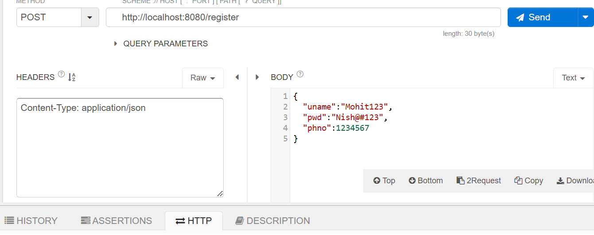
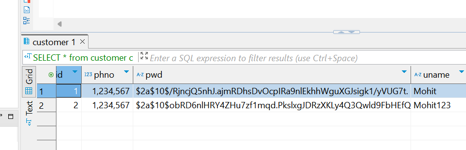
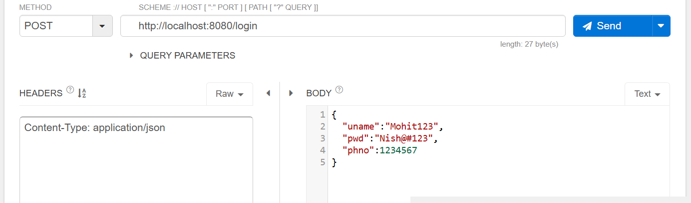
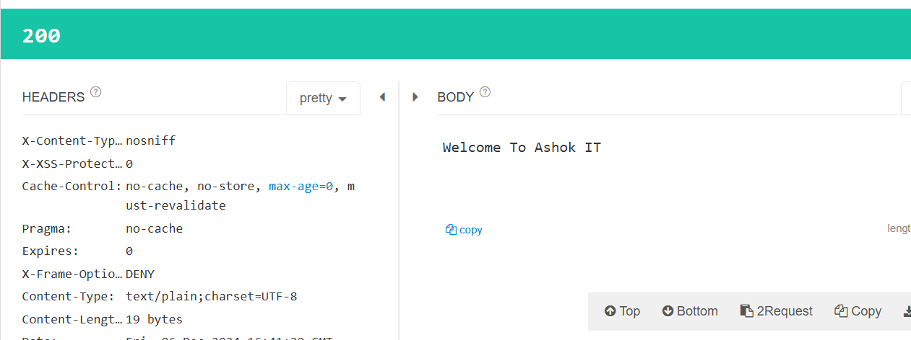

# Notes Login and Registration using spring security

To insert record in table we use JPA!!

## How to work with UserDetailsService in Spring Security

=> UserDetailsService is a predefined interface which contains loadUserByUsername(String name) method.

=> This is used to load User record for Authentication purpose in Spring Security.

=> We can implement UserDetailsService interface and we can write the logic to retrieve User record based on given username for Authentication purpose.

=> If we give UserDetailsService object to AuthenticationManagerBuild then AuthManager will call this method for every login request.

## Login and Registration using Spring Security

 Git Hub repo : https://github.com/ashokitschool/SpringBoot_Security_Register_Login.git

1) Create Boot app with required dependencies ##

			a) web-starter
			b) data-jpa-starter
			c) mysql
			d) security-starter
			e) devtools

2) Configure Data Source properties in yml file

2) Create Entity class & Repository interface 

Customer Entity
```java
	private Integer cid;
	private String uname;
	private String pwd;
	private Long phno;

```

```java
@Repository
public interface CustomerRepo extends CrudRepository<Customer, Integer> {

	public Customer findByUname(String cuname);

}
```

Here Repository annotation is optional, JPA will get it automatically!!

As username is not PK so we need to write findByUname method!!

3) Create UserDetailsService class (this is for login)

```java
@Service
public class MyUserDetailsService implements UserDetailsService {

	@Autowired
	private CustomerRepo crepo;

	@Override
	public UserDetails loadUserByUsername(String username) throws UsernameNotFoundException {
		Customer c = crepo.findByUname(username);
		return new User(c.getUname(), c.getPwd(), Collections.emptyList());
	}
}
```
to login based on username we get record

User definition
```java
	public User(String username, String password, Collection<? extends GrantedAuthority> authorities) {
		this(username, password, true, true, true, true, authorities);
	}

```

Collections tells about the roles!!here no roles so empty collection!!if roles avialable in roles table then we pass roles from that table too!!

 4) Create Security Config Class

Here we created various beans

1. PasswordEncoder - to encode password
2. auth provider - how data coming for authentication from db
3. AuthenticationManager - check is credentials valid
4. SecurityFilterChain -to customize security!! as we want /login and /register to be accessed by all

```java
@Configuration
@EnableWebSecurity
public class AppSecurityConfig {
	
	@Autowired
	private MyUserDetailsService userDtlsSvc;
	// for password encoding
	@Bean
	public PasswordEncoder pwdEncoder() {
		return new BCryptPasswordEncoder();
	}
	
    //get auth provider and auth manager here we tell spring security to get user data from UserDetailService

    //here telling what is user detail service and what password encoder we are using
	@Bean
    public AuthenticationProvider authenticationProvider(){
        DaoAuthenticationProvider authenticationProvider=
        		new DaoAuthenticationProvider();
        authenticationProvider.setUserDetailsService(userDtlsSvc);
        authenticationProvider.setPasswordEncoder(pwdEncoder());
        return authenticationProvider;
    }

    @Bean
    public AuthenticationManager authenticationManager(AuthenticationConfiguration config) throws Exception {
        return config.getAuthenticationManager();
    }

	//configuring spring security
    @Bean
	public SecurityFilterChain securityConfig(HttpSecurity http) throws Exception {
		return http.csrf().disable()
                .authorizeHttpRequests()
                .requestMatchers("/register", "/login").permitAll()
                .and()
                .build();
	}
}
```
 5) Create RestController with required methods

 two methods 
 1. login
 2. register
```java
@RestController
public class CustomerRestController {

	@Autowired
	private CustomerRepo crepo;

	@Autowired
	private PasswordEncoder pwdEncoder;// from configuration

	@Autowired
	private AuthenticationManager authManager;

	@PostMapping("/login")
	public ResponseEntity<String> loginCheck(@RequestBody Customer c) {
		//with username and password we generate a token
		UsernamePasswordAuthenticationToken token = 
				new UsernamePasswordAuthenticationToken(c.getUname(), c.getPwd());

		try {
            //token is authenticated
			Authentication authenticate = authManager.authenticate(token);

			if (authenticate.isAuthenticated()) {
				return new ResponseEntity<>("Welcome To Ashok IT", HttpStatus.OK);
			}

		} catch (Exception e) {
			//logger
		}

		return new ResponseEntity<String>("Invalid Credentials", HttpStatus.BAD_REQUEST);
	}

	@PostMapping("/register")
	public String registerCustomer(@RequestBody Customer customer) {
		
		// duplicate check

		String encodedPwd = pwdEncoder.encode(customer.getPwd());
		customer.setPwd(encodedPwd);

		crepo.save(customer);

		return "User registered";
	}

}
```

 6) Run the application and test it

```properties

#db specific properties
spring.datasource.url=jdbc:mysql://whatsapp-clone-db.chwegskauib2.ap-south-1.rds.amazonaws.com/<Db-name>
spring.datasource.username=admin
spring.datasource.password=<password>

#ORM s/w specific properties
spring.jpa.hibernate.ddl-auto=update
spring.jpa.show-sql=true


```
last two tells to create table if not exists!!

to debug spring security we use this in properties


logging.level.org.springframework.security=DEBUG

```java

public SecurityFilterChain securityConfig(HttpSecurity http) throws Exception {
    return http.csrf(csrf -> csrf.disable())
               .authorizeHttpRequests(auth -> auth
                   .requestMatchers("/register", "/login", "/welcome").permitAll()
                   .anyRequest().authenticated()
               )
               .build();
```

in here we first tell which url to be permitted to all using requestMatchers and then tell other request must be authenticated by anyRequest.authenticated()

## Ouptput

## registration




## login



