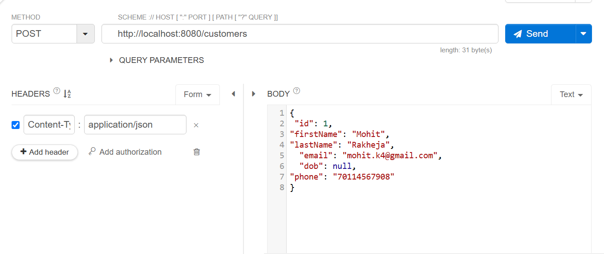
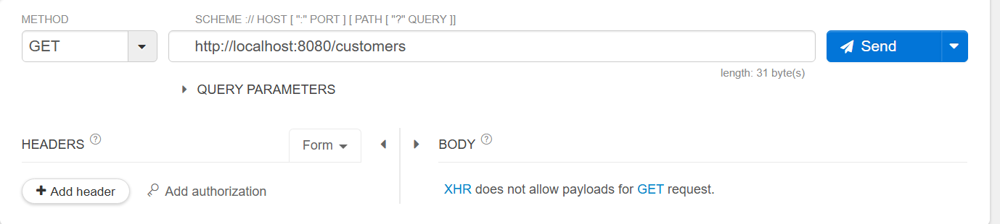
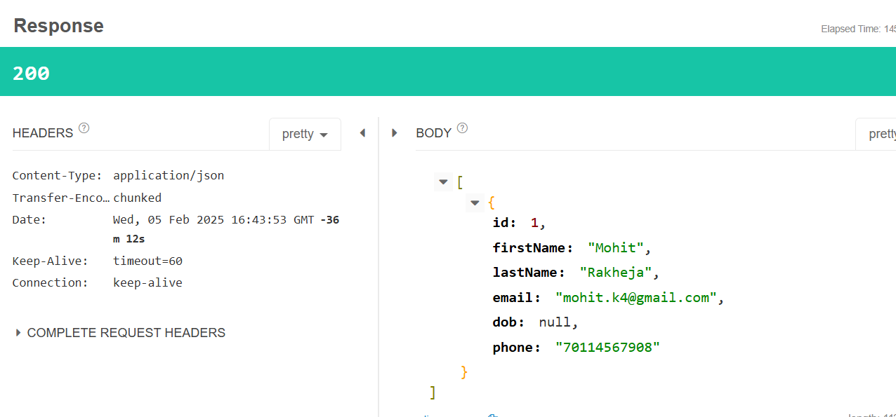
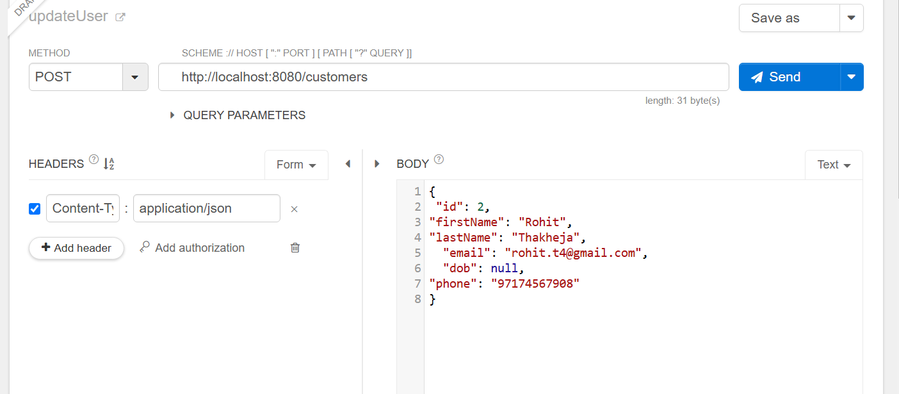
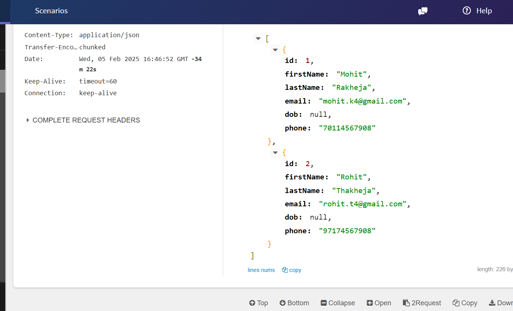
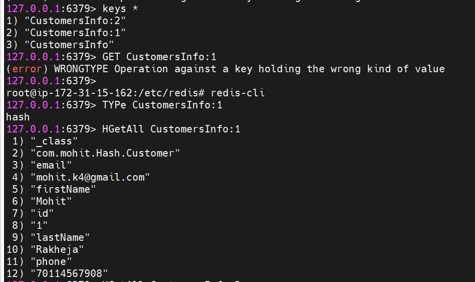
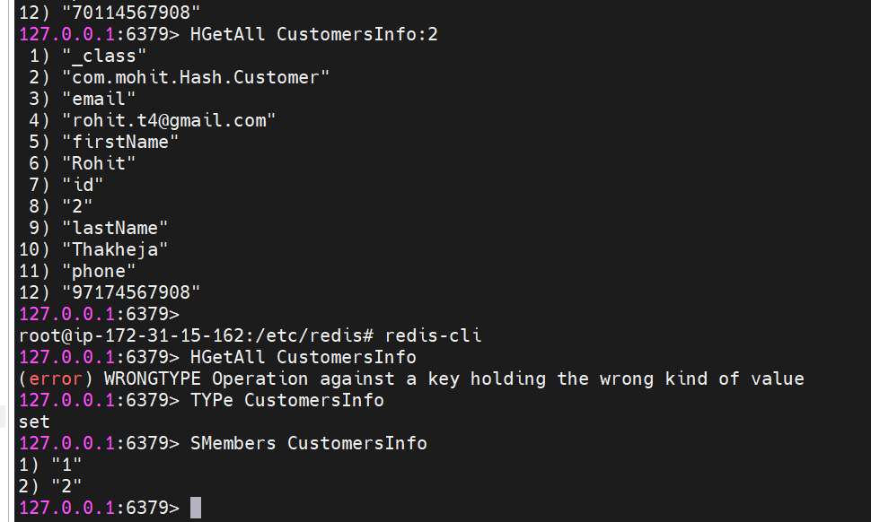

# Redis
let us now create our own project!!first provide configuartions

```java

@Configuration
public class RedisConfig {

    @Bean
    public RedisConnectionFactory connectionFactory() {

        return new LettuceConnectionFactory("ip-of-ec2",6379);
    }

    @Bean
    @Primary
    public RedisTemplate<String, Object> redisTemplate() {

        RedisTemplate<String, Object> redisTemplate = new RedisTemplate<>();

        //connection Factory
        redisTemplate.setConnectionFactory(connectionFactory());

        //key serializer
        redisTemplate.setKeySerializer(new StringRedisSerializer());

        // value serializer
        redisTemplate.setValueSerializer(new GenericJackson2JsonRedisSerializer());
        return redisTemplate;

    }

```

hash of redis or entity of RDBMS

```java
@Data
@AllArgsConstructor
@NoArgsConstructor
@RedisHash("CustomersInfo")
public class Customer implements Serializable {

    private static final long serialVersionUID= 1L;

    @Id
    private Integer id;
    private String firstName;
    private String lastName;
    private String email;
    @JsonFormat(pattern = "dd/MM/yyyy")
    private Date dob;
    private String phone;
}
```

 you're defining a Customer class that implements Serializable. This means that objects of the Customer class can be converted into a byte stream, which is useful for saving objects to files or transmitting them over a network.

 serialVersionUID: This is a unique identifier for the class version. It helps ensure that a serialized object can be deserialized correctly even if the class has changed over time.
 
CustomersInfo --> is hash name for redis
Controller

```java
@RestController
@RequestMapping("/customers")
public class CustomerController {

    @Autowired
    private CustomerService service;

    @PostMapping
    public Customer saveCustomer(@RequestBody Customer customer) {
        return service.saveCustomer(customer);
    }

    @GetMapping
    public List<Customer> getAllCustomers() {
        return service.getAllCustomers();
    }

    @GetMapping("/{id}")
    public Customer getCustomer(@PathVariable int id) {
        return service.getCustomer(id);
    }

    @DeleteMapping("/{id}")
    public String deleteCustomer(@PathVariable int id) {
        return service.deleteCustomer(id);
    }

    @PutMapping("/{id}")
    public Customer updateCustomer(@PathVariable int id, @RequestBody Customer customer) {
        return service.updateCustomer(id, customer);
    }
}
```

CustomerRepository

```java
public interface CustomerRepository extends CrudRepository<Customer,Integer> {
}
```

Simple enough till now!!!

```java

@Service
@Slf4j
public class CustomerService {

    @Autowired
    private CustomerDAO dao;

    private static final String CACHE_NAME="customers";

    @Autowired
    private CustomerRepository repository;

    @CachePut(key = "#customer.id",value = CACHE_NAME)
    public Customer saveCustomer(Customer customer) {
        //return dao.addCustomer(customer);
        log.info("CustomerService::saveCustomer() Inserting record to DB");
        return repository.save(customer);
    }

    @Cacheable(value = CACHE_NAME)
    public List<Customer> getAllCustomers() {
        //return dao.getAllCustomers();
        log.info("CustomerService::getAllCustomers() fetching records from DB");
        return StreamSupport.stream(repository.findAll().spliterator(), false)
                .collect(Collectors.toList());
    }

    @Cacheable(key = "#id",value = CACHE_NAME)
    public Customer getCustomer(int id) {
        //return dao.getCustomer(id);
        log.info("CustomerService::getCustomer() fetching record from DB");
        return repository.findById(id).get();
    }

    @CacheEvict(key = "#id",value = CACHE_NAME)
    public String deleteCustomer(int id) {
        //return dao.deleteCustomer(id);
        log.info("CustomerService::deleteCustomer() deleting record from DB");
        repository.deleteById(id);
        return "customer removed !";
    }

    @CachePut(key = "#id",value = CACHE_NAME)
    public Customer updateCustomer(int id, Customer customer) {
        //return dao.updateCustomer(id, customer);
        log.info("CustomerService::updateCustomer() updating record from DB");
        Customer existingCustomer = repository.findById(id).get();
        existingCustomer.setFirstName(customer.getFirstName());
        existingCustomer.setLastName(customer.getLastName());
        existingCustomer.setEmail(customer.getEmail());
        existingCustomer.setPhone(customer.getPhone());
        existingCustomer.setDob(customer.getDob());
        return repository.save(existingCustomer);

    }
}

```

now see 

```java

@Repository
public class CustomerDAO {

    public static final String HASH_KEY = "CustomersInfo";


    @Autowired
    private RedisTemplate template;

    public Customer addCustomer(Customer customer) {
        //tell hashname and then key and value to store
        template.opsForHash().put(HASH_KEY, customer.getId(), customer);
        return customer;
    }

    public List<Customer> getAllCustomers() {
        return template.opsForHash().values(HASH_KEY);
    }

    public Customer getCustomer(int id) {
        return (Customer) template.opsForHash().get(HASH_KEY, id);
    }

    public String deleteCustomer(int id) {
        template.opsForHash().delete(HASH_KEY, id);
        return "Customer " + id + " has been removed from system !";
    }

    public Customer updateCustomer(int id, Customer customer) {
        Customer existingCustomer = (Customer) template.opsForHash().get(HASH_KEY, id);
        if (existingCustomer != null) {
            existingCustomer.setFirstName(customer.getFirstName());
            existingCustomer.setLastName(customer.getLastName());
            existingCustomer.setEmail(customer.getEmail());
            existingCustomer.setPhone(customer.getPhone());
            existingCustomer.setDob(customer.getDob());
            template.opsForHash().put(HASH_KEY, id, existingCustomer);
            return existingCustomer;
        } else {
            throw new RuntimeException("Customer not found !");
        }

    }


}
```
now see





output:


one more insertion


then again get all



now see how it is stored in redis





first Type of customersInfo is a set which has all keys in it!!

CustomerInfo:1 is id=1 and CustomerInfo is hashName