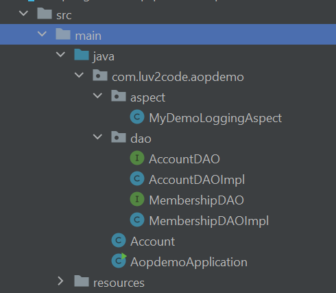

# Project 6
Lets see Project Structure first


## Main code
Now lets see code

```java
@SpringBootApplication
public class AopdemoApplication {

	public static void main(String[] args) {
		SpringApplication.run(AopdemoApplication.class, args);
	}

	@Bean
	public CommandLineRunner commandLineRunner(AccountDAO theAccountDAO, MembershipDAO theMembershipDAO) {

		return runner -> {

			demoTheBeforeAdvice(theAccountDAO, theMembershipDAO);
		};
	}

	private void demoTheBeforeAdvice(AccountDAO theAccountDAO, MembershipDAO theMembershipDAO) {

		// call the business method
		Account myAccount = new Account();
		theAccountDAO.addAccount(myAccount);

		// call the membership business method
		theMembershipDAO.addSillyMember();

	}

}

```

## Account code

```java
public class Account {

    private String name;
    private String level;


    public String getName() {
        return name;
    }

    public void setName(String name) {
        this.name = name;
    }

    public String getLevel() {
        return level;
    }

    public void setLevel(String level) {
        this.level = level;
    }
}

```
## implementation code
### 1
```java
@Repository
public class AccountDAOImpl implements AccountDAO {

    @Override
    public void addAccount(Account theAccount) {

        System.out.println(getClass() + ": DOING MY DB WORK: ADDING AN ACCOUNT");

    }
}

```
### 2
```java
@Repository
public class MembershipDAOImpl implements MembershipDAO {

    @Override
    public boolean addSillyMember() {

        System.out.println(getClass() + ": DOING MY DB WORK: ADDING A MEMBERSHIP ACCOUNT");

        return true;
    }
}
````

## Aspect code

```java
@Aspect
@Component
public class MyDemoLoggingAspect {

    @Before("execution(* add*(com.luv2code.aopdemo.Account))")
  //tells any return type with method name add* and parameter as Account so addSillymember() has no paramtr so aspect not run before that
    public void beforeAddAccountAdvice() {

        System.out.println("\n=====>>> Executing @Before advice on method");

    }
}
````

## Output

```text
=====>>> Executing @Before advice on method
class com.luv2code.aopdemo.dao.AccountDAOImpl: DOING MY DB WORK: ADDING AN ACCOUNT
class com.luv2code.aopdemo.dao.MembershipDAOImpl: DOING MY DB WORK: ADDING A MEMBERSHIP ACCOUNT

Process finished with exit code 0
```
