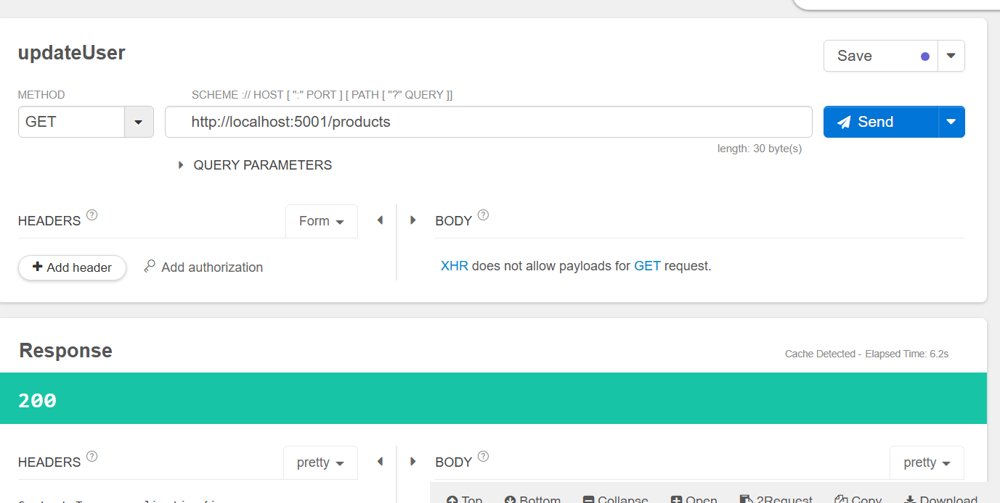
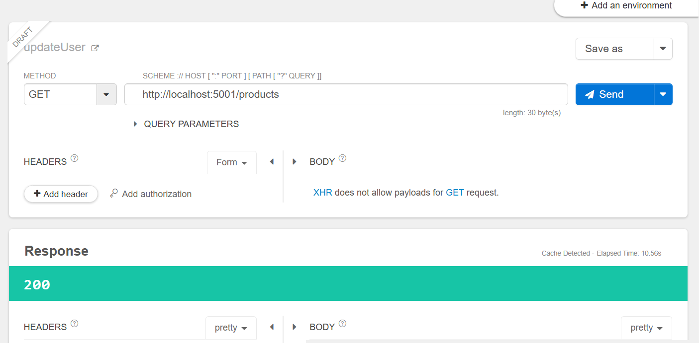
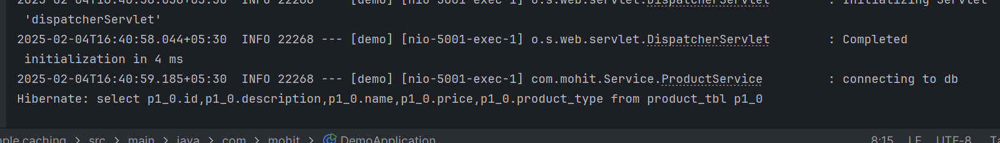
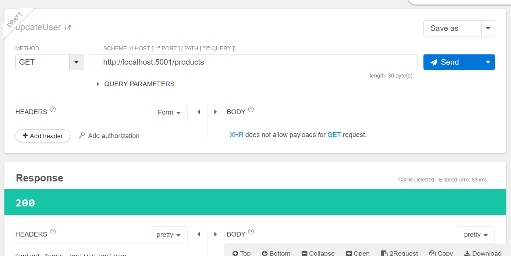
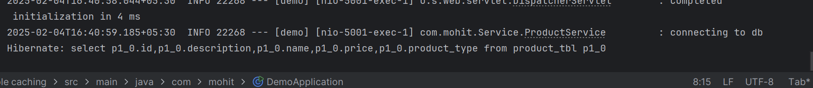

## Default cache

A lot of processing is required to get to DB!! so we use cache!! 1st time we go to DB and then the data is stored in cache!!

we have 1 lakh record to retive the all data see 6.2 sec is taken 



can see code in 001.simple DB!!
now see code in 002.simple cache!!

to enable cache

```java

@SpringBootApplication
@EnableCaching
public class DemoApplication {

	public static void main(String[] args) {

		SpringApplication.run(DemoApplication.class, args);
	}

}

```
to get cache a particular method

```java
    @Cacheable(cacheNames = "products")
    public List<Product> getProducts() {
        log.info("connecting to db");
        return repository.findAll();
    }

```
put @Cacheable for logging use slf4j!!


After implementing cache first time



10.56 sec to get 1lkah record now let see 2nd time!!



Also in log getting to db can see now let us hit 2nd time!!



see just 635 ms!!

Also in log can see not getting to DB!!



