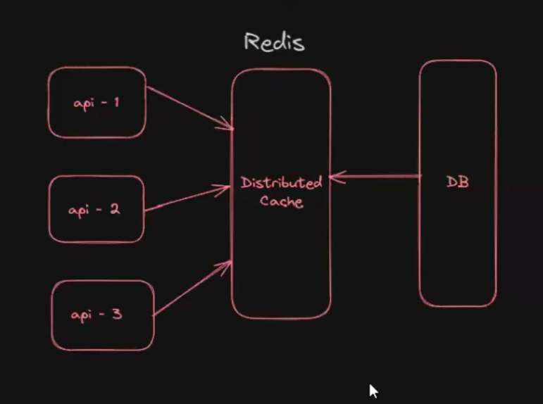

# Cache Redis


1) Transactional Tables (app will perform DML (data will be manipulated)(create update delete) operations)

2) Non-Transactional tables (app will perform DQL(only read operations) operations)


=> When table is static (only read operations) there is no use of retrieving data from that table again and again.

=> For static tables data we should use Cache.

What is Cache : temporary storage

=> Get static table data only once and store it in a variable and re-use that variable for future requests.

```java
@Controller
public class UserController {

	private List<String> countries = null;

	@GetMapping("/register")
	public String loadRegisterPage(Model model){
			if(countries == null)
				countries = service.getCountries();
			}
			model.addAttribute("countries", countries);
			return "regiterPage";
	}
}

```


=> The advantage with above logic is countries we will fetch only once from database.Here list of countries act as cache !!



Distributed Cache --> multiple application can connect to it!!

Redis keeps data in key and value pair!! 

## Redis Cache


=> It is an open source data store

=> We can use Redis as 

			a) database
			b) cache
			c) message broker

=> Redis supporting for 50+ programming languages

=> We can setup Redis in 2 ways

			1) On Prem Setup (Windows / Linux)

			2) Redis Cloud

## What is Redis?
Redis stands for REmote DIctionary Server. It was written in C by Salvatore Sanfilippo in 2006. It is a NoSQL advanced key-value data store. The read and write operations are very fast in Redis because it stores all data in memory. The data can also be stored on the disk and can be written back to the memory.

It is often referred to as a data structure server because keys can contain strings, hashes, lists, sets, sorted sets, bitmaps, and hyperloglogs.

## What is Spring Data Redis?
Spring Data Redis is a module of the Spring Data umbrella project that provides seamless integration with Redis. It simplifies the integration of the Spring application with Redis by offering high-level and object-oriented APIs. With Spring Data Redis, we can leverage Redis’s powerful features, such as caching, Pub/Sub messaging, and data persistence. It also supports advanced Redis features like transactions, pipelining, and Lua scripting.

```configuration
spring.redis.host=localhost
spring.redis.port=6379
```

```java
@SpringBootApplication
public class SpringDataRedisApplication implements CommandLineRunner {

    private static final Logger log = LoggerFactory.getLogger(SpringDataRedisApplication.class);

    public static void main(String[] args) {
        SpringApplication.run(SpringDataRedisApplication.class, args).close();
    }

    @Override
    public void run(String... args) throws Exception {
        log.info("Spring Data Redis");
    }
}
```

## Object Mappings
Object mapping and repositories in Spring Data Redis provide a smooth integration between Java objects and Redis data structures, leveraging serialization and deserialization capabilities. Spring Data Redis repositories simplify data access by providing high-level abstractions for common Redis operations, such as CRUD operations and querying.

```java
//book entity
@Data
@RedisHash("book")
public class Book implements Serializable {

    private String id;
    private String name;
    private String summary;

    private List<Author> authors;

    @Override
    public String toString() {
        return "Book{" +
                "id=" + id +
                ", name='" + name + '\'' +
                ", summary='" + summary + '\'' +
                ((null != authors) ? ", authors=" + authors.stream().map(i -> i.getFullName()).collect(Collectors.toList()) + '\'' : "") +
                '}';
    }

}
```

 We use Lombok’s @Data annotation to automatically create the getters and setters of the properties, equals, and hashcode methods.

 We use the @RedisHash annotation of Spring Data Redis to map the Book entity with the book hash in our Redis datastore.


 ```java
//Author

@Data
@RedisHash("author")
public class Author implements Serializable {

    private String id;
    private String firstName;
    private String lastName;

    private List<Book> books;

    public String getFullName() {
        return lastName + " " + firstName;
    }

    @Override
    public String toString() {
        return "Author{" +
                "id=" + id +
                ", firstName='" + firstName + '\'' +
                ", lastName='" + lastName + '\'' +
                ((null != books) ? ", books=" + books.stream().map(i -> i.getName()).collect(Collectors.toList()) + '\'' : "") +
                '}';
    }
}
 ```

 With Spring Data Redis, we get the usual repositories like CrudRepository and PagingAndSortingRepository from the Spring Data Common module. We can use either when defining Redis repositories for our Book and Author entities.

 ```java
//Bookrepo
@Repository
public interface BookRepository extends CrudRepository<Book, String> {
}

 ```

 ```java
 //authorrepo
@Repository
public interface AuthorRepository extends CrudRepository<Author, String> {
}
 ```

## Main application
 ```java
@SpringBootApplication
public class SpringDataRedisApplication implements CommandLineRunner {

    private static final Logger log = LoggerFactory.getLogger(SpringDataRedisApplication.class);

    public static void main(String[] args) {
        SpringApplication.run(SpringDataRedisApplication.class, args).close();
    }

    @Autowired
    private BookRepository bookRepository;

    @Autowired
    private AuthorRepository authorRepository;

    @Override
    public void run(String... args) throws Exception {
        // CRUD started

        //create author
        Author andyWeir = new Author();
        andyWeir.setFirstName("Andy");
        andyWeir.setLastName("Weir");
        authorRepository.save(andyWeir);

        //read author
        log.info(String.valueOf(authorRepository.findAll()));

        ArrayList<Author> martianAuthors = new ArrayList<>();
        martianAuthors.add(andyWeir);

        //create book
        Book martian = new Book();
        martian.setName("Martian");
        martian.setSummary("One problem at a time and survive");
        bookRepository.save(martian);

        //read book
        log.info(String.valueOf(bookRepository.findAll()));

        //update book
        martian.setAuthors(martianAuthors);
        bookRepository.save(martian);

        //read book
        log.info(String.valueOf(bookRepository.findAll()));

        //delete author
        authorRepository.delete(andyWeir);

        //read author
        log.info(String.valueOf(authorRepository.findAll()));

        // CRUD finished
    }
}

 ```


 >Note: we can use the Redis command line interface (CLI) to check out the logs on the Redis datastore. Rerun the application, and while the application is starting, we can use the redis-cli command on a new terminal to connect to the CLI of Redis and then use the MONITOR command to check the following logs. The Redis commands will show up once the application starts and runs the Spring Data Redis integration code in the previous terminal.


 ## The RedisTemplate class

The RedisTemplate provided by Spring Data Redis allows us to interact directly with Redis data structures. With RedisTemplate, we can perform operations such as data insertion, retrieval, updating, and deletion using key-value pairs or other Redis-specific data structures. This provides flexibility and control over Redis operations, enabling efficient and customized data handling within Spring applications.


### Key-value operations
The RedisTemplate class provides convenient key-value operations for efficient storage and retrieval of key-value pairs in Redis.

```java
//Set the string serializer for key and value
redisTemplate.setKeySerializer(new StringRedisSerializer());
redisTemplate.setValueSerializer(new StringRedisSerializer());

//String operations
redisTemplate.opsForValue().set("Book", "Author");

log.info(String.valueOf(redisTemplate.hasKey("Book")));
log.info(String.valueOf(redisTemplate.opsForValue().get("Book")));

```

Here’s an explanation for the code:

 We set StringRedisSerializer for the string-to-byte and vice-versa conversion because Redis stores everything in byte format.

 We use the opsForValue().set method to set a value for a key.

 We get the hasKey method to check if a String type key exists.

 We use the opsForValue().get method to retrieve a value for the key.

 ### List operations

 ```java
//List operator
ListOperations redisListOperator = redisTemplate.opsForList();
// We get the ListOperations instance, obtained from RedisTemplate using the opsForList method.


//List operations
redisListOperator.rightPush("BookList", "Atomic Habits");
redisListOperator.rightPush("BookList", "Martian");
redisListOperator.rightPush("BookList", "The Psychology Of Money");
redisListOperator.rightPush("BookList", "Zero To One");
//We use the rightPush method of the ListOperations to append the values to the right of the list with the BookList key.
//here 1st value is list to which we are putting values
log.info(String.valueOf(redisTemplate.hasKey("BookList")));
log.info(String.valueOf(redisListOperator.size("BookList")));
//We get the size method to log the size of the list with the BookList key.


log.info(String.valueOf(redisListOperator.index("BookList", 1)));
//We use index to retrieve and log the value at index 1 in the list with the BookList key.

log.info(String.valueOf(redisListOperator.range("BookList", 2, 3)));
// The range method retrieves and logs a range of values from index 2 to 3 in the list.

redisListOperator.set("BookList", 1, "Project Hail Mary");
// The set method replaces the value at index 1 in the list, the BookList key, with Project Hail Mary.

log.info(String.valueOf(redisListOperator.index("BookList", 1)));
 ```


 ### Set operations

 ```java
//Set operator
SetOperations redisSetOperator = redisTemplate.opsForSet();
//We get the instance of the SetOperations obtained from RedisTemplate using the opsForSet method.

//Set operations
redisSetOperator.add("BookSet", "Atomic Habits", "Martian", "The Psychology Of Money", "Leaders eat last");
//We use the add method that adds multiple values to the set with the BookSet key.
//here 1st value is list to which we are putting values so putting all values to Book set

log.info(String.valueOf(redisSetOperator.size("BookSet")));
log.info(String.valueOf(redisSetOperator.isMember("BookSet", "Martian")));
log.info(String.valueOf(redisSetOperator.isMember("BookSet", "Zero To One")));
//We perform direct operations to check if the value is a member of our BookSet set.

log.info(redisSetOperator.members("BookSet").toString());
//We use the members method to retrieve all the entries of our BookSet set.

redisSetOperator.remove("BookSet", "Martian");

log.info(redisSetOperator.members("BookSet").toString());
//We use the remove method to delete an entry and then log all the members of the set BookSet.
 ```
### Hash operations
The hash operations provided by RedisTemplate enable us to efficiently handle the hash data structures. It allows operations such as setting, getting, and deleting hash fields, providing convenient access to structured data stored in Redis. Let’s see a few examples of such direct operations.
 

 ```java
//Set the string serializer for hash key and value
redisTemplate.setHashKeySerializer(new StringRedisSerializer());
redisTemplate.setHashValueSerializer(new StringRedisSerializer());

//Hash operator
HashOperations redisHashOperator = redisTemplate.opsForHash();

//Hash operations
Map thePsychologyOfMoney = new HashMap<String, String>();
thePsychologyOfMoney.put("id", "thePsychologyOfMoney");
thePsychologyOfMoney.put("name", "The Psychology of Money");
thePsychologyOfMoney.put("summary", "Timeless Lessons on Wealth, Greed, and Happiness");

redisHashOperator.putAll("Book" + thePsychologyOfMoney.get("id"), thePsychologyOfMoney);
//We use the putAll method to store a hash with multiple values.
//key-->"Book" + thePsychologyOfMoney.get("id")
//value--> thePsychologyOfMoney

log.info(String.valueOf(redisHashOperator.entries("Book" + thePsychologyOfMoney.get("id"))));
//We log the entries of the hash data.

HashMapper<Book, String, String> bookHashMapper = new DecoratingStringHashMapper<>(new PojoHashMapper<>(Book.class));
//We create the HashMapper object to convert our hash into the custom Book object.

log.info(String.valueOf(bookHashMapper.fromHash(redisHashOperator.entries("Book" + thePsychologyOfMoney.get("id")))));
//The bookHashMapper object converts the hash entries to the Book object using the fromHash method.

 ```

 ```bash

2025-02-04 06:28:25.109 | INFO  | main       | c.s.SpringDataRedisApplication | Starting SpringDataRedisApplication using Java 17.0.8 on educative with PID 119 (/usr/share/usercode/spring_data_examples/spring_data_redis/build/libs/spring_data_redis-0.0.1-SNAPSHOT.jar started by root in /usr/share/usercode/spring_data_examples/spring_data_redis)
2025-02-04 06:28:25.114 | DEBUG | main       | c.s.SpringDataRedisApplication | Running with Spring Boot v2.7.5, Spring v5.3.23
2025-02-04 06:28:25.117 | INFO  | main       | c.s.SpringDataRedisApplication | No active profile set, falling back to 1 default profile: "default"
2025-02-04 06:28:32.820 | INFO  | main       | c.s.SpringDataRedisApplication | Started SpringDataRedisApplication in 9.425 seconds (JVM running for 12.094)
2025-02-04 06:28:34.734 | INFO  | main       | c.s.SpringDataRedisApplication | {summary=Timeless Lessons on Wealth, Greed, and Happiness, name=The Psychology of Money, id=thePsychologyOfMoney}
2025-02-04 06:28:35.402 | INFO  | main       | c.s.SpringDataRedisApplication | Book{id=thePsychologyOfMoney, name='The Psychology of Money', summary='Timeless Lessons on Wealth, Greed, and Happiness'}
 ```
## Redis Messaging

Learn about messaging through the publisher-and-subscriber model in Redis using Spring Data Redis.

Redis messaging refers to the Pub/Sub messaging functionality provided by Redis. It allows real-time communication between publishers and subscribers, enabling the exchange of messages, notifications, and updates in a scalable and efficient manner.

Spring Data Redis allows us to integrate Redis messaging in a Spring application by building a Publish/Subscribe pattern where publishers send messages to channels, and subscribers receive messages from those channels.

